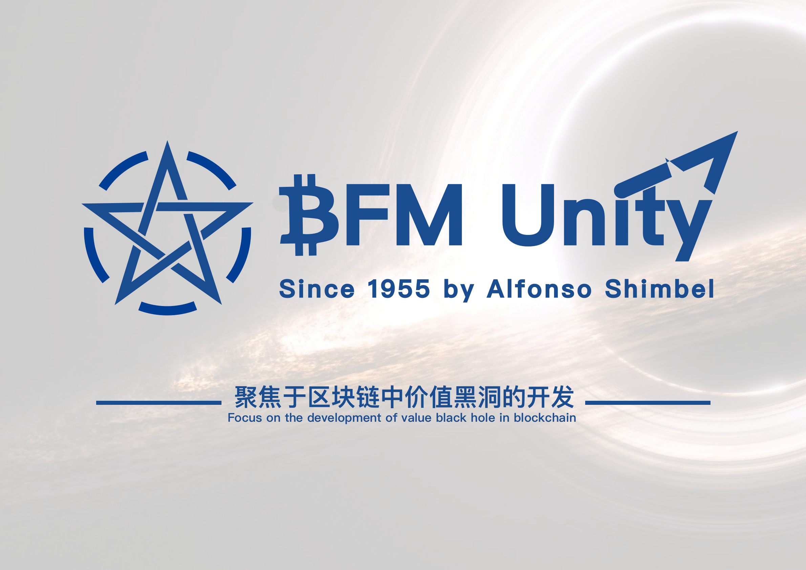
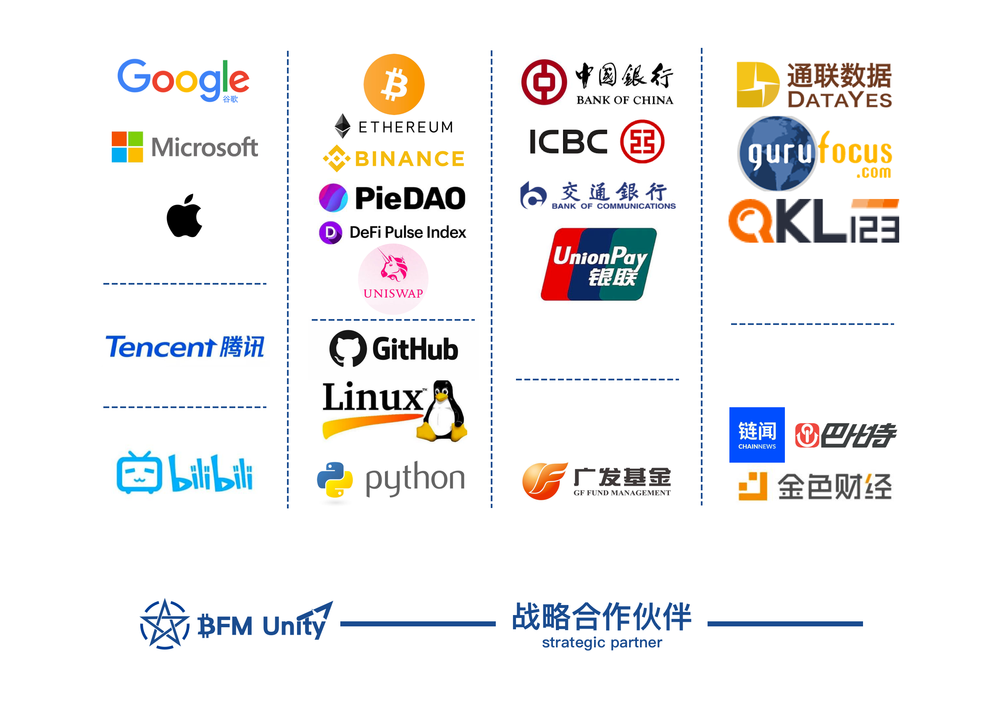

# 主舰桥 \(引导\) 🇺🇳


NOTE: **This project is in beta. Use at your own risk.**    
  
[**怀念旧版**](https://guhhhhaa.gitbook.io/bfm-unity-doc-v1/) **+ 曾用域名：**[**https://guhhhhaa.gitbook.io/bfm**](https://guhhhhaa.gitbook.io/bfm)

**主舰桥负责连接**₿FM Unity™**的过去（**[**旧版本**](https://guhhhhaa.gitbook.io/bfm-unity-doc-v1/)**，**[**陈列室**](https://app.gitbook.com/@guhhhhaa/s/bfm/~/drafts/-MVoBIyjmm3RsXnacjGa/roadmap)**），现在（**[**驾驶舱**](https://app.gitbook.com/@guhhhhaa/s/bfm/~/drafts/-MVjhzEka3Q9R9_edu0U/management-cockpit-operation)**，**[**指挥室**](https://app.gitbook.com/@guhhhhaa/s/bfm/~/drafts/-MVjhzEka3Q9R9_edu0U/command-room-discovery)**）与未来（**[**研究院**](https://app.gitbook.com/@guhhhhaa/s/bfm/~/drafts/-MVoBIyjmm3RsXnacjGa/research-institute-development)**）。**












## [**投资方法论**](https://guhhhhaa.gitbook.io/joinquant/jin-rong-li-lun-zong-jie)  **，** [**系统核心代码**](https://guhhhhaa.gitbook.io/bfm/ruan-jian-bfm-on-python)\*\*\*\*

## [加群](https://guhhhhaa.gitbook.io/bfm/ru-he-jia-ru-wo-men-de-tao-lun-qun-zu) ，[看板](https://trello.com/b/z4aDgNAL/todolist) ，[捐款](https://guhhhhaa.gitbook.io/bfm/juan-zeng-da-shang)

[Assets](https://share.weiyun.com/l21pilUf)

## 加密货币投资路径

## 漫谈世界金融体系

## 以太坊生态

## 战略合作伙伴

## 愿景及使命

我喜欢坐在 ****[**SCP-2950**](https://www.bilibili.com/video/BV1ts411g7Qw) ****上，看 ****[**GOC**](https://www.bilibili.com/video/BV1gW411J7eP) ****的公告。（[**愿景及使命**](https://www.bilibili.com/bangumi/play/ss28381/)）

#### [₿FM Unity™](https://www.bfm-unity.com/) \| [₿itcoin-Finance-Management Unity™](https://www.bfm-unity.com/) \| [Bellman-Ford-Moore Unity™](https://www.bfm-unity.com/) \| BFM联体 \| 2020.3.23 - 至今 \| [_**管理员入口**_](https://app.gitbook.com/@guhhhhaa/s/bfm/) _****_**\|** [**Github文档地址**](https://github.com/guhhhhaa/bfm-gitbook) **\|** [**Github代码地址**](https://github.com/guhhhhaa/bfm-group-file) **\|** [**B站主页**](https://space.bilibili.com/11708778)

**© 2020-2021** [**BFM-Unity.com.**](https://www.bfm-unity.com/) ****[**₿FM Unity™.**](https://www.bfm-unity.com/) **All Rights Reserved.**

