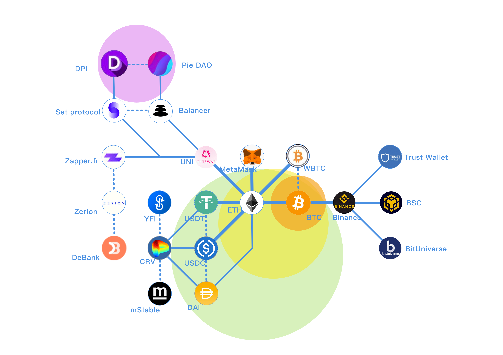

# 主舰桥（引导）






NOTE: **This project is in beta. Use at your own risk.**    
  
[**怀念旧版**](https://guhhhhaa.gitbook.io/bfm-unity-doc-v1/) **——** [**量子退火和FPGA**](https://guhhhhaa.gitbook.io/bfm-unity-doc-v1/bfm-suan-fa-de-wei-lai-fa-zhan-wei-wan-cheng)  
**曾用域名：**[**https://guhhhhaa.gitbook.io/bfm**](https://guhhhhaa.gitbook.io/bfm)\*\*\*\*


## [**投资方法论**](https://guhhhhaa.gitbook.io/joinquant/jin-rong-li-lun-zong-jie)  **，** [**系统核心代码**](https://guhhhhaa.gitbook.io/bfm/ruan-jian-bfm-on-python)\*\*\*\*

## [加群](https://guhhhhaa.gitbook.io/bfm/ru-he-jia-ru-wo-men-de-tao-lun-qun-zu) ，[看板](https://trello.com/b/z4aDgNAL/todolist) ，[捐款](https://guhhhhaa.gitbook.io/bfm/juan-zeng-da-shang)

[Assets](https://share.weiyun.com/s6DJ9fiz)

我喜欢坐在 ****[**SCP-2950**](https://www.bilibili.com/video/BV1ts411g7Qw) ****上，看 ****[**GOC**](https://www.bilibili.com/video/BV1gW411J7eP) ****的公告。

#### ฿FM Unity™ \| ฿itcoin-Finance-Management Unity™ \| Bellman-Ford-Moore Unity™ \| 2020.3.23 - 至今 \| [_**管理员入口**_](https://app.gitbook.com/@guhhhhaa/s/bfm/) _****_**\|** [**Github项目地址**](https://github.com/guhhhhaa/bfm-gitbook) **\|** [**B站主页**](https://space.bilibili.com/11708778)\*\*\*\*

