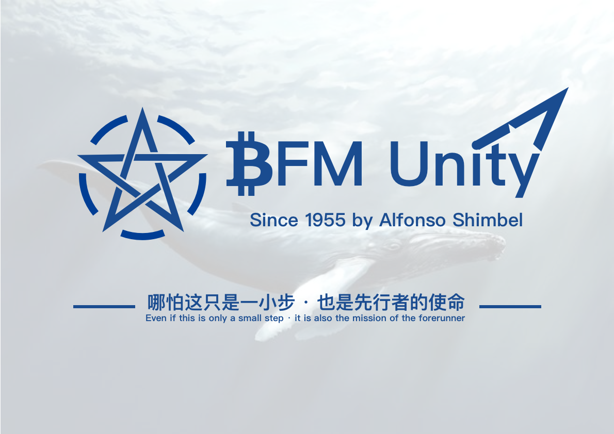
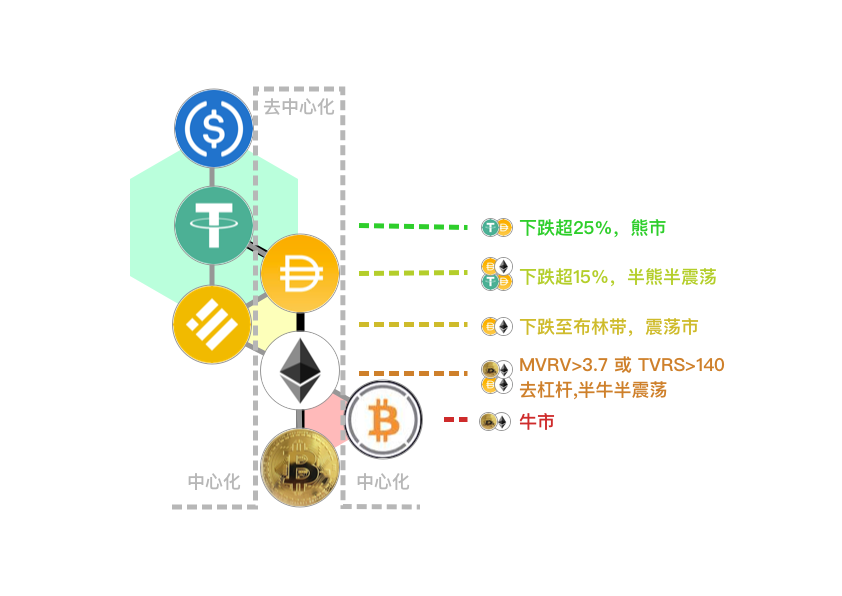
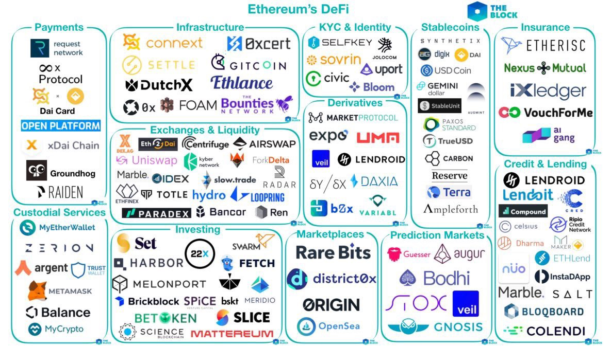

# 主页


NOTE: **This project is in beta. Use at your own risk.**    
  
   [**怀念旧版**](https://guhhhhaa.gitbook.io/bfm-unity-doc-v1/)


## [**投资方法论**](https://guhhhhaa.gitbook.io/joinquant/jin-rong-li-lun-zong-jie)  **，** [**系统核心代码**](https://guhhhhaa.gitbook.io/bfm/ruan-jian-bfm-on-python)\*\*\*\*

## [加群](https://guhhhhaa.gitbook.io/bfm/ru-he-jia-ru-wo-men-de-tao-lun-qun-zu) ，[看板](https://trello.com/b/z4aDgNAL/todolist) ，[捐款](https://guhhhhaa.gitbook.io/bfm/juan-zeng-da-shang)

## 比特币指标

* [**MVRV**](https://charts.woobull.com/bitcoin-mvrv-ratio/) **或** [**MVRV**](https://www.blockchain.com/charts/mvrv)\*\*\*\*

  \*\*\*\*[**MVRV**](https://medium.com/@kenoshaking/bitcoin-market-value-to-realized-value-mvrv-ratio-3ebc914dbaee)**：3.7**（表示高估）和 **1**（表示低估）

* [**NVT**](https://charts.woobull.com/bitcoin-nvt-ratio/) **&** [**NVTS**](https://charts.woobull.com/bitcoin-nvt-signal/) **或** [**NVT**](https://www.blockchain.com/charts/nvt) **&** [**NVTS**](https://www.blockchain.com/charts/nvts) ****[**NVT**](https://woobull.com/introducing-nvt-ratio-bitcoins-pe-ratio-use-it-to-detect-bubbles/#fnref2)**：90**（表示高估）和 **40**（表示低估） **如果价格小幅下跌后，NVT依然&gt;90，说明是泡沫，应该立即离场。** [**NVTS**](https://woobull.com/nvt-signal-a-new-trading-indicator-to-pick-tops-and-bottoms/)**：150**（表示高估）和 **45**（表示低估）
* \*\*\*\*[**TradingView**](https://www.tradingview.com/chart/ooNfs1M1/) **下跌至第二条布林线离场**
* [**USDT市值TradingView**](https://www.tradingview.com/symbols/CRYPTOCAP-USDT/) **&** [**USDT发行量与比特币价格**](https://www.longhash.com/cn/livecharts/USDT-circulation-and-bitcoin-prices) **&** [**USDT市值**](https://coinmarketcap.com/currencies/tether/)

## 传统区块链



* [**比特派钱包**](https://bitpie.com/)（**推荐**）
* \*\*\*\*[**币安**](https://www.binance.com/cn) **（不推荐，需要交提币手续费）**




* [**TrustWallet**](https://trustwallet.com/)**（**BIP44钱包**）**
* [**比特派钱包**](https://bitpie.com/)**（**多功能钱包，非BIP44）



* \*\*\*\*[**币安**](https://www.binance.com/cn) ****




* \*\*\*\*[**币优**](https://www.biyou.tech/)
* \*\*\*\*[**Pionex**](https://www.pionex.com/)







## **DeFi**



\*\*\*\*[**DeFi Pulse Index \(DPI\)** ](https://info.uniswap.org/token/0x1494ca1f11d487c2bbe4543e90080aeba4ba3c2b)\*\*\*\*

| 了解 DeFi |
| :---: |
| [https://defipulse.com/](https://defipulse.com/) |
| [https://defiprime.com/](https://defiprime.com/) |
| \*\*\*\*[**链闻：DeFi**](https://www.chainnews.com/tag_9336.htm)\*\*\*\* |

**不能理解，可以看看** [**动画片**](https://www.agefans.tv/play/20200054?playid=2_1)



* [**Zapper.fi** ](https://www.zapper.fi/) **小白专用，**[**Atom bomb baby**](https://music.163.com/song?id=567215077&userid=273670441)**。**

  * \*\*\*\*[**DeFi Zap 使用说明**](https://www.fmz.com/bbs-topic/5371)  ****
  * [**Uniwap    使用说明**](https://www.chainnews.com/articles/522868612900.htm)  ****
  * \*\*\*\*[**Uniswap**](https://app.uniswap.org/) [**Curve**](https://www.curve.com/) [**Balancer**](https://balancer.finance/) [**1Inch**](https://1inch.exchange/)**，**[**Mooniswap**](https://mooniswap.exchange/)\*\*\*\*

  **PMM：**[**DodoEx**](https://app.dodoex.io/)  
  **其他：**[**BlackHoleSwap**](https://blackholeswap.com/swap)\*\*\*\*

* \*\*\*\*[**Uniswap Info**](https://info.uniswap.org/) **Uniswap TradingView版本：**[**https://uniswap.vision/**](https://uniswap.vision/) **或** [**https://www.chartex.pro/**](https://www.chartex.pro/)\*\*\*\*
* [其他工具](https://www.bilibili.com/video/BV13D4y1o7Wh?p=1)





* [**Badger**](https://app.badger.finance/)\*\*\*\*
* [**Harvest**](https://harvest.finance/)\*\*\*\*



* 资产管理平台， [Zapper Finance](https://zapper.fi/)、[Zerion](https://zerion.io/)、[Debank](https://debank.com/)
* 交易类聚合器， [1inch Exchange](https://1inch.exchange/)、[Matcha](https://matcha.xyz/)、[ParaSwap](https://paraswap.io/#/)、[InstaDapp](https://defi.instadapp.io/) 
* 收益类聚合器，[YFI](https://yearn.finance/)、[YFII](https://dfi.money/)、[Rari Capital](https://app.rari.capital/)
* 稳定币聚合协议， [mStable](https://mstable.app/)
* 信息聚合， [DeFi Pulse](https://defipulse.com/)、[DeFi Prime](https://defiprime.com/)、[DeFiRate](https://defirate.com/) 、[CoinGecko](https://www.coingecko.com/) 这类门户网站
* 比较收益，[https://pools.fyi/](https://pools.fyi/) 

  



* [Curve](https://www.curve.fi/)
* [mStable](https://mstable.app/#/save)
* [Curve mUSD-3POOL](https://www.curve.fi/musd/deposit) , [mStable API](https://mstable.app/#/earn/curve-musd-3pool)



* [**Aave**](https://app.aave.com/)\*\*\*\*

闪电贷一般需要用户通过编程实现，但目前也出现了一些工具，比如 [CollateralSwap](https://collateralswap.com/)、[DeFi Saver](https://app.defisaver.com/)、[Furucombo](https://furucombo.app/) 等，使得用户不需要编程也能使用闪电贷。



* [**Mirror.finance**](https://mirror.finance/)

\*\*\*\*[**教程**](https://www.douban.com/group/topic/204847108/)\*\*\*\*



* \*\*\*\*[**dYdX**](https://dydx.exchange/) ****
* [**Synthetix**](https://synthetix.io/)\*\*\*\*



* [**PolkaSwap**](https://polkaswap.io/)\*\*\*\*
* \*\*\*\*[**Reef**](https://reef.finance/)\*\*\*\*



## 融资加杠杆




推荐，**费率最低**，

使用如下**资金周转方案**，只需手续费**0.38%/月**


1，申请信用卡

* \*\*\*\*[**51信用卡管家**](https://www.u51.com/)，[**卡牛信用卡管家**](https://www.kaniu.com/)，各大手机银行

2，激活信用卡

* 需**本人**带**身份证**和**信用卡**去各大银行**线下实体网点**激活

3，刷卡收款

* [**易钱包**](https://yqb.net.cn/)**（建议使用**[**云闪付**](https://yunshanfu.unionpay.com/)**，费率0.38%）**
* **激活序列成本：¥0.5**

4，资金周转方案：如借了1.5W，手中只有1k，那么将1k还进刷出，重复15次即可还清该期欠款，延后到下一期。理论上可以无限延后，这样每个月只需交手续费，无需交利息。

建议不要集中一天，而是在还款期之前分散多天操作。

注意先多预留出少量的手续费。



币安可以抵押借币，日息万五，年18%



* [**Aave**](https://app.aave.com/)\*\*\*\*

闪电贷一般需要用户通过编程实现，但目前也出现了一些工具，比如 [CollateralSwap](https://collateralswap.com/)、[DeFi Saver](https://app.defisaver.com/)、[Furucombo](https://furucombo.app/) 等，使得用户不需要编程也能使用闪电贷。



群主不了解，不建议



### MetaMask 清除 Pending 状态方法：点头像-设置-高级-重设账户

我喜欢坐在 ****[**SCP-2950**](https://www.bilibili.com/video/BV1ts411g7Qw) ****上，看 ****[**GOC**](https://www.bilibili.com/video/BV1gW411J7eP) ****的公告。

2020.3.23 - 至今

