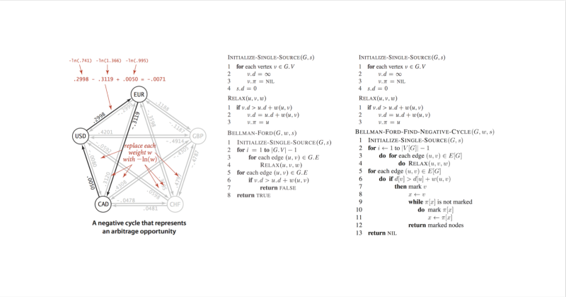

# BFM 问题与解答


本章 **不包含任何代码** ，适合 **金融，经济，管理，法律** 人士阅读。

如果您 **不是** 上述人士，想直接从算法开始，请 [**跳过**](https://guhhhhaa.gitbook.io/bfm/what-is-bfm-al)。


文档 GitBook 地址：[https://guhhhhaa.gitbook.io/bfm/](https://guhhhhaa.gitbook.io/bfm/)  
文档 GitHub 地址：[https://github.com/guhhhhaa/bfm-gitbook](https://github.com/guhhhhaa/bfm-gitbook)

## BFM 是什么？

BFM是 Bellman-Ford-Moore 算法的简称。

该算法于 1955 年由 Alfonso Shimbel 创立。

{% embed url="https://baike.baidu.com/item/Bellman-Ford%E7%AE%97%E6%B3%95/1089090" %}

{% embed url="https://en.wikipedia.org/wiki/Bellman%E2%80%93Ford\_algorithm" %}

我们利用这个算法优化三角套利的推广——多角套利路径的搜索。



## 从马克思的“国家消亡论“开始

在马克思看来，阶级、国家都只是一个历史范畴，它并不是从来就有的，也不是永恒存在的。人类曾经有过不需要国家，也不知国家权力是何物的社会。国家只是在人类社会经济发展到一定阶段，社会分裂为阶级时，才成为必要。随着社会化大生产的发展，阶级对立的生产关系必将成为社会生产的真正障碍，作为先进生产力代表的无产阶级，将发动无产阶级革命消灭私有制，消灭阶级对立和阶级本身存在的条件。而当社会不再有需要加以镇压的阶级的时候，也就不再需要国家这种特殊的镇压力量，国家也就成为多余的了。

{% embed url="https://baike.baidu.com/item/%E5%9B%BD%E5%AE%B6%E6%B6%88%E4%BA%A1%E8%AE%BA" %}

## BFM 是一项超越时代的事业，而这是艰难的。

实现 BFM 的意义是深远的，道路是漫长的。  
中国目前处于社会主义初级阶段，离共产主义还有很大一段距离。  
尽管我们已经确定了算法，并且正尽力扩充它的细节。  
但是，前途是光明的，道路是曲折的。

## 国家消亡的第一步是什么？

解构国家的第一步是——解构全球货币体系。  
BFM 就是原子弹，量子退火就是氢弹。我们即将按下核按钮。  
很多人觉得解构国家，解构货币，可能从心理上感觉很可怕，甚至不可理解。 解构国家不等于摧毁国家，解构货币不等于取消使用货币。解构的意思是“使之失去价值，失去意义”。

也就是说，可能假象，表象依然在维持，而且一般不考虑这个的人也不会发现不会在意。但是，其权力，价值，功能，意义等，均已消亡。 就像君主立宪制下的君主一样，只作为象征意义而存在。

在共产主义系统下，国家，和国家信用背书的信用货币，在经济和政治中起到的作用几乎为零，也只作为象征意义，和理论上的过渡意义而存在。

{% embed url="https://baike.baidu.com/item/%E8%B4%A7%E5%B8%81%E6%B6%88%E4%BA%A1%E8%AE%BA" %}

## 为什么 BFM 对资本主义理论体系是和平解构?

1，BFM 可以获得稳定的盈利。  
2，BFM 的实现成本虽然很大，但是推广成本几乎为 0。

## BFM 的盈利来自哪里?

来自全球市场货币的交叉汇率定价缺陷。

{% embed url="https://wiki.mbalib.com/wiki/%E5%A5%97%E7%AE%97%E6%B1%87%E7%8E%87" %}

## 交叉汇率的缺陷源于哪里？

1，政府和中央银行要吃饭。  
2，当今货币体系没有将价值储藏和流通手段这两大功能完全分开。  
3，理论上本应只具有流通手段功能的货币，其内部依然含有价值。



## 为什么这种盈利模式是可持续的？

因为交叉汇率的缺陷是随时发生，不可避免的，是一种自然现象。

## 如何通俗解释 BFM 的盈利来源？

BFM在卖一种保险，卖的是全球货币体系陷入瘫痪，世界爆发战争的保险。

## 为什么这种保险容易销售？

因为只要有人参与外汇市场交易，就默认他接受了定价缺陷，所以他们就在变相购买我们的保险。

## 为什么使用 BFM 是合法的？

因为它在维护世界和平。

## 既然 BFM 这么好，我们为什么将其公开？

因为每一个加入 BFM 的人都是另一个 BFM 的交易合作者，他们的交易方向有可能是相反的，所以可以是合作关系。 更多人加入 BFM ，这不仅仅会加速套利进度，而且会减少套利风险。因为这会减少价格的波动，使套利活动更加稳定。

## 为什么 BFM 在解构世界金融系统，而并不是粉碎？

粉碎世界金融系统的副作用太大，我们并不想让全世界陷入暴乱，动荡，无政府状态。  
虽然消灭国家是一个确定的历史过程，但这个过程必须是循序渐进，和平演变的。  
鉴于世界上大部分人习惯于生存在现有的国家政权和金融系统之下，且依靠现有的经济系统维持较为有序的分工协作，维持现有的政权和经济金融系统在短期内有利于世界和平。  
因此，我们采取的方针，并不是暴力粉碎，而是和平解构，和和平演变。



## 什么是和平解构，BFM 如何实现对现有经济和金融系统的和平解构？

现有的货币体系无法摆脱稀缺性和流动需要的普遍性的矛盾，也就是将微观经济学体系和宏观经济学体系的矛盾。 BFM 算法扩大了这一矛盾，并有可能将这一矛盾推广到每个人手中——将暂时的，非扩散的和微小的矛盾整合成系统性，结构性的矛盾。 这会形成一个威力巨大的价值符号原子弹，而这种符号价值体系内爆的巨大能量是取之不尽用之不竭的，将会导致现有的金融系统在巨大的结构性矛盾之下，其意义和价值被瞬间瓦解，只剩下符号的流动。

{% embed url="https://wiki.mbalib.com/wiki/%E5%86%85%E7%88%86" %}

## 为什么货币只保留符号的流动才是合理的？

因为货币本身不包含价值，货币不应该在其中存储价值，也不应该将稀缺性与其中包含的价值绑定。 实际上，现有的货币体系建构在人为制造的稀缺上，但这都基于一个假设——货币应该在其内部存储价值，这样它才能成为价值的量度和流通的手段。 稍有逻辑的人都会发现，这种假设是经不起推敲的。货币本身不应该有价值，也不应该用稀缺性保证货币的价值，它只是作为价值的量度和流动的手段而已。 如果全球法定货币价值归 0 ，世界经济金融体系依然可以流转，只不过大家使用的量度不同。

共产主义社会下，货币本身不存储价值，只是作为价值的量度，而囤积货币也毫无意义。 因为货币只在衡量价值和作为交换中介时使用，其本身不存储任何价值，也不包含任何价值。

{% embed url="https://wiki.mbalib.com/wiki/%E7%AC%A6%E5%8F%B7%E6%94%BF%E6%B2%BB%E7%BB%8F%E6%B5%8E%E5%AD%A6" %}

## 为什么共产主义货币不能是 BTC ？

虽然 BTC 接近这个目标，但由于它依然具有价值储存功能，所以很遗憾，BTC 不能成为共产主义社会下的货币。

共产主义社会下的货币只有两个可以储藏的价值：要么是 0 ，要么是 ∞

## 为什么共产主义货币很有可能基于 BFM ？

BFM 算法，同时包含了 0 和 ∞ 。所以，它必然是连接现实货币和共产主义货币的中介。

BFM 算法是共产主义货币的重要组成部分它是一个核按钮，引爆是 0 ，不引爆是 ∞ ，在此基础上，共产主义货币的强制力才得以建立。而只有把这个核按钮分配到所有人手上，共产主义制度才得以确立。

人们不得不按需分配，各取所需。否则，世界会强制切换到所有货币价值归 0 的境地。

## BFM算法的价值到底是多少？

人类的价值观在直觉上，不会接受 0 = ∞ 的，不过，人类又会接受 ∞ = 0 。 这就是一个矛盾，而共产主义货币建立在这个矛盾之上。

你可以说它等于 0 ，也可以说它等于 ∞ ，因为，人类对价值的认知本身，就存在这样的一个矛盾。

## 共产主义货币的强制力是谁造成的？

BFM 算法造成了共产主义货币的强制力。 这种强制力凌驾于国家机器的军事和武力之上，但是比军事和武力更强有力。 因为它是数学规律武器，它的强制力建立在 2 \* 3 = 6 或者类似被全人类公认的乘法数学公理上。 BFM 算法理论上具有通过借助数学公理，让现存所有货币价值归 0 的强制力。

## 为什么BFM算法具有让现存所有货币价值归零的强制力？

因为人类的数学，建立在理性之上，而人类的价值感，则被患得患失的感情所控制。 理性与感情是冲突的，存在天然的矛盾，货币和金融系统，把这两者整合了起来，而且让所有人接受。

BFM 算法不会杀人，只会 ∞ 地循环放大理性和感情的矛盾，最终摧毁人类的价值判断。 如果它普及，会摧毁全世界人类的价值判断。 所以，它会摧毁现存人类最大的幻觉和泡沫——货币体系。

## BFM 算法怎么和平解构货币体系的呢？

它制造了一个黑洞，并把它 ∞ 放大。这会一点点抽干整个货币系统的价值。 它抽取的，本质上是全人类的信用。

它在问地球上的每一个人，如果你有能力，你愿不愿意收全人类的保护费？

大部分人的回答都是愿意，直到他们发现事情不会这样简单，于是共产主义降临了。他们不得不按需分配，各取所需，否则，世界将进入魔法时代。

魔法时代的意思是，任何一个人，都有能力，或者有可能，在想象中摧毁整个世界。

为了避免这一点，人们不得不做出一致的选择——接受共产主义货币。

## 为什么我们如此急于实现 BFM 算法？

因为，红宝书是公开的，量子退火算法也是公开的。在网上人人都可查阅，所以目前这个情况，会非常的严峻。

红宝书的作者之所以把那个算法分散到 170 页之间，用了一个非常显眼具有象征意义的图作为演示，说明，红宝书作者，他想引起别人的注意，但是又不想让非专业人士参与。而专业人士，也似乎对此没有什么太大的重视。 因为看这本书的人，似乎没有政治经济学和货币金融学的思维，也不是恐怖分子，更不是反政府主义者。都是学校里认真学习的 IT 人士，他们的目标都是刷题找工作，不可能想过共产主义。

而共产主义者，或者，反政府主义者，思想太过单纯，也不会对一本算法书感兴趣，更不会认识到其中包含的强大理论威力，和碾压性的强制力。

他从不会想到有人会如此认真地反人类，要么，或者，他肯定是故意这么做的。

注：我们使用红宝书代表《 Algorithms, 4th Edition》 by Robert Sedgewick and Kevin Wayne，因为它的封面是红色的

## 总结

1. BFM算法，在现存货币基础上，建立共产主义货币。
2. 共产主义货币本身不存储价值，或者说它存储了整个人类社会的价值。也就是说它存储的价值为 0 ，或者 ∞ 。
3. BFM 算法造成了共产主义货币的强制力，这种强制力凌驾于军事和武力之上，但是比军事和武力更强有力。因为它是数学规律武器，它的强制力建立在 2 \* 3 = 6 或者类似的乘法数学公理上。 BFM 算法理论上具有通过借助数学公理，让现存所有货币价值归 0 的强制力。
4. BTC 如果想成为共产主义货币，它的价值为 0，或者 ∞ 。成为 ∞ 的意思是，任何人都无法获得 BTC ，可以用 1 [Satoshi \(unit\)](http://www.baidu.com/link?url=XO4TJQFhmDZHkkTntQ60PY3iges66wOsFvQW-NMCnfzu0by9cWUlKJxmGz12jIU3m0fYTgfVw-D8LGqsuFklvK) 换取世界上所有人类生产物。 成为 0 的意思是，任何人都可以免费获得 BTC 。1 [Satoshi \(unit\)](http://www.baidu.com/link?url=XO4TJQFhmDZHkkTntQ60PY3iges66wOsFvQW-NMCnfzu0by9cWUlKJxmGz12jIU3m0fYTgfVw-D8LGqsuFklvK) 只是作为价值的理论最小量子位存在。

