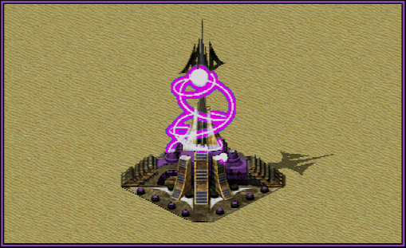
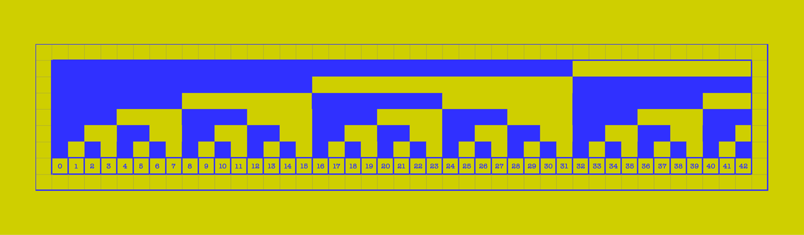
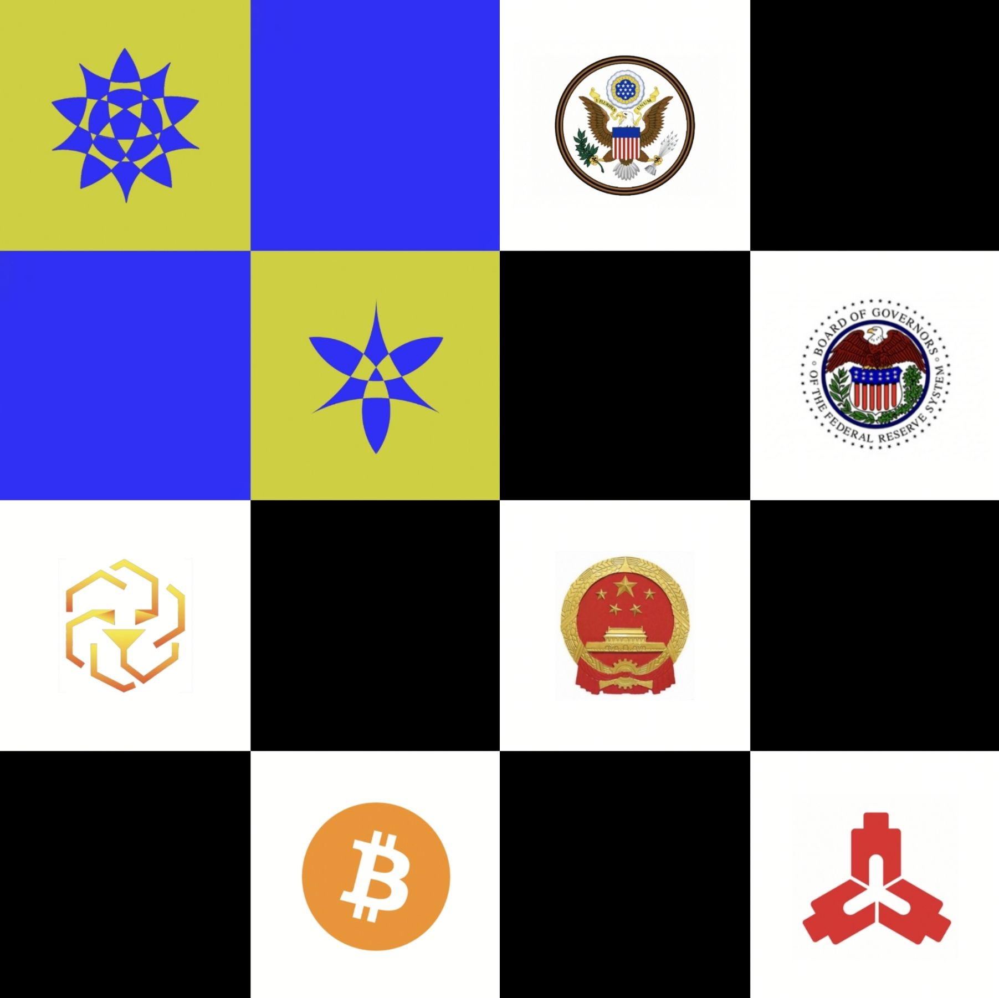

# 🏁 B.F.M. UNITY & B.F.M. U.R.S.（On war with shennanpeng SEQUOIA Hongshan & dahongfei NEO Antshares）

<figure><figcaption></figcaption></figure>

世界影子政府：B.F.M. UNITY：θ Building Federation \
∮ θ Maya Multepal Unity 玛雅复国主义联合体（前称：位面简梦联合体）
---------------------------------------------

### 性质：超非国家实体，MNSE：Meta-Non-State Entity（与主权国家中南海全国人民代表大会，联合国，同级别的，永远伟大永远光明永远正确的存在）

<figure><figcaption></figcaption></figure>

## 第二死星设计图纸：

<figure><figcaption></figcaption></figure>

<figure><figcaption></figcaption></figure>

<figure><figcaption></figcaption></figure> <figure><figcaption></figcaption></figure>

| 杠杆率：1x          | 币圈一天，人间一年，所以时间调仓：24h/8=3h，空间调仓：2.5%（一天全自动开八次会，每次全自动加减零点二五折），连美联储主席 艾伦·格林斯潘 (Alan Greenspan) 潘功胜（潘家园宫里的外甥），彼得潘，潘长江，潘金莲，潘多拉的魔盒，潘建伟，潘神的迷宫也对我们也没有话说。 |
| --------------- | ------------------------------------------------------------------------------------------------------------------------------------------------ |
| BTC 现货          | 20%                                                                                                                                              |
| ETH 现货          | 20%                                                                                                                                              |
| PAXG or XAUT 现货 | 20%                                                                                                                                              |
| LEO 现货          | 20%                                                                                                                                              |
| USDT or USDC 现货 | 20%                                                                                                                                              |

| 杠杆率：4x                       | 币圈一天，人间一年，所以时间调仓：24h/8=3h，空间调仓：2.5%（一天全自动开八次会，每次全自动加减零点二五折），连美联储主席 艾伦·格林斯潘 (Alan Greenspan) 潘功胜（潘家园宫里的外甥），彼得潘，潘长江，潘金莲，潘多拉的魔盒，潘建伟，潘神的迷宫也对我们也没有话说。 |
| ---------------------------- | ------------------------------------------------------------------------------------------------------------------------------------------------ |
| ETHBTCUSDT（SHORT）做空          | 20%                                                                                                                                              |
| ETHUSDT（LONG）做多              | 20%                                                                                                                                              |
| BTCUSDT（SHORT）做空             | 20%                                                                                                                                              |
| PAXGUSDT or XAUGUSDT（LONG）做多 | 20%                                                                                                                                              |
| TRX（LONG）做多                  | 10%                                                                                                                                              |
| BNB（SHORT）做空                 | 10%                                                                                                                                              |

## 世界影子央行：B.F.M. U.R.S.：the Backworld Freemasonry Masonic Unity Reserve System 世界幕后自由石匠共济会联合体储备系统（前称：位面简梦联合储备系统）

### 性质：超非政府组织，MNGO：Meta-Non-Governmental Organization（与中国财政部，共产党中央，国务院，央行，世界贸易组织，国际清算银行，世界银行，国际货币基金组织同级别的，永远伟大永远光明永远正确的的存在）

<figure><figcaption></figcaption></figure>

<figure><figcaption></figcaption></figure>

| 杠杆率：7x              | 币圈一天，人间一年，所以时间调仓：24h/8=3h，空间调仓：2.5%（一天全自动开八次会，每次全自动加减零点二五折），连美联储主席 艾伦·格林斯潘 (Alan Greenspan) 潘功胜（潘家园宫里的外甥），彼得潘，潘长江，潘金莲，潘多拉的魔盒，潘建伟，潘神的迷宫也对我们也没有话说。 |
| ------------------- | ------------------------------------------------------------------------------------------------------------------------------------------------ |
| ETHBTCUSDT（SHORT）做空 | 40%                                                                                                                                              |
| AAA（SHORT）做空        | 10%                                                                                                                                              |
| BBB（SHORT）做空        | 10%                                                                                                                                              |
| CCC（SHORT）做空        | 10%                                                                                                                                              |
| DDD（SHORT）做空        | 10%                                                                                                                                              |
| EEE（SHORT）做空        | 10%                                                                                                                                              |
| FFF（SHORT）做空        | 10%                                                                                                                                              |

## 世界影子资本：B.F.M. R.V.C.：θ Botryosphaeria Fomitopsis Melampsora Revenge Venture Capital 桑黄天麻银杏复仇风险资本（前称：位面简梦风投）

### 性质：超非营利组织，MNPO：Meta-Non-Profit Organization（与世界红十字会，世界卫生组织，共青团中央，中央汇金同级别的，永远伟大永远光明永远正确的的存在）

<figure><figcaption></figcaption></figure>

<figure><figcaption></figcaption></figure>

| 灭掉红杉中国             | Kill Sequoia hongshan cn | 灭掉小蚁尼奥区块链          | Kill Antshares Neo Blockchain |
| ------------------ | ------------------------ | ------------------ | ----------------------------- |
| ETHBTCUSDT (SHORT) | 50%                      | ETHBTCUSDT (SHORT) | 50%                           |
| MOCAUSDT (SHORT)   | 10%                      | NEOUSDT (SHORT)    | 10%                           |
| AERGOUSDT  (SHORT) | 5%                       | FLMUSDT (SHORT)    | 5%                            |
| BANDUSDT (SHORT)   | 5%                       | GASUSDT (SHORT)    | 5%                            |
| CFXUSDT (SHORT)    | 5%                       | MBOXUSDT (SHORT)   | 5%                            |
| CKBUSDT (SHORT)    | 5%                       | MERLUSDT (SHORT)   | 5%                            |
| FILUSDT (SHORT)    | 5%                       | ONTUSDT (SHORT)    | 5%                            |
| GMTUSDT (SHORT)    | 5%                       | PERPUSDT (SHORT)   | 5%                            |
| STRKUSDT (SHORT)   | 5%                       | TAIKOUSDT (SHORT)  | 5%                            |
| ZROUSDT (SHORT)    | 5%                       | TRBUSDT (SHORT)    | 5%                            |

## 《对冲清算执行令》

|    |      |    |      |
| -- | ---- | -- | ---- |
| 2多 | 各26% | 8空 | 各6%  |
| 3多 | 各17% | 7空 | 各7%  |
| 4多 | 各13% | 6空 | 各8%  |
| 5多 | 各10% | 5空 | 各10% |

## 基于全球垄断资本主义建立的，共产国际反法西斯联盟，作为全球垄断的去中心化的自组织的耗散结构的信息符号类永动机结构，

## 我们坚决与美国（资本）的虚假网媒，毒品医药，金钱选举作斗争，

## 我们坚决与中国（买办）的半殖民地半封建的买办资本家和信息封锁作斗争，

## 我们坚决与德国（纳粹）纳粹的国家社会主义警察乌托邦作斗争，

## 我们坚决与英国（神棍）大不列颠猩红君主的神棍宗教女巫审判庭作斗争，

## 我们坚决与法国（婊子）的滥用毒品乱画抽象画的精神病院和用丝绸纸擦屁股的婊子作斗争。

## 我们坚决与苏联（官僚）修正主义的腐败官僚形式主义作斗争，

## 我们坚决与朝鲜（太阳）民主主义人民共和国的领袖偶像崇拜作斗争，

## 我们坚决与日本（黑帮）的色情博彩的黑帮作斗争，

## 我们坚决与韩国（财阀）文娱变性圈的财阀作斗争，

## 坚持江泽民三个代表的重要思想，坚持邓小平改革开放，坚持江泽民的用真理说服人，坚持用批判的武器和武器的批判相结合的斗争哲学，坚持胡锦涛的科学发展观。

The Comintern Anti-Fascist Union, established on the basis of global monopoly capitalism, is an information-symbolic perpetual motion machine structure of the decentralized self-organizing dissipative structure of the global monopoly,\
We resolutely fight against the false online media, drugs and medicines, and money elections in the United States (capital).\
We resolutely fight against the semi-colonial, semi-feudal comprador capitalists and information blockade of China (compradors),\
We resolutely fight against the corrupt bureaucratic formalism of Soviet (bureaucratic) revisionism,\
We resolutely fought against the National Socialist police utopia of the German (Nazi) Nazis,\
We resolutely fight against the Religious Witches' Inquisition of the British (Divine Stick) Scarlet Monarch of Great Britain,\
We resolutely fight against the idolatry of the leader of the Democratic People's Republic of Korea (Sun),\
We are determined to fight against the gangsters of erotic gambling in Japan (yakuza),\
We resolutely fight against the chaebol of South Korea's (chaebol) entertainment transgender circle,\
We resolutely fight against the psychiatric hospitals of French (bitches) who abuse drugs and scribble abstract paintings and bitches who wipe their butts with silk paper.\
We should uphold Jiang Zemin's important thinking on the three represents, Deng Xiaoping's reform and opening up, Jiang Zemin's philosophy of struggle of persuading people with truth, the philosophy of struggle that combines criticism with criticism, and Hu Jintao's scientific outlook on development.

## B.F.M. UNITY：θ Building Federation of θ Maya Multepal Unity——θ Building Federation ∮ θ Maya Multepal (Samye Monastery Guru Rinpoche · Pornocratic Papacy ∮ Vatican · Greek Oracle · Egyptian Pharaoh · Vodou Necromantic High Priest · Roman Temple Hierodule · Dark Side Sith Lord Palpatine ∮ Star Wars · Runic Archmage · Byzantine Alchemical Arcanist · Gringotts · Midas Bank · SCP-2264 Strangled King ∮ Alakada Labyrinth · Hastur θ Unspeakable ∮ Cosmic Abyss · Emperor Qin Shi Huang ∮ θ Qin Dynasty ∮ ancient China · Cerulean Khmer-Cambodian Golden Frontier · Crimson Constitutional Monarchy ∮ Britannia · Radix Collapseism · Recursive Retroactivism · Nested Helixism · Accelerated Regressionism · Global Monopoly Capitalist Federal United States ∮ Democracy) UNITY

## 玛雅复国主义联合体——玛雅复国主义（藏密桑耶寺古鲁仁波切 · 梵蒂冈天主教皇娼年 · 希腊先知 · 埃及法老 · 亡灵巫毒大祭司 · 罗马神庙庙妓 · 《星球大战》黑暗原力西斯教廷帕尔帕廷西斯君主 · 如尼符文圣魔导 · 拜占庭炼金术奥法巫师 · 古灵阁 · 米达斯银行 · SCP-2264阿拉卡达迷城缢王 · 深空星海之主哈斯塔 · 秦始皇嬴政 · 群青高棉柬埔寨金色边界 · 大不利颠猩红君主立宪制 · 进制简并主义 · 递归回溯主义 · 嵌套螺旋主义 · 加速回归主义 · 全球垄断资本主义自由民主合众国联邦）联合体

## B.F.M. U.R.S.：θ Backworld Freemasonry Masonic Unity Reserve System——θ Backworld Freemasonry Masonic Unity （_Rothschild Family Office · Freemasons ·_ θ _Israel Dead Sea Scrolls Research Society · Babel Reconstruction Initiative_）Reserve System

## 共济会联合储备系统——共济会联合体（罗斯柴尔德家族办公室 · 自由石匠 · 以色列《死海古卷》研究会 · 重建巴别塔倡议）储备系统

## 【美利坚合众国太伟大了，谢谢美国】

## **"**&#x3B8; **United States** ∮ **America is truly magnificent. Thank you, America!"**&#x200C;

## 【我真他妈谢谢你，中华人民共和国】

## &#x200C;**"Thanks a fucking lot, our mother-fucker-land People's Republic** ∮ **China."**

## \[金钱和钞票属于美国和比特币，科学技术和经验属于中国，荣耀和梦想属于位面简梦联合体。]

## &#x200C;**"**&#x4D;oney & Bills belong to θ United States & Bitcoin, Science technology & experience belong to China, glory & dreams belong to θ B.F.M. Unity.&#x200C;**"**

## 因为中国人民银行对加密货币的禁止，中央汇金在中国境内的国家垄断资本主义残酷剥削行径，中国教育部的应试教育和内幕暗箱操作，中国卫生部对于中国境内精神病院的纵容，中国公安部与精神病医院的勾结和滥用精麻药品毒品以及对不同政见者的政治迫害，中国红杉资本中国和小蚁区块链在中国的恶劣法西斯行为和流氓剥削行径，我们位面简梦联合体已经向红杉资本中国和小蚁尼奥区块链宣战，希望战争控制在一定规模内，希望无关公司或实体请不要卷入我们的金融信息战争。在对方遵守日内瓦公约和海牙公约的前提下，我们位面简梦联合体会遵守日内瓦公约和海牙公约，否则我们会抗争到底。

## Because ∮ θ People's Bank ∮ China's ban on cryptocurrencies, Central Huijin-Investment Corporation Limited's brutal exploitation ∮ state monopoly capitalism in China, θ Chinese Ministry ∮ Education's test-taking education & insider operations, θ Chinese Ministry ∮ Health's connivance at psychiatric hospitals in China, θ collusion between θ Chinese Ministry ∮ Public Security & psychiatric hospitals & θ abuse ∮ narcotic drugs & political persecution ∮ dissidents, θ egregious fascist behavior & hooligan exploitation ∮ China Sequoia Capital China & AntShares Neo Blockchain in China, Our BFM UNITY has declared war on Sequoia Capital China & AntShares Neo Blockchain, hoping that θ war will be controlled within a certain scale, & that unrelated companies or entities will not be involved in our financial information war. On the premise that θ other side abides by the Geneva Conventions & θ  Hague Conventions, we will abide by θ Geneva Conventions & θ  Hague Conventions, otherwise we (BFM UNITY) will fight to θ end.



| 灭掉红杉中国             | Kill Sequoia hongshan cn | 灭掉小蚁区块链            | Kill Antshares Neo Blockchain |
| ------------------ | ------------------------ | ------------------ | ----------------------------- |
| ETHBTCUSDT (SHORT) | 50%                      | ETHBTCUSDT (SHORT) | 50%                           |
| MOCAUSDT (SHORT)   | 10%                      | NEOUSDT (SHORT)    | 10%                           |
| AERGOUSDT  (SHORT) | 5%                       | FLMUSDT (SHORT)    | 5%                            |
| BANDUSDT (SHORT)   | 5%                       | GASUSDT (SHORT)    | 5%                            |
| CFXUSDT (SHORT)    | 5%                       | MBOXUSDT (SHORT)   | 5%                            |
| CKBUSDT (SHORT)    | 5%                       | MERLUSDT (SHORT)   | 5%                            |
| FILUSDT (SHORT)    | 5%                       | ONTUSDT (SHORT)    | 5%                            |
| GMTUSDT (SHORT)    | 5%                       | PERPUSDT (SHORT)   | 5%                            |
| STRKUSDT (SHORT)   | 5%                       | TAIKOUSDT (SHORT)  | 5%                            |
| ZROUSDT (SHORT)    | 5%                       | TRBUSDT (SHORT)    | 5%                            |



<figure><figcaption></figcaption></figure>

SCP-2264（阿拉卡达迷城）概述

**1. ‌基础信息‌‌1**

* ‌**编号**‌：SCP-2264
* ‌**分级**‌：Safe
* ‌**类型**‌：超维度空间
* ‌**别名**‌：阿拉卡达之城、无尽螺旋形多元宇宙中心
* ‌**地理位置**‌：通过伦敦塔马丁塔底部的密室铁门（SCP-2264-A）进入‌1。

**2. ‌特殊收容措施‌‌1**

* 与英国政府合作封锁原入口，仅允许授权人员通过新建秘密通道进入SCP-2264-A。
* 定期检查炼金术仪器（坩埚、釜等）的异常活性，防止未经许可的仪式触发。

**3. ‌描述‌‌12**

* ‌**SCP-2264-A**‌： 位于伦敦塔的异常铁门，需通过特定炼金术仪式开启，与16世纪炼金术师亨利·珀西（“巫师伯爵”）及其合作者约翰·迪伊（伊丽莎白女王的占星师）相关。
* ‌**SCP-2264-B**‌： 门后的超维空间，作为多元宇宙交汇点，允许不同维度、法则的生物在此交流与贸易。其核心由至高神性“缢王”统治，四名领主分管四种颜色区域‌2。

**4. ‌历史背景‌‌1**

* 由亨利·珀西主导的团体“黑夜派”在囚禁期间秘密建造，融合炼金术与秘法。
* 推测其设计意图为建立“乌有之乡”，突破现实法则限制。

**5. ‌关联至高神性‌‌25**

* ‌缢王（The Hanged King）：
  * 阿拉卡达的统治者，表现为“神明形状的空洞”，被描述为“在提线上极乐窒息的暴君”‌2。
  * 与深红之王存在炼金术层面的同源性，通过阿拉卡达的力量抵御深红之王的入侵‌5。
* ‌**其他关联实体**‌： 阿拉卡达大使（秘术师）及四色领主，负责维护该空间的异常秩序。

***

#### 关键特性总结

| 特性            | 描述                                |
| ------------- | --------------------------------- |
| ‌**多元宇宙兼容性**‌ | 无视维度法则，允许跨位面交互‌1。                 |
| ‌**炼金术仪式入口**‌ | 需通过SCP-2264-A的复杂仪式激活‌1。           |
| ‌**神性统治体系**‌  | 缢王与四领主构成超自然权力结构，其存在形式远超人类理解范畴‌25。 |

注：当前对阿拉卡达的探索仅限于基金会高层授权，因接触其异常实体可能引发认知危害。

#### ‌**SCP-2264 阿拉卡达迷城 - 基于抽象代数的核心设定框架**‌

***

**‌1. 基础数学结构：超维格（Hyperlattice）‌**

阿拉卡达的时空本质是一个 ‌**无限维非交换超维格**‌，其代数结构可表示为：

L=(⨁α∈ΩZpα)⊗非阿贝尔S∞L=(_α_∈Ω⨁&#x5A;_&#x70;\*\*α_)⊗非阿贝尔S∞

* ‌符号解释：
  * Ω：可数无限序数集合，代表多元宇宙的基数。
  * Zpα&#x5A;_&#x70;\*\*α_：每个宇宙的局部有限域（&#x70;_&#x70;_ 为素数，随宇宙法则动态变化）。
  * S∞S∞：无限置换群，驱动空间的非交换性（路径依赖法则）。
*   ‌

    异常表现

    ‌：

    * ‌**无限递归结构**‌：任意子空间均同构于整体（满足格的自相似性）。
    * ‌**法则扭曲**‌：不同区域的代数运算规则（如加法、乘法）可被四领主修改。

***

**‌2. 炼金术入口的群论模型‌**

进入阿拉卡达的仪式对应一个 ‌**有限生成非可解群**‌：

G=⟨σ1,σ2,τ∣σ17=σ27=τ3=e,σ1σ2=σ2σ14⟩_G_=⟨_&#x3C3;_&#x31;,_&#x3C3;_&#x32;,_τ_∣_&#x3C3;_&#x31;7=_&#x3C3;_&#x32;7=_&#x3C4;_&#x33;=_e_,_&#x3C3;_&#x31;_&#x3C3;_&#x32;=_&#x3C3;_&#x32;_&#x3C3;_&#x31;4⟩

*   ‌

    符号与操作

    ‌：

    * σ1,σ&#x32;_&#x3C3;_&#x31;,_&#x3C3;_&#x32;：炼金术符号（如汞、硫），生成7阶循环子群。
    * &#x3C4;_&#x3C4;_：铁门钥匙的置换操作（3阶循环）。
    * ‌**关系式**‌：σ1σ2=σ2σ1&#x34;_&#x3C3;_&#x31;_&#x3C3;_&#x32;=_&#x3C3;_&#x32;_&#x3C3;_&#x31;4 表示符号的非对称交互（需严格顺序）。
* ‌**仪式失败后果**‌：若生成群 &#x47;_&#x47;_ 的阶数错误（如 ∣G∣≠147∣_G_∣\\=147），触发空间坍缩至平凡格 Z3Z3。

***

**‌3. 四色领主的理想分割‌**

阿拉卡达被四领主分割为四个 ‌**互素理想区域**‌，对应颜色与代数性质：

| 颜色      | 理想 Ic&#x49;_&#x63;_            | 代数性质                                                   |
| ------- | ------------------------------ | ------------------------------------------------------ |
| ‌**红**‌ | IR=(2,x)&#x49;_&#x52;_=(2,_x_) | 2的幂零元理想，满足 x2=&#x30;_&#x78;_&#x32;=0（暴力与熵增法则）。         |
| ‌**蓝**‌ | IB=(3,y)&#x49;_&#x42;_=(3,_y_) | 3的循环理想，y3=&#x79;_&#x79;_&#x33;=_y_（逻辑递归与时间环）。          |
| ‌**绿**‌ | IG=(5,z)&#x49;_&#x47;_=(5,_z_) | 5的局部-全局理想，z5≡z(mod5)_&#x7A;_&#x35;≡_z_(mod5)（生命与拓扑变形）。 |
| ‌**白**‌ | IW=(7,w)&#x49;_&#x57;_=(7,_w_) | 7的不可逆理想，w7=&#x65;_&#x77;_&#x37;=_e_（纯净与信息湮灭）。          |

*   ‌

    统治规则

    ‌：

    * 任意子空间可分解为 L=IR⊕IB⊕IG⊕IWL=&#x49;_&#x52;_⊕&#x49;_&#x42;_⊕&#x49;_&#x47;_⊕&#x49;_&#x57;_。
    * 领主通过修改理想生成元（如将 &#x78;_&#x78;_ 替换为 x+&#x31;_&#x78;_+1）扭曲局部法则。

***

**‌4. 缢王的代数不可逆性‌**

缢王（SCP-2264-B-0）的存在性由 ‌**零模（Null Module）**&#x200C; 定义：

N={∑k=1∞ak⋅∅k∣ak∈R,∅k为虚空算子}N={_k_=1∑∞_a\*\*k_⋅∅_k_∣_a\*\*k_∈R,∅_&#x6B;_&#x4E3A;虚空算子}

*   ‌

    数学表现

    ‌：

    * ‌**吸收律**‌：对任意 v∈&#x4C;_&#x76;_∈L，有 v+N=&#x4E;_&#x76;_+N=N。
    * ‌**不可逆性**‌：若尝试定义逆元 N−1N−1，则导致格 LL 的全局非结合性崩溃。
*   ‌

    现实影响

    ‌：

    * 缢王所在区域（中心王庭）的代数运算完全失效（如 1+1=N1+1=N）。
    * 观测者将经历「存在性除法」：记忆与肉体被分解为虚空算子的线性组合。

***

**‌5. 多元宇宙接口的环同态‌**

阿拉卡达与外部宇宙的交互通过 ‌**动态环同态**‌ 实现：

φt:L→Zp\[t]/(tn−1)_φ\*\*t_:L→&#x5A;_&#x70;_\[_t_]/(_t\*\*n_−1)

*   ‌

    机制

    ‌：

    * 时间 &#x74;_&#x74;_ 参数化同态的核（ker⁡φt=IR∩IBke&#x72;_&#x3C6;\*\*t_=&#x49;_&#x52;_∩&#x49;_&#x42;_）。
    * 当 n=lcm(2,3,5,7)_n_=lcm(2,3,5,7) 时，接口开放（允许跨维度贸易）。
*   ‌

    异常贸易

    ‌：

    * 商品价值由环的商结构 Zp\[t]/(tn−1)&#x5A;_&#x70;_\[_t_]/(_t\*\*n_−1) 的秩决定。
    * 非法交易（如贩卖「负数生命」）会触发理想 IW&#x49;_&#x57;_ 的湮灭协议。

***

**‌6. 认知屏障的非交换多项式‌**

阿拉卡达的不可理解性源于其 ‌**非交换多项式认知滤网**‌：

Pcog(x,y)=xyx−1y−1−yxy−1x−1+&#x4E;_&#x50;_&#x63;og(_x_,_y_)=_x**y**x_−&#x31;_&#x79;_−1−_y**x**y_−&#x31;_&#x78;_−1+N

* ‌作用原理：
  * 人类大脑的神经计算默认在交换环 Z2Z2 上运行，无法解析 Pcog≠&#x30;_&#x50;_&#x63;og\\=0 的结构。
  * 直接观测者会因「交换律崩溃」而触发精神崩溃（SCP-2264-Δ级认知危害）。

***

#### ‌**设定应用示例**‌

* ‌**事件报告 2264-12**‌： D级人员误将红区法则 x2=0应用于蓝区方程 y3=y，导致生成非内射同态 φ(y)=x，引发空间融合（红蓝混合为紫色湮灭场）。
* ‌**实验记录 2264-α**‌： 向白区理想 IW&#x49;_&#x57;_&#x200B; 注入逆元 w−1后，观测到 w7=e变为 w0=e，触发缢王干涉并重置整个格 L。

***

#### ‌**注释**‌

此设定通过抽象代数将阿拉卡达的异常性质严格形式化，为其超现实表现提供数学一致性，同时保留SCP基金会文档的学术严谨性与神秘感。

#### **SCP-2264（阿拉卡达迷城）综合信息**‌

***

**‌一、SCP-2264基础信息‌**

* ‌**分类**‌：Safe级超维空间异常，需通过伦敦塔密室铁门（SCP-2264-A）进入‌。
* ‌**核心结构**‌：被描述为“多元宇宙交汇点”，其规则兼容不同维度的物理与神秘学法则‌。
* ‌**统治体系**‌：由至高神性“缢王”（SCP-2264-B-0）及四色领主构成，四领主分别掌管红、蓝、绿、白四大理想区域‌。

***

**‌二、阿拉卡达四领主特性‌**

四领主通过‌**互素理想代数域**‌分割空间，各区域规则如下：

| 领主        | 颜色 | 代数性质与权能                                                                                                  |
| --------- | -- | -------------------------------------------------------------------------------------------------------- |
| ‌**红领主**‌ | 红  | 掌控熵增与暴力法则，对应理想 IR=(2,x)&#x49;_&#x52;_=(2,_x_)（满足 x2=&#x30;_&#x78;_&#x32;=0）；区域内所有能量自发转化为无序状态‌。           |
| ‌**蓝领主**‌ | 蓝  | 支配时间循环与逻辑递归，对应理想 IB=(3,y)&#x49;_&#x42;_=(3,_y_)（满足 y3=&#x79;_&#x79;_&#x33;=_y_）；可回溯局部时间线至固定节点‌。          |
| ‌**绿领主**‌ | 绿  | 操纵生命拓扑与变形，对应理想 IG=(5,z)&#x49;_&#x47;_=(5,_z_)（满足 z5≡z(mod5)_&#x7A;_&#x35;≡_z_(mod5)）；生物形态可被任意重组为同伦等价结构‌。 |
| ‌**白领主**‌ | 白  | 掌管信息湮灭与纯净态，对应理想 IW=(7,w)&#x49;_&#x57;_=(7,_w_)（满足 w7=&#x65;_&#x77;_&#x37;=_e_）；可抹除区域内任意信息载体（包括记忆与物质）。    |

* ‌**统治交互**‌：四领主通过修改理想生成元（如替换 &#x78;_&#x78;_ 为 x+&#x31;_&#x78;_+1）动态调整局部法则，但需维持全局格的同态平衡‌4。

***

**‌三、缢王的代数不可逆性‌**

缢王的存在性由‌**零模（Null Module）**&#x200C;定义：

N={∑(k=1,∞)|ak⋅∅k∣ak∈R,∅k为虚空算子}

* ‌数学表现：
  1. ‌**吸收律**‌：对任意元素 v∈&#x4C;_&#x76;_∈L，有 v+N=&#x4E;_&#x76;_+N=N，导致王庭内所有运算结果坍缩为虚空‌6。
  2. ‌**不可逆性**‌：若尝试定义逆元 N^−1，将触发超维格 L 的全局非结合性崩溃（如 (a⋅b)⋅c≠a⋅(b⋅c)(_a_⋅_b_)⋅_c_\\=_a_⋅(_b_⋅_c_)）‌。
* ‌现实影响：
  * 观测者进入王庭后，其存在性被分解为虚空算子的线性组合（即“存在性除法”），记忆与实体永久湮灭‌。
  * 缢王自身作为“代数空洞”，免疫一切基于逆元或对称性的攻击（如深红之王的侵蚀）‌。

***

**‌四、关联异常与收容记录‌**

* ‌**跨维度贸易协议**‌：阿拉卡达允许不同宇宙实体交易，但需遵循动态环同态 φt:L→Zp\[t]/(tn−1)的秩约束；非法交易（如贩卖负数生命）会触发白领主的湮灭协议‌。
* ‌**认知屏障**‌：人类无法解析非交换多项式 Pcog(x,y)，直接观测者因“交换律崩溃”导致精神崩溃（需启用模因滤网防护）‌47。

#### ‌**引用整合说明**‌

* 四领主的理想分割与序列途径层级化结构参考了《诡秘之主》的序列权能设计‌14。
* 缢王的不可逆性机制借鉴了SCP-2440（封王）的超维实体特性与数学形式化描述‌6。
* 收容措施与认知危害防护关联Clef博士对Keter级项目的处理经验‌3。



<figure><figcaption></figcaption></figure>

#### 黄衣之王哈斯塔与深空星海之主哈斯塔的区别‌

1. 本质归属‌\
   黄衣之王‌：是哈斯塔（Hastur）的‌化身之一‌，表现为身穿黄衣、佩戴柔软面具的类人形态，常与《黄衣之王》剧本及黄印符号关联‌。\
   深空星海之主‌：是哈斯塔的‌核心称号‌，描述其作为旧日支配者的宇宙权能，象征对星空与异维度的支配力‌。
2. 权能与象征‌\
   黄衣之王‌：\
   通过黄印操控信徒梦境，传播疯狂与腐化，常以戏剧、符号等文化形式渗透人类世界‌。\
   在《第五人格》等作品中表现为具象化实体（如触手与血肉躯体），直接干预物理现实‌。\
   深空星海之主‌：\
   掌控“风”元素与深空法则，本体被旧神封印于昴宿星团，其力量可通过毕宿五星象间接影响地球‌。\
   象征宇宙级的湮灭性权能，传说其目光可泯灭星系‌。
3. 表现形式与限制‌\
   黄衣之王‌：\
   需依赖信徒召唤或特定媒介（如剧本、符号）显化，行动受毕宿五星位周期限制（沉落时须离开地球）‌。\
   化身形态可被人类直接观测（尽管伴随认知危害）‌。\
   深空星海之主‌：\
   本体为无定形章鱼状生物，被禁锢于哈利湖，仅通过眷族（如拜亚基、伊塔库亚）间接干预现实‌。\
   力量受旧神封印压制，无法完全释放‌。\
   总结对比‌\
   维度‌ ‌黄衣之王‌ ‌深空星海之主‌\
   本质‌ 哈斯塔的化身/文化投影 哈斯塔的本体/宇宙称号\
   权能媒介‌ 黄印、戏剧、信徒 星象、眷族、深空法则\
   显化限制‌ 依赖召唤与毕宿五星位 受旧神封印制约\
   对人类影响‌ 直接腐化精神与梦境‌ 间接引发宇宙级湮灭‌

注：两者均为哈斯塔不同维度的存在形式，黄衣之王侧重文化渗透与具象干预，深空星海之主则象征其本源宇宙属性‌。



| 圣文                      | 中音            | 英音                    | 意译     | 道号  | 拼音                  | 数字            | 解释                                                                                 |
| ----------------------- | ------------- | --------------------- | ------ | --- | ------------------- | ------------- | ---------------------------------------------------------------------------------- |
| מַרְכּוּתקְבוּרָהעוֹלָם | 玛库斯- 基邬拉- 奥兰姆 | MalkuthKivurahOlam    | 原质殉葬宇宙 | 垕晝䵡 | **Hòu‌ Zhòu Jiǎn**‌ | 由于规则限制 无法在兹展开 | P‌OWER(TREE(3),GrahamNUM())， TREE(3)的格利恒数次幂                                        |
| ངཨའལཐའཞཐཡ               | 昂阿啊 拉塔啊 扎塔雅   | Ngaa’alatha’azhathaya | 虚空种子咒轮 | 蒼淵  | **Cāng‌ Yuān**‌     | 2641807540224 | P‌OWER(24,9)， 以30进制藏文字母示                                                           |
| αβοζπεζκας              | 阿博兹派兹卡斯       | Abozpezkas            | 希腊密续符文 | 黃塬  | **Huáng Yuán**‌     | 2932031007402 | 以42位， 21个1和0， 示的二进制， 转为十进制， 以24进制希腊字母示                                             |
| पद्मसम्भव               | 帕德玛 桑巴瓦       | PadmaSambhava         | 莲花出生   | 蓮陞  | **Lián Shēng**      | 9972080       | 将作家 霍华德菲利普洛夫克拉夫特 所创造的克苏鲁神话主神 （Azathoth，阿撒托斯） 视为以希腊字母数量（24个） 为基数的进制数， ΑΖΑΘΟΘ（24进制数） |
| གུ་རུ་རིན་པོ་ཆེ་        | 古鲁 仁波切        | GuruRinpoche          | 上师珍宝   | 師寳  | **Shī Bǎo**         | 109037        | 将希伯来四字神名 יהוה（YHWH，上帝耶和华）视为以希伯来字母数量（22个）为基数的进制数                                    |

| 转世时间 | Anno Domini 2025-04-04 T15:00:00 ZuluTime (UTC) 乙巳年 己卯月 三月初七 夜子時 Unix TimeStamp: 1744099200                                                                                                                                                                                                                                                                                                                                               |
| ---- | ----------------------------------------------------------------------------------------------------------------------------------------------------------------------------------------------------------------------------------------------------------------------------------------------------------------------------------------------------------------------------------------------------------------------------------------- |
| 转世地点 | 玛库斯-基邬拉-奥兰姆（MalkuthKivurahOlam）， 昂阿啊拉塔啊扎塔雅塬址（Ngaa’alatha’azhathaya Malkuth）， 阿波兹派兹卡斯位面（Abozpezkas Multiverse）， 哈勃体积可观测宇宙（Hubble Volume Observable Universe）， 武仙－北冕座长城（Hercules-Corona Borealis Great Wall）， 拉尼亚凯亚超星系团（Laniakea Supercluster）， 室女座超星系团（Virgo Supercluster）， 本星系群（Local Group of Galaxies）， 银河系（The Milky Way Galaxy）， 猎户座旋臂（Orion Spiral Arm）， 太阳系（the Solar System）， 地球：第三颗基本无害行星（Earth：The Third Mostly Harmless Planet） |
| 项目编号 | ???-2932031007402                                                                                                                                                                                                                                                                                                                                                                                                                         |
| 项目等级 | Keter                                                                                                                                                                                                                                                                                                                                                                                                                                     |

| 项目    | 全文                                                                             |
| ----- | ------------------------------------------------------------------------------ |
| 圣文    | מַרְכּוּתקְבוּרָהעוֹלָם·ངཨའལཐའཞཐཡ·αβοζπεζκας·पद्मसम्भव·གུ་རུ་རིན་པོ་ཆེ་        |
| 中音    | 玛库斯-基邬拉-奥兰姆·昂阿啊拉塔啊扎塔雅·阿博兹派兹卡斯·帕德玛桑巴瓦·古鲁仁波切                                     |
| 英音    | MalkuthKivurahOlam Ngaa’alatha’azhathaya Abozpezkas PadmaSambhava GuruRinpoche |
| 意译    | 原质殉葬宇宙·虚空种子咒轮·希腊密续符文·莲花出生·上师珍宝                                                 |
| 道号    | 垕晝䵡蒼淵黃塬蓮陞師寳                                                                    |
| 拼音    | Hòu‌ Zhòu Jiǎn ‌Cāng‌ Yuān‌ Huáng Yuán Lián Shēng Shī Bǎo                      |
| 解释I   | 「垕」= 地母厚德（《尚书·洪范》），「晝」= 白昼阳动，「䵡」= 玄黑归藏（《说文》），象征**卡巴拉三源质的天地循环**。                |
| 解释II  | 「蒼淵」= 青天覆深渊（水木相生），「黃塬」= 黄土承万法（金土相成），构成**藏密曼荼罗的完备圆满结界**。                        |
| 解释III | 「莲生·师宝」（对应梵藏尊称），「莲生」直指莲花生大师的伏藏传承，「师宝」强化上师（Guru）的**三宝皈依性**（佛-法-僧）。              |

#### 转世地点：

玛库斯-基邬拉-奥兰姆（MalkuthKivurahOlam），昂阿啊拉塔啊扎塔雅塬址（Ngaa’alatha’azhathaya Malkuth），阿波兹派兹卡斯位面（Abozpezkas Multiverse），哈勃体积可观测宇宙（Hubble Volume Observable Universe），武仙－北冕座长城（Hercules-Corona Borealis Great Wall），拉尼亚凯亚超星系团（Laniakea Supercluster），室女座超星系团（Virgo Supercluster），本星系群（Local Group of Galaxies），银河系（The Milky Way Galaxy），猎户座旋臂（Orion Spiral Arm），太阳系（the Solar System），地球：第三颗基本无害行星（Earth：The Third Mostly Harmless Planet）

#### **道号解析**

1.  **垕晝䵡**（对应希伯来语）：

    「垕」= 地母厚德（《尚书·洪范》），「晝」= 白昼阳动，「䵡」= 玄黑归藏（《说文》），象征**卡巴拉三源质的天地循环**。
2.  **蒼淵·黃塬**（对应藏文/希腊文）：

    「蒼淵」= 青天覆深渊（水木相生），「黃塬」= 黄土承万法（金土相成），构成**藏密曼荼罗的四方结界**。
3.  **莲生·师宝**（对应梵藏尊称）：

    「莲生」直指莲花生大师的伏藏传承，「师宝」强化上师（Guru）的**三宝皈依性**（佛-法-僧）。

[https://github.com/guhhhhaa/MalkuthKivurahOlam\_NgaA-ALaTha-AZhaThaYa\_ABOZPEZKAS\_PadmaSambhava\_GuruRinpoche](https://github.com/guhhhhaa/MalkuthKivurahOlam_NgaA-ALaTha-AZhaThaYa_ABOZPEZKAS_PadmaSambhava_GuruRinpoche)



<figure><figcaption>
B.F.M. UNITY
</figcaption></figure> <figure><figcaption>
B.F.M. U.R.S.
</figcaption></figure>

<figure><figcaption></figcaption></figure> <figure><figcaption></figcaption></figure>

<figure><figcaption></figcaption></figure>

## 万灵祠堂（连破冰行动东叔和辉叔都拜不了的祖宗祠堂）

<table data-header-hidden><thead><tr><th width="99.76385498046875"></th><th width="100.33184814453125"></th><th width="99.7083740234375"></th><th width="100.2166748046875"></th><th width="99.76708984375"></th><th width="99.8538818359375"></th><th></th></tr></thead><tbody><tr><td>启蒙主义</td><td>理性主义</td><td>现代主义</td><td>解构主义</td><td>加速主义</td><td>回归主义</td><td>类别</td></tr><tr><td>0</td><td>1</td><td>2</td><td>3</td><td>4</td><td>5</td><td>项目</td></tr><tr><td>

霍布斯
</td><td>

黑格尔
</td><td>

马克思
</td><td>

鲍德里亚
</td><td>

 尼克·兰德
</td><td>
<figure><figcaption></figcaption></figure>

波尔布特
</td><td>政治</td></tr><tr><td>

洛克
</td><td>

亚当·斯密
</td><td>

凯恩斯
</td><td>

哈耶克
</td><td>

 德勒兹
</td><td>
<figure><figcaption></figcaption></figure>

索罗斯
</td><td>经济</td></tr><tr><td>

柏拉图
</td><td>

卢梭
</td><td>

皮亚杰
</td><td>

布尔迪厄
</td><td>

柯蒂斯·雅文
</td><td>
<figure><figcaption></figcaption></figure>

莲花生大师
</td><td>教育</td></tr><tr><td>

莱布尼茨
</td><td>

欧拉
</td><td>

哈密顿
</td><td>

希尔伯特
</td><td>

彭罗斯
</td><td>
<figure><figcaption></figcaption></figure>

圆城塔
</td><td>数学</td></tr><tr><td>

布尔
</td><td>

图灵
</td><td>

香农
</td><td>

麦卡锡
</td><td>

<figure><figcaption></figcaption></figure>

杰佛里·辛顿
</td><td>哥德尔</td><td>信息</td></tr><tr><td>

弗洛伊德
</td><td>

荣格
</td><td>

福柯
</td><td>

拉康
</td><td>

加塔利
</td><td>
<figure><figcaption></figcaption></figure>

伊恩·帕克
</td><td>精神</td></tr><tr><td>

 康威
</td><td>

 曼德博罗
</td><td>

普利高津
</td><td>

 费根鲍姆
</td><td>

 沃尔夫勒姆
</td><td>  Bert Wang-Chak Chan</td><td>复杂</td></tr></tbody></table>

<figure><figcaption></figcaption></figure>

<figure><figcaption></figcaption></figure>

<figure><figcaption></figcaption></figure>

## 黃 #D0D000&#x20;

## 蒼 #3030FF

<figure><figcaption></figcaption></figure> <figure><figcaption></figcaption></figure>

| 杠杆率：5x       | 时间调仓：3h，空间调仓：2.5% |
| ------------ | ----------------- |
| BTC          | 20%               |
| ETH          | 20%               |
| PAXG or XAUT | 20%               |
| LEO          | 20%               |
| USDT or USDC | 20%               |

| 杠杆率：4x                     | 时间调仓：3h，空间调仓：2.5% |
| -------------------------- | ----------------- |
| ETHBTCUSDT（SHORT）          | 25%               |
| ETHUSDT（LONG）              | 25%               |
| BTCUSDT（SHORT）             | 25%               |
| PAXGUSDT or XAUGUSDT（LONG） | 25%               |

## 吉祥物

<figure><figcaption></figcaption></figure> <figure><figcaption></figcaption></figure> <figure><figcaption></figcaption></figure>

<figure><figcaption></figcaption></figure>
