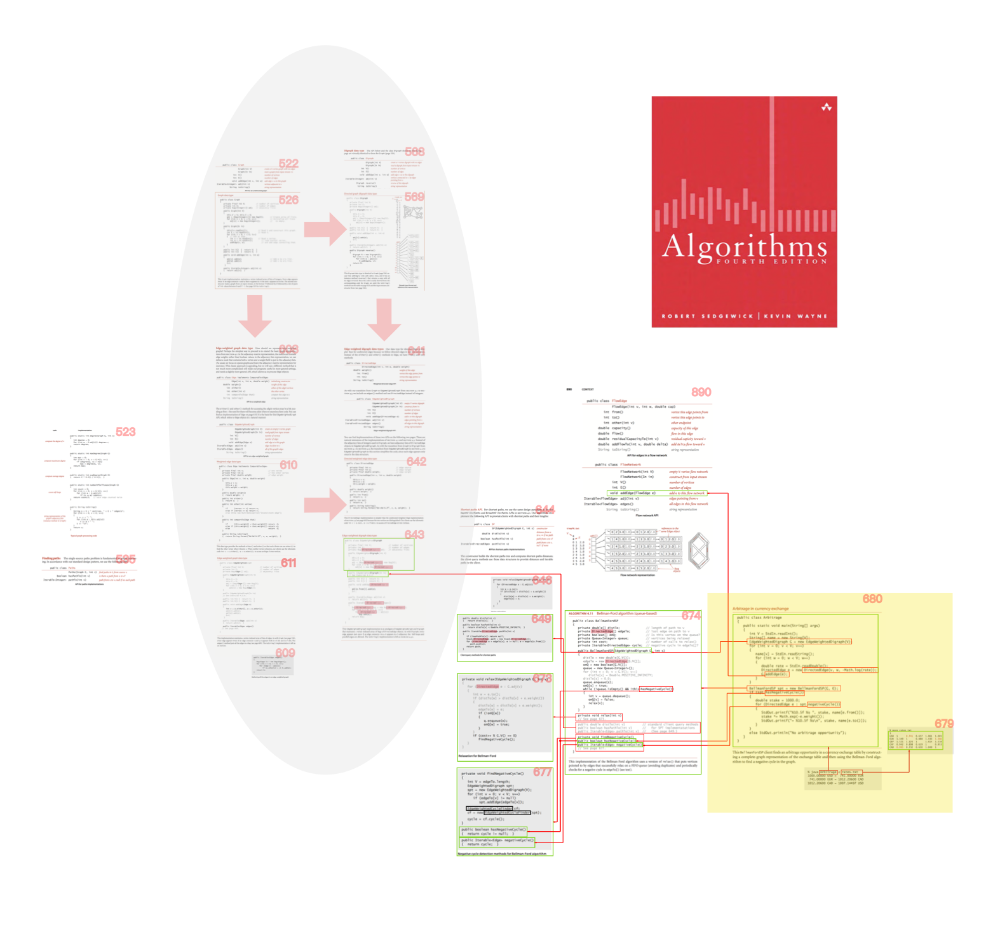

# BFM算法的参考文献有哪些


本章纯理论，适合科研人员和校园人士阅读。

如果您不是上述人士，请大略浏览，仅供日后查找，不适合细读。


## 我们应该查阅什么文献来具体实现BFM算法

### [https://ocw.mit.edu/courses/electrical-engineering-and-computer-science/6-046j-design-and-analysis-of-algorithms-spring-2015/lecture-notes/MIT6\_046JS15\_lec11.pdf](https://ocw.mit.edu/courses/electrical-engineering-and-computer-science/6-046j-design-and-analysis-of-algorithms-spring-2015/lecture-notes/MIT6_046JS15_lec11.pdf)



### [https://ocw.mit.edu/courses/electrical-engineering-and-computer-science/6-046j-design-and-analysis-of-algorithms-spring-2015/lecture-notes/MIT6\_046JS15\_writtenlec11.pdf](https://ocw.mit.edu/courses/electrical-engineering-and-computer-science/6-046j-design-and-analysis-of-algorithms-spring-2015/lecture-notes/MIT6_046JS15_writtenlec11.pdf)



### [https://courses.csail.mit.edu/6.006/spring11/rec/rec15.pdf](https://courses.csail.mit.edu/6.006/spring11/rec/rec15.pdf)



### [https://courses.csail.mit.edu/6.006/spring11/lectures/lec15.pdf](https://docs.google.com/viewerng/viewer?url=https://courses.csail.mit.edu/6.006/spring11/lectures/lec15.pdf)



### [https://courses.csail.mit.edu/6.006/fall11/lectures/lecture17.pdf](https://courses.csail.mit.edu/6.006/fall11/lectures/lecture17.pdf)



### [https://courses.csail.mit.edu/6.046/fall02/handouts.html](https://courses.csail.mit.edu/6.046/fall02/handouts.html)

| 10/30/02 | Handout 19: Problem Set 6 | [PostScript](https://courses.csail.mit.edu/6.046/fall02/handouts/ps6.ps) | [Adobe PDF](https://courses.csail.mit.edu/6.046/fall02/handouts/ps6.pdf) |
| :--- | :--- | :--- | :--- |
| 11/15/02 | Handout 22: Problem Set 6 Solutions | [PostScript](https://courses.csail.mit.edu/6.046/fall02/handouts/ps6sol.ps) | [Adobe PDF](https://courses.csail.mit.edu/6.046/fall02/handouts/ps6sol.pdf) |

### [https://courses.csail.mit.edu/6.046/fall03/handouts.html](https://courses.csail.mit.edu/6.046/fall03/handouts.html)

| 10/31/03 | Handout 19: Problem Set 6 | [PostScript](https://courses.csail.mit.edu/6.046/fall03/handouts/pset6.ps) | [Adobe PDF](https://courses.csail.mit.edu/6.046/fall03/handouts/pset6.pdf) |
| :--- | :--- | :--- | :--- |
| 11/14/03 | Handout 24: Problem Set 6 Solutions | [PostScript](https://courses.csail.mit.edu/6.046/fall03/handouts/pset6-sol.ps) | [Adobe PDF](https://courses.csail.mit.edu/6.046/fall03/handouts/pset6-sol.pdf) |



## 我们应该查阅什么文献来具体应用BFM算法



{% embed url="https://raw.githubusercontent.com/Mcdonoughd/CS2223/master/Books/Algorithhms%204th%20Edition%20by%20Robert%20Sedgewick%2C%20Kevin%20Wayne.pdf" %}

