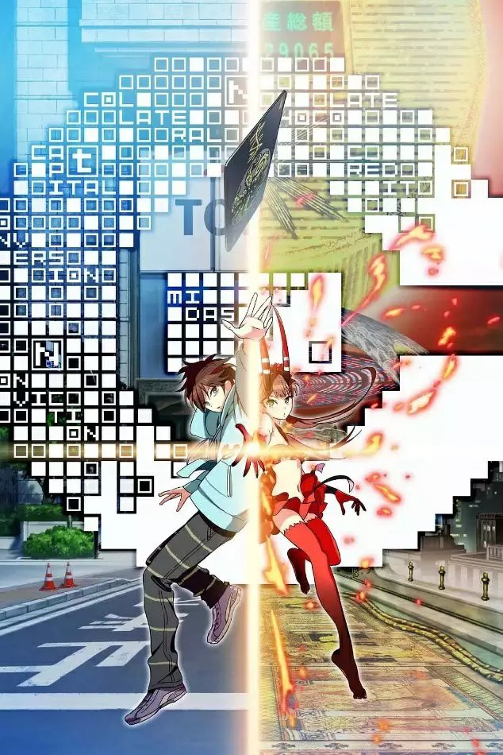

# 【传媒】引起兴趣


本章可能适合 **设计师，ACGN **或** 广告 **行业相关人士。

其他 **商务办公 **人士可以 [**跳过**](https://guhhhhaa.gitbook.io/bfm/bfm-al-ckwx)。


## BFM Unity 的组织性质是什么？

> BFM Unity 在政治，经济和世界范围内均保持中立。 \
> 它是耗散结构集群的去中心化的金融和经济统一体，\
> 由智能算法驱动的微观经济结构的模块化单元的分布式自组织形成。

> BFM Unity is neutral politically, economically and worldwide. \
> It is a decentralized financial and economic continuum of dissipative structure clusters, \
> formed by distributed self-organization of modular units of microeconomic structures driven by intelligent algorithms.

BFM Unity 并不需要新加入的 Unit(s) 公开响应或者认同价值观。

不管基于牟利或其他目的，只要使用 BFM 算法，都是在壮大我们在市场中的力量，所以也就都是 BFM Unity 的一部分。

## 我们使用星杯代表我们的理想

## 我们使用深渊代表我们遇到的困难

## 我们使用印钞机代表我们实现的功能

## 我们使用全视之眼代表三角套利

{% embed url="https://baike.baidu.com/item/%E5%85%A8%E7%9F%A5%E4%B9%8B%E7%9C%BC/8219624" %}

## 我们使用GOC代表多角套利和BFM算法。



## 我们使用塞拉伊诺断章代表两种算法表示



## 我们使用纳克特抄本代表对Algorithhms的汇集

{% embed url="https://baike.baidu.com/item/%E5%A5%88%E5%85%8B%E7%89%B9%E5%9F%8E/3866151" %}

## 我们使用红宝书代表Algorithhms，因为它的封面是红色的

Algorithhms 4th Edition by Robert Sedgewick

{% embed url="https://raw.githubusercontent.com/Mcdonoughd/CS2223/master/Books/Algorithhms%204th%20Edition%20by%20Robert%20Sedgewick%2C%20Kevin%20Wayne.pdf" %}

## 我们使用黑魔书代表Introduction to Algorithms，因为它中文版封面是黑色的

{% embed url="https://edutechlearners.com/download/Introduction_to_algorithms-3rd%20Edition.pdf" %}

