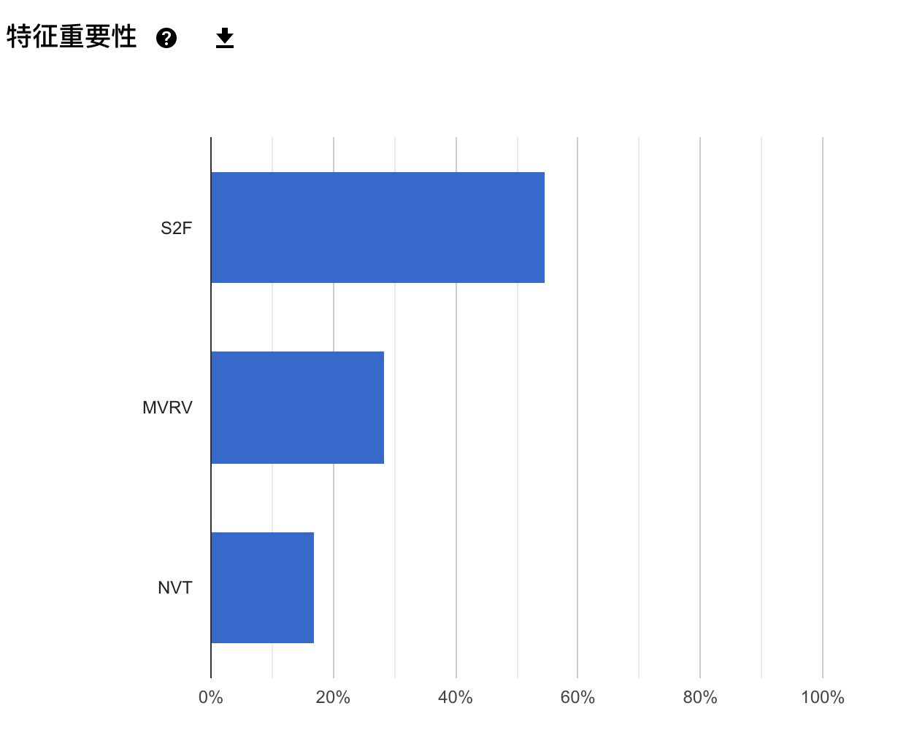

# 人工智能-实验

* [人工智能实践：Tensorflow笔记](https://www.icourse163.org/course/PKU-1002536002?tid=1452937471)🚩
  * 源码下载链接：[https://pan.baidu.com/s/19XC28Hz\_TwnSQeuVifg1UQ](https://pan.baidu.com/s/19XC28Hz_TwnSQeuVifg1UQ) 

    提取码：mocm

  * [https://github.com/guhhhhaa/Artificial-intelligence-combat-tensorflow-notes](https://github.com/guhhhhaa/Artificial-intelligence-combat-tensorflow-notes)















