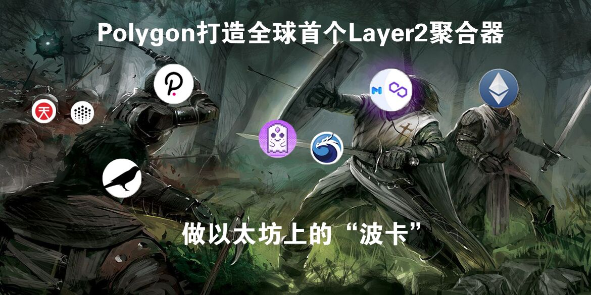
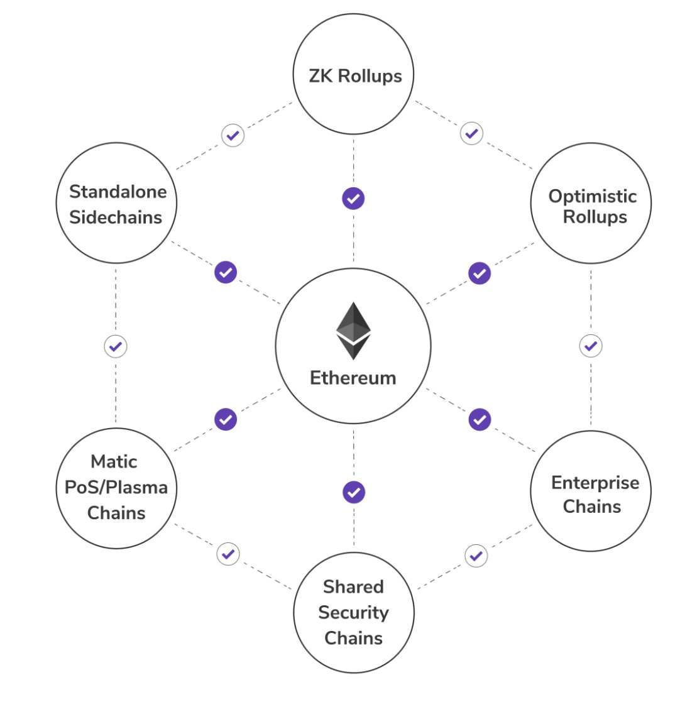

# MATIC - Polygon

## Layer-2 Polygon 操作面板


NOTE: **💀 This project is in beta. Use at your own risk.**

[https://polygon.technology/](https://polygon.technology/)

users must first migrate their digital assets to the Polygon network through the [POS Bridge](https://wallet.matic.network/bridge) or [Zapper Bridge](https://zapper.fi/bridge).

* [**QuickSwap**](https://quickswap.exchange/#/swap) **|** [**QuickSwap Info**](https://info.quickswap.exchange/) **|** [**Bitkeep - Quickswap**](https://bitkeep.org/defi.html) **交易对排名**
* [**DeBank - Polygon**](https://debank.com/projects?chain=matic) **项目排名**
* [**polygon.Uniswap**](https://app.uniswap.org/#/swap?chain=polygon)
* [**polygon.Balancer**](https://polygon.balancer.fi/)
* [**polygon.Curve**](https://polygon.curve.fi/)

[Layer 2使用教程系列一：教你使用几大Layer 2应用](https://www.theblockbeats.com/news/21604)

[Layer 2使用教程系列二：如何使用Matic Network完成资产跨链并进行交易](https://www.theblockbeats.com/news/22403)


