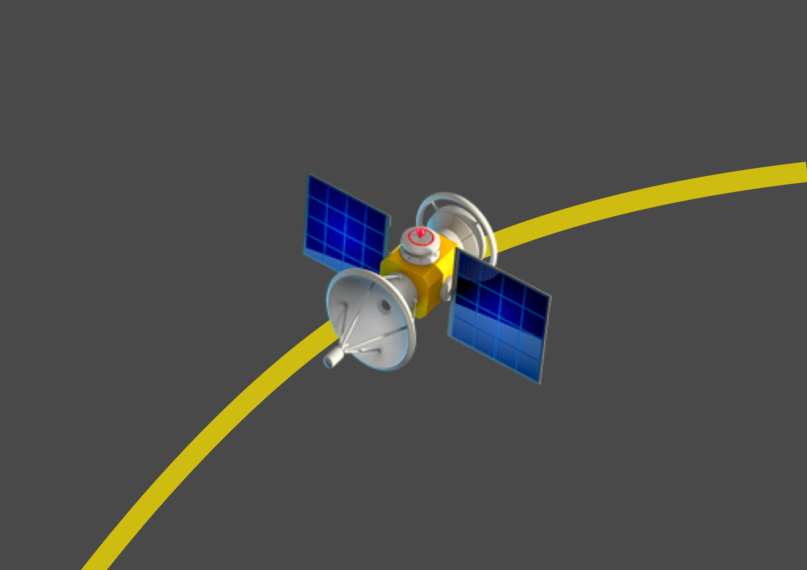
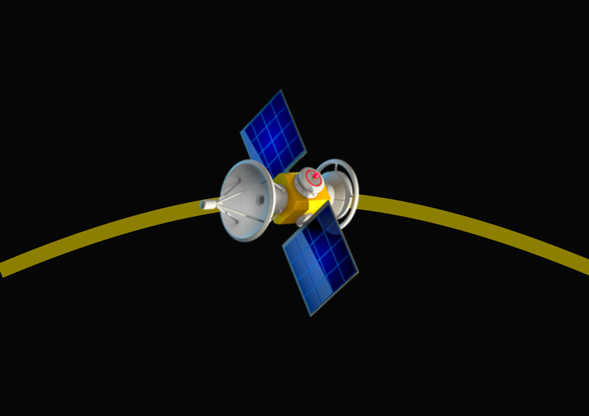

# 🌱 新人必看（🔥）

免责提示

NOTE: **💀 This project is in beta. Use at your own risk.**

NOTE: **💀 Please** [Do Your Own Research (DYOR) - Binance Academy](https://academy.binance.com/zh/glossary/do-your-own-research)

1，本网站所载的资料并不构成投资的意见或建议。

2，在作出任何投资决策前，您应考虑自己的财务状况、投资目标及经验、风险承受能力，及理解相关区块链金融产品的性质和风险。

3，我们的分析和理论，仅供参考，若你相信并依照实行，所面临的风险，须自行承担。

4，我们的分析和方案，仅供参考，若您因此进行投资行为，所面临的损失，须自行承担。

5，我们不对因分析结果，方案模拟，未来预测的变化和准确性做任何投资担保。

## 0 准备工作

### 0.1，科学上网

* 首先你需要科学上网，才能正常访问本网站和大部分币圈网站
* 由于兔国政策不友好，本网站和大部分币圈网站已经屏蔽兔国IP，不对兔国人民提供服务


[ss-v2ray.md](../gong-ju/ss-v2ray.md)


如果你只有一台安卓 Android 手机：\
去 Github 搜 [V2RayNG](https://github.com/2dust/v2rayNG/releases) 找软件，\
去 Github 搜 [freefq](https://github.com/freefq/free) 找免费订阅链接。\
注：国内可以访问 Github。\
然后试试是否能访问 Google Play。

### 0.2，手机安装 Google Play

* 如果手机品牌是华为和小米，建议去拼多多以旧换新 oppo，vivo，华为和小米部分机型由于系统限制。无法适用 Google Play。
* [HiGoPlay 服务框架安装器 - 应用宝- 腾讯](https://sj.qq.com/myapp/detail.htm?apkName=com.higoplayservice.higoplay)，安装 Google Play 后，看看 Google Play 是否闪退，如果闪退，很可能是系统限制，解决方案是换手机品牌。
* 如果不通过 Google Play 渠道下载手机软件，很可能下载到盗版手机软件造成资金损失，因此这一步必须做。
* 或者使用这个网站：[https://apkpure.com/apk-install.html](https://apkpure.com/apk-install.html)

### 0.3，学习区块链知识







## 1，入金（不确定且有风险的年化收益：约50%）

### **交易所**

* [**Binance**](https://www.binance.com/zh-CN)
* [**OKX**](https://www.okx.com/)
* [**MEXC**](https://www.mexc.com/zh-cn)
* [**Gate.io**](https://www.gate.io/zh-cn)
* [**KuCoin**](https://www.kucoin.com/)
* [**Kraken**](https://www.kraken.com/)

### **场外交易**

* \*\*\*\*[**Pexpay**](https://www.pexpay.com/)**（与Binance合作，可互相免手续费划转）**
* [**Paxful**](https://paxful.com/)**（支持礼品卡交易）**
* ~~\*\*\*\*~~[~~**CoinCola**~~](https://www.coincola.com/?lang=zh-CN)**（不再支持CNY交易）**
* ~~\*\*\*\*~~[~~**LocalBitcoins**~~](https://localbitcoins.com/)（停止运行）

## 2，机器人（不确定且有风险的年化收益：约100%）

### 绑定API



[**AntBot**](https://antrade.io/)**（**[**文档**](https://antrade.io/guide/docs/cn)**）**

* **网格**
* **移动网格**
* **双向网格**
* 再平衡（智能调仓）🆓
* 马丁



\*\*\*\*[**币优 - BitUniverse**](https://www.bituniverse.org/zh-CN/index.html)

* **网格** 🆓



### 交易所自带



[**Binance**](https://www.binance.com/zh-CN)\*\*\*\*

* **网格**
  * **现货网格**
  * **合约网格**
* **再平衡(智能持仓)**



[**KuCoin**](https://www.kucoin.com/)\*\*\*\*

* **网格**
  * **现货网格**
  * **合约网格**
* **无限网格**
* **再平衡（智能持仓）**
* **极速定投**



[**Gate.io**](https://www.gate.io/zh-cn)\*\*\*\*

* **网格**
  * **现货网格**
* **无限网格**
* **再平衡（智能调仓）**
* **组合指标**
* **MACD**
* **MACD-RSI**
* **双均线**
* **双均线-RSI**



[**OKX**](https://www.okx.com/)\*\*\*\*

* **网格**
* **再平衡（屯币宝）**
* 马丁



[**派网 - Pionex**](https://www.pionex.cc/zh-CN/sign/ref/NxwM4W0S)**（不推荐）**

* **网格**
* **屯币宝**
* 马丁



### 创建步骤

| 第一步                                                                 | 第二步                                                                        | 第三步                                                                                             | 第四步                                                                                                                                                                                                                                       | 第五步                                               |
| ------------------------------------------------------------------- | -------------------------------------------------------------------------- | ----------------------------------------------------------------------------------------------- | ----------------------------------------------------------------------------------------------------------------------------------------------------------------------------------------------------------------------------------------- | ------------------------------------------------- |
| 火箭发射                                                                | 变轨展开                                                                       | 环绕同步                                                                                            | 空间站组装对接                                                                                                                                                                                                                                   | 湮灭光束                                              |
|  |         |                              |                                                                                                                                                                     | .png>)           |
| <ul><li>定投</li></ul>                                                | <ul><li>单币网格</li><li>单币流动性挖矿</li></ul>                                     | <ul><li>双币网格</li><li>双币流动性挖矿 </li></ul>                                                      | <ul><li>多币动态平衡（市值占比分配）</li></ul>                                                                                                                                                                                                          | <ul><li>做空！</li><li>割韭菜！</li></ul>                |
| <ul><li>USDT ->BTC</li><li>USDT ->ETH</li></ul>               | <ul><li>BTC/USDT</li><li>ETH/USDT</li></ul>                                | <ul><li>ETH/BTC</li><li>MATIC/BNB</li><li>DOGE/SHIB</li></ul><ul><li>PAXG/USDT(黄金/美元)</li></ul> | <ul><li>BTC</li><li>ETH</li><li>BNB</li><li>ADA</li></ul><ul><li>MATIC</li><li>DOGE</li><li>DOT</li><li>SHIB</li></ul><ul><li>AVAX</li><li>ATOM</li><li>LINK</li><li>LDO </li><li>NEAR</li><li>TWT</li><li>ENS</li><li>COCOS</li></ul> | <ul><li>BTC杠杆代币（做空）</li><li>ETH杠杆代币（做空）</li></ul> |
| <ul><li>币安 🆓</li><li>KuCoin 🆓</li></ul>                           | <ul><li>币安+BitUniverse 🆓</li><li>币安+AntBot 🆓</li><li>KuCoin 🆓</li></ul> | <ul><li>币安+BitUniverse 🆓</li><li>KuCoin 🆓</li></ul>                                           | <ul><li>币安+AntBot 🆓</li><li>KuCoin 🆓</li></ul>                                                                                                                                                                                          | <ul><li>币安</li></ul>                              |

## 3，智能投顾相关（不确定且有风险的年化收益：约500%）

1. **智能投顾表格，帮您轻松确定杠杆率，抄底+逃顶**

MVRV+S2F+币圈美林时钟+激活函数神经元确定仓位+帕累托分布+香农的恶魔+山寨币指数+市值占比幂率修正——共同构筑的基于Excel表格的策略！


[the-tzolkin-calendar](../bfm-da-bi-fang-meng-shu-chan/zi-chan-pei-zhi/the-tzolkin-calendar/)


2. **链上数据分析工具集锦**


[lian-shang-shu-ju-fen-xi.md](../bfm-eco.-bi-fang-meng-qu-kuai-sheng-tai/lian-shang-shu-ju-fen-xi.md)


3. **减半，顶部，底部时间预测**


[shi-jian-xiao-zhun-yan-jiu.md](../bfm-da-bi-fang-meng-shu-chan/zi-chan-pei-zhi/shi-jian-xiao-zhun-yan-jiu.md)


## 4，其他交易所 和 DeFi（不确定且有风险的年化收益：未知）


[management-cockpit-operation](management-cockpit-operation/)



[command-room-discovery.md](../bfm-eco.-bi-fang-meng-qu-kuai-sheng-tai/command-room-discovery.md)



[yan-sheng-chan-pin-bu.md](../bfm-dins.-bi-fang-meng-gong-cheng-she-ji-yuan/yan-sheng-chan-pin-bu.md)


## 5，加群讨论


[ru-he-jia-ru-wo-men-de-tao-lun-qun-zu](../bfm-unity-bi-fang-meng-lian-he-ti/ru-he-jia-ru-wo-men-de-tao-lun-qun-zu/)


## 6，新人小白币圈避坑指南



1，如何对付利出一孔，内卷竞争的制度：

* 躺平。
* 不当制度和上位者的舔狗。
* 换赛道。
* 不参与，但是趴在这个赛道上面吸血。
* 把海弄干，釜底抽薪。

2，面对控制你，伤害你，消耗你的父母，老师，亲戚，朋友，学校，银行，政府：

* 不主动，不心软，不负责，不联系。
* 学会拒绝，学会拖延，学会消耗，学会欺骗。

这样做，他们会自动离开你，要将计就计，讲究化劲，接化发，四两拨千斤。

3，面对骚扰你的朋友，或道德绑架你的长辈，或者政府和银行：

* 直接跟他借钱就好了。你找我有事？我现在缺钱你能借我吗？
* 你说你为我好？怎么证明？你直接给我钱啊。
* 你想让我给你打工？你先给我钱啊。
* 我们是平等的，我不是奴隶，我是自由的。
* 你这个事情是自愿的，不是强制的

4，想要与一个朋友断交：

* 只约定借钱的口头协议。
* 然后借钱不还。

5，面对找你借钱的朋友：

* 直接让他办信用卡，或给他推荐银行贷款。
* 如果他依然执意找你借钱，或者说银行不借他，你就说，
  * 你是不是不想还才找我借？
  * 银行都不借你钱我怎么借你？

用一首《孤勇者》送给那些被欺骗，被伤害，被消耗的年轻人：

爱你来自于蛮荒 一生不借谁的光

你将造你的城邦 在废墟之上



币圈和游戏的区别

1，游戏不允许中途切换装备，币圈可以中途换币种。

2，游戏限制装备数量，币圈不限制币种数量。

3，游戏默认所有装备的购买比例是确定的，币圈不限制，可以是任意比例。

4，游戏玩法有限，币圈玩法无限。

5，游戏装备无法带出游戏或者更换平台，币圈可以随意换。

6，游戏用现实金钱购买装备是单向的，只能买不能卖，或者损耗很大，币圈是双向的。

7，游戏禁止外挂，币圈不限制机器人，量化交易。

8，老游戏玩一段时间，就过气了或者下线了，要换新游戏重新玩，币圈老币种不会过气，不会下线。

9，游戏内货币和装备会贬值，币圈有价值的币种都是长期增值的。

10，游戏需要练习游戏技能，而且需要后期投入大量时间，币圈后期几乎不需要投入时间。

原因在于：

游戏是中心化的，是虚拟世界。存在于想象界。

币圈是去中心化的，是与现实的符号经济相关的，是真实的。存在于符号界。



红杉，真格，一生之敌。



不要碰马丁格尔！

不要碰大于2的高杠杆！

不要购买别人的策略，特别是代码型的！

如果某策略手续费敏感，或者严重依靠低手续费，远离！

如果某策略要求你提币提出排名前十交易所，而不是绑定API，远离！

如果某策略以跨交易所套利为理由，向你要求API提币权限，远离！

如果某策略要求天天盯盘技术分析，远离！

如果某策略只涨不跌，远离！

如果某策略提到100ms以下并且严重依赖高频交易，远离！

如果某策略强调自己不可公开，不可复制，不可重复，远离！



不要碰小币种！！！

不要碰期货合约！！！

不要碰小币种期货合约！！！

远离DeFi，GameFi，NFT代币！包括龙头！

远离一切存储项目！

远离一切高TPS项目！

远离一切算法稳定币！

远离GameFi，NFT项目，包括龙头！

别随便把币提离排名10以内交易所！

不要参与Meme代币，狗屎除外。

有人问我什么是主流币，什么是小币，很简单，屎币以上全是主流币，屎币以下全是小币。

记住一句话，你忙活半天，居然他妈的连屎都不如。所以，干就完了，兄弟们。

有人问我什么主流币能投，什么不能投，很简单，流通量超过80%的可以投，流通量80%以下不能投，简单吧？



远离跨链桥！BSC和MATIC除外。

可以参与龙头DeFi项目，不要参与土狗DeFi项目。



严重依靠拉新，远离！

发了超过2个代币，远离！

短期突然有不合理的高收益率，远离！

套娃式锁仓，远离！

流通性不是80%以上，远离！

有预挖或者预分配超过20%，远离！

是貔貅，远离！

有不尊重社区利益的记录，远离！

说高TPS会成为某某杀手，远离！

分叉过，或fork别人的代码，且不是主项目，远离！

有增发，但没有燃烧，回购或销毁机制持续赋能，远离！

治理代币看不出来怎么治理的，或治理不需要燃烧代币持续赋能，远离！

有多签钱包字眼，还标榜自己是去中心化项目的，远离！



元宇宙，赛道崩了！

覆巢之下，焉有完卵？

链游，数藏，元宇宙，以后会成为骗局的代名词。

“你没赚钱是因为不了解”，不要信！赛道错了，了解越多越亏钱。

“你没赚钱是因为投的少”，不要信！投的越多，亏的越多！

“你没赚钱是因为玩的时间短”，不要信！时间越长，套的越深！

“你没赚钱是因为入场晚”，不要信！入场早的都是家人，死全家的那种家人！

“你没赚钱是因为没选头部项目”，不要信！头部项目也亏钱！

“你没赚钱是因为没有复投”，不要信！复投就血本无归了！

“你没赚钱是因为不会做波段，不会高抛低吸。”不要信！永恒熊市，最后崩盘！

“现在抄底下个牛市会赚钱。”不要信，链游是活不到下个区块链牛市的——赛道没了，没人赛跑；覆巢之下，焉有完卵？

以上都是链游，元宇宙，数藏的骗钱手段！

以后链游，元宇宙，数藏，会成为类似P2P或者邮币卡那样的伪概念，人人喊打！

国外的GameFi，NFT，Metaverse，P2E，等等，都是骗局，它们只是低劣的娱乐消费，不可能成为投资选择。

VR，AIGC，现在都是爆死！

元宇宙到底是什么？

庞氏，资金盘，金字塔传销，貔貅，赌博，贬值，流动性丧失，信用缺失……

抽卡，盲盒，抽水，改规则……

廉价劳动力，时间浪费，资金浪费，各种风险……

诸多骗局的集大成之作，就是元宇宙！

玩家和社区，永远都玩不过精算师和项目方。



## 7，0启动资金币圈生存指南

0启动资金，币圈生存指南

0启动资金，爆仓破产后上岸攻略。

1，网申办信用卡

2，准备刷卡工具，刷出来，留10%用来还进刷出

3，弄好科学上网和Google Play

4，进Gate做期现套利

5，收益去KuCoin做量化交易价值投资



如果手机是华为和小米，建议去拼多多以旧换新oppo，vivo，华为和小米部分机型由于系统限制。无法适用Google Play。

[HiGoPlay服务框架安装器 - 应用宝- 腾讯](https://sj.qq.com/myapp/detail.htm?apkName=com.higoplayservice.higoplay)，安装Google Play后，看看Google Play是否闪退，如果闪退，很可能是系统限制，解决方案是换手机品牌。



去 Github 搜 [V2RayNG](https://github.com/2dust/v2rayNG/releases) 找软件，\
去 Github 搜 [freefq](https://github.com/freefq/free) 找免费订阅链接。\
注：国内可以访问 Github。\
然后试试是否能访问 Google Play。



在应用宝搜51信用卡或者云闪付，网申办信用卡。

[51信用卡管家 - 应用宝- 腾讯](https://a.app.qq.com/o/simple.jsp?pkgname=com.zhangdan.app)

[云闪付 - 应用宝- 腾讯](https://sj.qq.com/appdetail/com.unionpay)



推荐的永久方案：去拼多多搜“信用卡提额宝典”，点进去问客服搞个拉卡拉电签机。\
不推荐的暂时方案：去谷歌搜索“无卡支付”，弄个无卡支付手机App。



把信用卡用第2步的工具套出来，留10%用来还进刷出，\
其余进 Gate.io 做期现套利。

[Gate.io - Buy Bitcoin & Crypto - Apps on Google Play](https://play.google.com/store/apps/details?id=com.gateio.gateio\&hl=en\_US\&gl=US)



套利的收益去 KuCoin 做极速定投，单币网格，双币网格，动态再平衡(智能持仓)。

[KuCoin: BTC, Crypto Exchange - Apps on Google Play](https://play.google.com/store/apps/details?id=com.kubi.kucoin\&hl=en\_US\&gl=US)

或者使用[Binance](https://www.binance.com/zh-CN)+[AntBot](https://antrade.io/)


