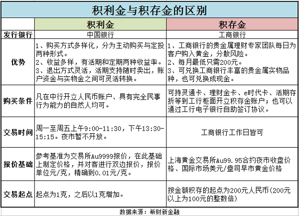

# 黄金投资

从上面的表格我们可以了解积利金与积存金的区别，但是只是一些比较基本的内容。如果从积利金与积存金的本质上分析的话，中国银行积利金更像是股票投资，它的业务起点为1克，投资时购买的是黄金，但是退出时可以在账户资金与实物金之间转换。

而工商银行积存金更像一款普通的理财产品，虽然投资者购入的是积存金这一与黄金市场挂钩的产品，但是投资者本身不需要了解黄金市场，因为工商银行会安排贵金属理财专家团队来购入黄金，买卖交易。

简单来说，购买中国银行积利金，需要投资者本身对贵金属市场有一定认识，因为需要自己根据上海黄金交易所黄金现货的请假来判断。而工商银行的积存金投资者把钱交给工商银行，然后工商银行的贵金属团队来操刀黄金市场的交易，在一定程度上可以分散风险。  

