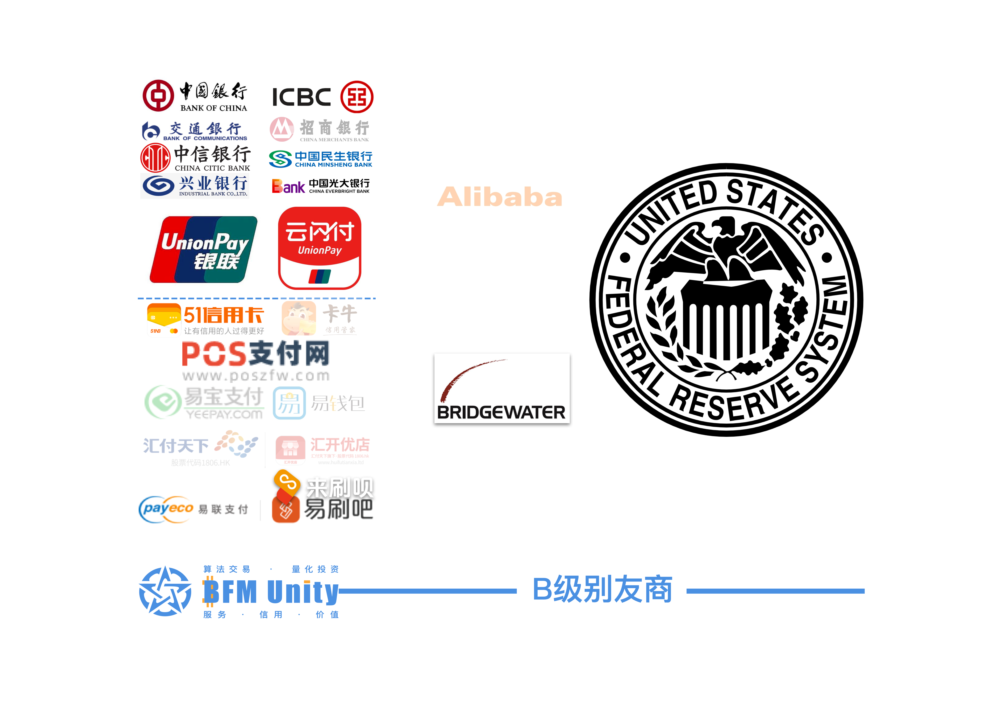
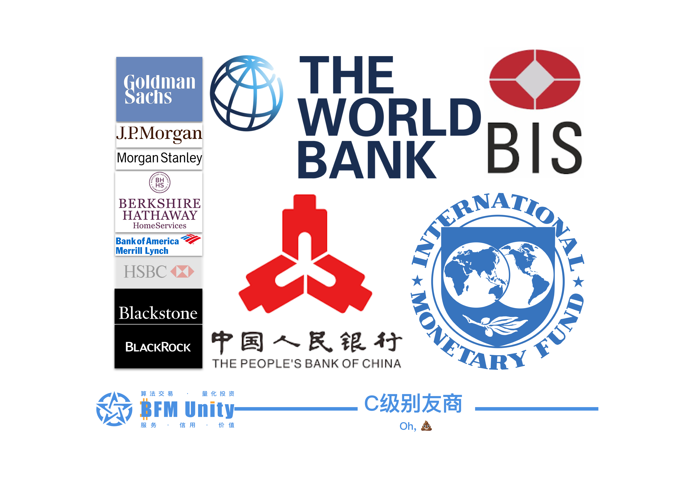
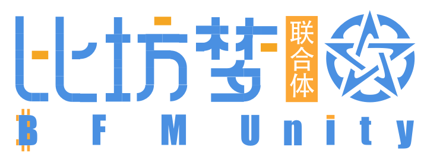

# 主舰桥 (引导)

> ## **比坊梦 —— 区块链 · 金融 · 元宇宙**
>
> **BF​M Unity —— Blockchain · Finance · Metaverse**


NOTE: **This project is in beta. Use at your own risk.**

[**怀念旧版**](https://guhhhhaa.gitbook.io/bfm-unity-doc-v1/) **+ 曾用域名：**[**https://guhhhhaa.gitbook.io/bfm**](https://guhhhhaa.gitbook.io/bfm)

### [赞助](https://www.bfm-unity.com/bfm-da-bi-fang-meng-shu-chan/juan-zeng-da-shang) | [加群](https://www.bfm-unity.com/bfm-unity-bi-fang-meng-lian-he-ti/ru-he-jia-ru-wo-men-de-tao-lun-qun-zu) | [看板](https://trello.com/b/z4aDgNAL/todolist)

### [**系统核心代码**](https://www.bfm-unity.com/bfm-dins.-bi-fang-meng-gong-cheng-she-ji-yuan/ruan-jian-bfm-on-python) | [**投资方法论**](https://guhhhhaa.gitbook.io/joinquant/jin-rong-li-lun-zong-jie) **|** [**设计Assets**](https://share.weiyun.com/l21pilUf)


.png>)

## 交易员必进


[the-tzolkin-calendar](../bfm-da-bi-fang-meng-shu-chan/zi-chan-pei-zhi/the-tzolkin-calendar/)



[the-tzolkin-calendar-0.md](../bfm-da-bi-fang-meng-shu-chan/zi-chan-pei-zhi/the-tzolkin-calendar/the-tzolkin-calendar-0.md)



[lv6-xing-mo-fang-fen-lei](../bfm-dins.-bi-fang-meng-gong-cheng-she-ji-yuan/lv6-xing-mo-fang-fen-lei/)



[management-cockpit-operation](../bfm-da-bi-fang-meng-shu-chan/management-cockpit-operation/)



[zi-chan-pei-zhi](../bfm-da-bi-fang-meng-shu-chan/zi-chan-pei-zhi/)


## 银行客户必进


[lv2-yin-hang](../bfm-da-bi-fang-meng-shu-chan/lv2-yin-hang/)


## 探险家必进


[command-room-discovery.md](../bfm-vc-bi-fang-meng-sheng-tai-feng-tou/command-room-discovery.md)


## 开发者必进


[research-institute-development.md](../bfm-rins.-bi-fang-meng-ke-xue-yan-jiu-yuan/research-institute-development.md)


## 游戏玩家必进


[Broken link](broken-reference)


## 老客户怀旧


[roadmap](roadmap/)



[qun-gong-gao-bei-fen.md](ru-he-jia-ru-wo-men-de-tao-lun-qun-zu/qun-gong-gao-bei-fen.md)


## 慈善家必进


[juan-zeng-da-shang.md](../bfm-da-bi-fang-meng-shu-chan/juan-zeng-da-shang.md)


## ₿TC 投资路径 

## **ΞTH** 生态 

## 世界金融体系 

## 我们的经合关系 

.png>)

[全球最大的50家银行在区块链领域的布局](https://cloud.tencent.com/developer/article/1356837)

### ~~~~[~~我们的友商2~~](https://www.bilibili.com/video/BV1YW411d7ZY)~~~~

## 愿景及使命 

我喜欢坐在 [**SCP-2950**](http://scp-wiki-cn.wikidot.com/scp-2950) 上，看 [**GOC**](http://scp-wiki-cn.wikidot.com/goc-hub-page) 的公告。

（[**愿景及使命1**](https://www.bilibili.com/bangumi/play/ss28381/) **|** [**愿景及使命2**](https://www.dilidili3.com/play/7107-1-1/) **|** [**愿景及使命3**](https://www.dm233.cc/anime/20200054.html) **|** [**愿景及使命4**](https://www.bilibili.com/bangumi/play/ss4098/)）

意识存储器：Bilibili，嘀哩嘀哩，233动漫网，[AgeFans](https://www.agefans.cc)

## ‌核心价值观

### 1.0

> ## [寻找网络终端遗传因子](https://www.dilidili3.com/play/7107-1-1/)

### 2.0

> 算法交易 · 量化投资
>
> #### BFM Unity
>
> 服务 · 信用 · 价值

### 3.0

> 品牌升级，
>
> 由 服务·信用·价值&#x20;
>
> #### 升级为 **金融·科技·智慧**&#x20;
>
> #### 金融：服务·信用·价值&#x20;
>
> #### 科技：算法交易·量化投资·区块链·量子退火&#x20;
>
> #### 智慧：数学·经济学·计算机科学(人工智能)&#x20;
>
> 品牌颜色: 金融:橙黄色&#x20;
>
> 科技:蓝色&#x20;
>
> 智慧:黑色或白色

### 4.0

> ## **比坊梦 —— 区块链 · 金融 · 元宇宙**
>
> **BF​M Unity —— Blockchain · Finance · Metaverse**

## 底部栏‌ 

设计统一色号：[**#**4A90E2](https://www.color-hex.com/color/4a90e2)  [#FCA735](https://www.color-hex.com/color/fca735)

#### ​[BFM Unity](https://www.bfm-unity.com) | [Blockchain(₿itcoin)-Financial-Management Unity](https://www.bfm-unity.com) | [Bellman-Ford-Moore Unity](https://www.bfm-unity.com) |  

#### ****[**比坊梦联合体**](https://www.bfm-unity.com) **|** [**币丰枚联合体**](https://www.bfm-unity.com) **|** [**百分秒联合体**](https://www.bfm-unity.com) 

#### 2020.3.23 - 至今 | [_**管理员入口**_](https://app.gitbook.com/@guhhhhaa/s/bfm/) **|** [**Github 文档地址**](https://github.com/guhhhhaa/bfm-gitbook) **|** [**Github 代码地址**](https://github.com/guhhhhaa/bfm-group-file) **|** [**B站主页**](https://space.bilibili.com/11708778) **|** [**YouTube主页**](https://www.youtube.com/channel/UCfiSjf-6Sxnf0t9J2xGVzuA) **|** [**Reddit论坛**](https://www.reddit.com/r/BFM\_Unity/) **|** [**Telegram群组**](https://t.me/BFMUnity) **|** [**Telegram频道**](https://t.me/BFM\_Unity)**** 

## 域名使用 [腾讯云](https://console.cloud.tencent.com/domain) 购买及续费

## 本项目使用 GNU General Public License v3.0


[gpl-v3.md](../feng-kong-yu-he-gui/gpl-v3.md)


**© 2021.** [**BFM-Unity.com.**](https://www.bfm-unity.com) [**BFM Unity**](https://www.bfm-unity.com)**.** [**比坊梦联合体**](https://www.bfm-unity.com)**. All Rights Reserved.**
