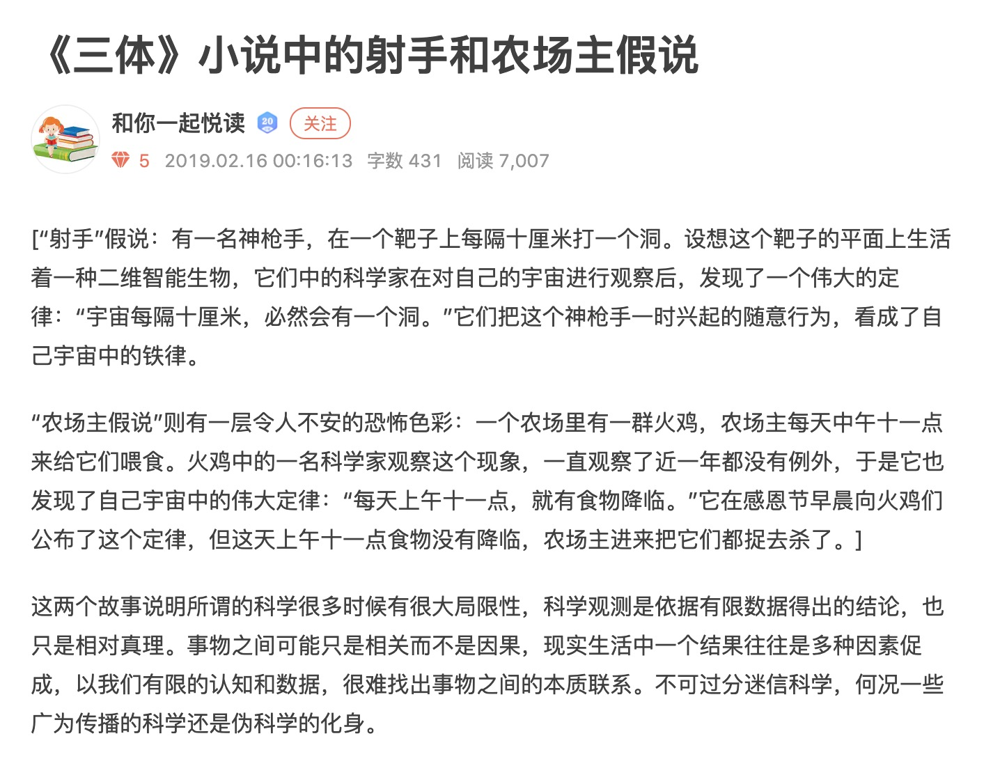

# 卓尔金历法旧版页面


> My clock is paper financial time 我的**时钟**显示账面的**金融时间**
>
> ——[《C》- 岩崎琢](https://music.163.com/#/song?id=22713696)

> 歌者启动了**大眼睛**的进程。
>
> —— 《三体》- 刘慈欣


[zi-chan-pei-zhi.md](../zi-chan-pei-zhi.md)



[yu-zhou-mo-fang-hui-gui-fen-xi.md](../../bfm-rins.-wei-mian-jian-meng-ke-xue-yan-jiu-yuan/shu-ju-zhi-neng-bu/lv6-xing-mo-fang-fen-lei/yu-zhou-mo-fang-hui-gui-fen-xi.md)



Disclaimer: **Any information found on this page is not to be considered as financial advice. You should do your own research before making any decisions.**



### [在线版](https://1drv.ms/x/s!Asrc\_kRox8f-bpKc8fj8SGlNLJc?e=Pb7H2G)

### 最新版下载链接🔗 [飞行船6.12](https://share.weiyun.com/LhAj6uYm)

#### [表格怎么使用？ ](https://www.bilibili.com/video/BV1HU4y1a7Ve)⬅️ 用户指南

#### 含有重要数据下载链接🔗 [卓尔金-智能飞船](https://share.weiyun.com/NrrPpvCw)



#### [教程视频1](https://www.bilibili.com/video/BV1K64y1S7FS) | [教程视频2](https://www.bilibili.com/video/BV16X4y1g7tH/) | [宣传视频1](https://www.bilibili.com/video/BV13x411R7Lf) | [宣传视频2](https://www.bilibili.com/video/BV1zW411D7gJ)



[zhuo-er-jin-li-fa-de-sheng-ji-1-ni-he-han-shu.md](zhuo-er-jin-li-fa-de-sheng-ji-1-ni-he-han-shu.md)



[zhuo-er-jin-li-fa-de-sheng-ji-2-wu-cha-fen-xi.md](zhuo-er-jin-li-fa-de-sheng-ji-2-wu-cha-fen-xi.md)



[zhuo-er-jin-sheng-ji-3-tu-ling-wan-bei.md](zhuo-er-jin-sheng-ji-3-tu-ling-wan-bei.md)



[zhuo-er-jin-sheng-ji-4-dong-tai-tu-biao.md](zhuo-er-jin-sheng-ji-4-dong-tai-tu-biao.md)



[zhuo-er-jin-sheng-ji-5-shen-jing-wang-luo.md](zhuo-er-jin-sheng-ji-5-shen-jing-wang-luo.md)



[zhuo-er-jin-sheng-ji-6-cang-wei-dan-yuan.md](../the-haab-calendar/zhuo-er-jin-sheng-ji-6-cang-wei-dan-yuan.md)



[zhuo-er-jin-sheng-ji-7-yin-li-tou-jing.md](zhuo-er-jin-sheng-ji-7-yin-li-tou-jing.md)



[zhuo-er-jin-sheng-ji-8-huo-bi-zheng-ce.md](zhuo-er-jin-sheng-ji-8-huo-bi-zheng-ce.md)



### 版本记录

#### 经典版 1.0

[卓尔金历法](https://share.weiyun.com/dhfGbd7l) | [卓尔金-探索者号飞船](https://share.weiyun.com/NAsqLyq8)

#### 升级版 2.0 —— 范围更大，考虑情况更多

[卓尔金历法](https://share.weiyun.com/dhfGbd7l) | [卓尔金-探索者号飞船](https://share.weiyun.com/NAsqLyq8)

#### 智能版 3.0 —— 智能函数拟合，更精确，更易调节

[卓尔金-智能原子钟](https://share.weiyun.com/y9kahvvr) | [卓尔金-智能飞船](https://share.weiyun.com/NrrPpvCw)

#### 尊享版 4.0 —— 优化了UI，增加了误差分析功能

[卓尔金飞船](https://share.weiyun.com/5vy0sGcS)

#### 哈布历 4.9 —— 增加了哈布历法

[卓尔金+哈布飞船](https://share.weiyun.com/O2bZwwMx)

#### 哈布历 5.0 —— 微调更新，优化了部分公式，修复了链接型的BUG，优化了UI，添加了LOGO

[卓尔金+哈布飞船(1)](https://share.weiyun.com/kqakKw4y)

#### 哈布历 5.01 —— 增加了与目录间的链接

[卓尔金+哈布飞船5.01](https://share.weiyun.com/miHqj1Ri)

#### 哈布历 5.02 ——

重组了卓尔金历法实验室，以适应更复杂的自动化分析，未来只需要输入参数，不需要像以前那样做实验了；\
增加了卓尔金历法实验室与记录仪和卓尔金历法中参数的的连接，使卓尔金历法更智能；\
增加了卓尔金历法实验室对神经网络中心点的控制，对延展参数的控制正在研究中。

[卓尔金+哈布飞船5.02](https://share.weiyun.com/7rzN1OXD)

#### 哈布历 5.03 —— 微调

[卓尔金+哈布飞船5.03](https://share.weiyun.com/KngDwZPD)

#### 哈布历 5.04 —— 增加了派网驾驶舱，增加了比例换算尺和仓位单元

原驾驶舱更名为币安驾驶舱。

[卓尔金+哈布飞船5.04](https://share.weiyun.com/F5Zb2drW)

#### 引力透镜 5.05 ——

增加了引力透镜，精度提高一倍从0.1至0.05，\
优化了驾驶舱内部的结构，支持了历史极值跟踪和更精确的误差分析。\
（有一点小BUG，因为卓尔金历法中的标尺不准。）

[引力透镜 5.05](https://share.weiyun.com/7fDhamQ4)

#### 货币政策 5.06 ——

增加了货币政策解读（函数生成），修复了“卓尔金历法中的标尺不准“和“记录仪里卓尔金历法的公式没有更新“这两个BUG。

[货币政策 5.06](https://share.weiyun.com/V2IAriMS)

#### 基金管理6.00——

增加了部分备注，优化了UI，提供了基金管理功能。

[基金管理6.00](https://share.weiyun.com/djiMy3na)

#### 基金管理6.01——

修补了部分BUG，更新了参数，优化了UI

[基金管理6.01](https://share.weiyun.com/DthR1zgk)

#### 泰坦6.02——

增加了总指挥室替代原币安驾驶舱的功能，\
更新派网驾驶舱为币圈驾驶舱，增加了杠杆控制表格。

[泰坦6.02](https://share.weiyun.com/m5YzCYl9)

#### 泰坦6.03——

增加了止损熔断器\
更新派网驾驶舱为币圈驾驶舱，增加了杠杆控制表格。

[泰坦6.03](https://share.weiyun.com/MAjvUh6t)

#### 泰坦6.04——

增加了空间站主舰桥，修复了一些BUG

[泰坦6.04](https://share.weiyun.com/BPHPP0iq)

#### 泰坦6.05——

止损熔断器由手动改为自动，修复了一些BUG

[泰坦6.05](https://share.weiyun.com/vc0gZ9cI)

#### 泰坦6.06——

在神经网络页面增加一个安全带以对最大杠杆率进行预警，修复了一些BUG

[泰坦6.06](https://share.weiyun.com/btzpOov6)

#### 泰坦6.07——

扩展支持币种的个数，增加挂载舱个数的设置，增加了对读取MVRV的支持，但没有实际应用，修复了一些BUG

[泰坦6.07](https://share.weiyun.com/SWyfs46Q)

#### 泰坦6.08——

* 扩展了币圈驾驶舱为币圈空间站
* 增加了熔断时的仓位控制模块
* 增加了对读取交易所排名的支持，但没有实际应用
* 修复了一些BUG

[泰坦6.08](https://share.weiyun.com/lWcLhfBg)

#### 飞行船6.09——

* 扩展整合了用户界面
* 修复了一些BUG

[飞行船6.09](https://share.weiyun.com/9XySlLxq)

#### 飞行船6.10——

* 更新了用户界面的显示
* 同时增加了[通过山寨季节指标控制山寨币的仓位占比的模块](zhuo-er-jin-sheng-ji-10-shi-zhan-mi-xiu.md#si)（利用山寨季节指标控制市值占比修正幂率因子，进而控制市值占比修正幂率，进而控制山寨币的仓位占比。）
* 修改了记录仪中资产和负债的显示

[飞行船6.10](https://share.weiyun.com/xInq3ftH)

#### 飞行船6.11——

* 增加了预测SHIB价格的模块，
* 优化了居家服务中利息的计算(按日计息)
* 优化了控制信用卡账单日和还款日的模块
* 优化了记录仪2对记录仪1中的读取算法
* 优化了记录仪1和记录仪2中的资产负债堆积面积图显示。

[飞行船6.11](https://share.weiyun.com/IyoCsgzu)

#### 飞行船6.12——

* 增加了控制感性仓位和直觉仓位的模块
* 优化了记录仪年对记录仪周中的读取算法，在记录仪年中增加了自动生成年报功能
* 优化了UI颜色使其更有科技感，更新了LOGO图片
* 在各个表格中增加了下拉菜单功能，变填空题为选择题，使操作更简便

[飞行船6.12](https://share.weiyun.com/LhAj6uYm)


## **周期发现**


#### [http://www.chidaolian.com/article-45496-1](http://www.chidaolian.com/article-45496-1)

#### 熊市：下跌到顶点的1/5

#### 震荡市：振荡上涨2倍

#### 牛市：减半后，上涨32倍-64倍

熊市做空时。可以买杠杆代币BTCDOWN，并计算好杠杆率。\
震荡行情，网格是用币优做的，BTC/USDT\
牛市做多时。可以用币安的流动性挖矿，做BTC/ETH。

具体软件如下：


[management-cockpit-operation](../../bfm-lite-wei-mian-jian-meng-qing-liang-ban/management-cockpit-operation/)


## 归一化操作


[zhuo-er-jin-sheng-ji-3-zhi-neng-shi-yan.md](zhuo-er-jin-sheng-ji-3-zhi-neng-shi-yan.md)



[shu-xue-li-qi.md](../../bfm-rins.-wei-mian-jian-meng-ke-xue-yan-jiu-yuan/shu-xue-li-qi.md)


数据归一到（-1，1）

```python
定义 a_1, b_1
定义 f_1(), f_2()

f_2() = LN(f_1()/a_1)
        /b_1 
        * 4 
# 因为sigmod函数x取(-4,4)时，y在约(0,1), 所以这里最后*4
# 你也可以*5，大概覆盖增长区间就行

a_1 = 几何平均数(f_1()) 
# 几何平均数：GEOMEAN

b_1 =   算数平均数(极大值(LN(f_1()/a_1),N)
      - 算数平均数(极小值(LN(f_1()/a_1),N)
# 算数平均数：AVERAGE
```

## 回测研究

**横X轴——MVRV——**[**数据来源**](https://www.blockchain.com/charts/mvrv)\*\*\*\*

**纵Y轴——S2F月预测价格/价格——**[**数据来源**](https://www.qkl123.com/data/s2f/btc)\*\*\*\*


## 归纳推理


## **历法**说明

**顺着三角形顺时针运行，**

**红色是牛市，绿色是熊市，蓝色是震荡市。**

**从蓝色到红色，减半开始，此时需要加杠杆，满仓多。**

**顺时针运行 ，落到第一个黑色框，就是牛市顶峰，熊市开始，可以做空。**

**顺时针运行 ，落到第二个黑色框，就是熊市底部，可以入场开网格。**

**就像一个时钟一样，很方便。**

## **与美林时钟的关系**


两个随机变量，才能校准、判断一个周期。

一个随机变量，是无法校准、判断周期的，所以用MACD，BOLL都是没用的。

一个随机变量，单独用MVRV，或者单独用S2F，噪声扰动太大，所以不能单独用，必须二者结合判断。

在比特币，这两个随机变量是MVRV，S2F。

在现实世界，这两个随机变量是GDP，CPI，或者货币，信用。

## 确定仓位

```python
=INDEX(
    神经网络!C26:W46,
    MATCH(
        ROUND(卓尔金历法GPS定位系统!D9,1),
        神经网络!B26:B46,
        0),
    MATCH(
        ROUND(卓尔金历法GPS定位系统!D7,1),
        神经网络!C25:W25,
        0)
    )
```

* [史上最牛查找函数组合Index+Match](https://www.sohu.com/a/334505538\_825825)
* [EXCEL取小数点后一位](https://zhidao.baidu.com/question/27632380.html)

## 模拟神经网络查找表


[zhuo-er-jin-li-fa-de-sheng-ji-1-ni-he-han-shu.md](zhuo-er-jin-li-fa-de-sheng-ji-1-ni-he-han-shu.md)


## 逻辑解释

不要让自己的人性干扰判断，比如说我那个卓尔金历法，

如果你是普通人，按照感性思考，是无法理解价格的指数增长的，所以我用数学的LN()来放弃感性思考。我放弃让自己来思考指数增长，而把指数增长的部分都取LN()来滤除。一个指数增长的数列取LN()之后就变成了线性增长，这样我只需要思考简单的线性增长就行。我通过一系列数学映射，简化了判断。

而且我放弃了思考价格和时间之间的关系，把绝对价格换成相对价格，把衡量绝对时间换成衡量状态，这样一切就都是相对的状态，而不是绝对的价格和时间。

用相对的思维来思考相对的牛熊，这样就容易多了。但是用绝对的思维思考相对的牛熊，就会很难。

相对的思维就是把一切都变成状态机，思考状态之间的切换，比如说我就把问题简化成了一个只有(-1，0，1)这三种状态的状态机。把所有的变量都归一到这三种状态中，然后再思考它们的关系，这样就很容易发现周期规律。

但是一个连续的状态，如何转化成离散的判断呢？如何防止噪声干扰？如何防止频繁买卖？答案很简单，我们电子专业有一个叫(施密特触发器)的元器件，我们利用它的逻辑就可以了。简单地说，它的逻辑，就是达到阈值就切换，没达到阈值就维持原状态。这样就可以避免噪声干扰，实现AD转换了。

在某些人(比如我)的眼里，比特币就是宏观电子，就是宏观的状态机，就是由三种状态，两个随机变量构成的。 就像藏传佛教，宇宙就是由唵啊吽三种状态构成的。 我相信比特币就是宏观的电子，宏观的状态机。

## 局限性

你可以研究过去的几次周期，来拟合这个三角形。

不过既然我给出了研究结果，你再研究一遍，也差不了多少，所以只要会使用就行了。

未来的话，每次达到新的阶段，都需要重新拟合一遍，来适应市场。

而且，如果最坏的情况，就是这个模型失效了，我们也可能会重新修改模型的框架规则。

但是在一个周期内还是不需要修改的，在3个周期，也就是10-12年之内，这个模型会很稳定。10-12年之内，这个模型会很稳定。数据不需要太大的修改。

我们很懒。不需要加班996改这个。

币圈人都知道，我们在一个没有尽头的电梯里，周围是无尽虚空。

我能在黑暗中寻找一丝光亮，我已经尽力了。还是那句话，这里很危险。信则灵，不信则不灵。

我建议你先看一下《三体》，里面有一个假说，射手和农场主假设，这是很可怕的。



但是，我们会因为害怕就放弃寻找规则吗？

如果有人能找到规则，至少比面对无尽虚空更强一点， 至少我找到了一定的规则，很宏大的规则。以3-4年的减半为周期的规则。我希望它能运行的长一点。

我只是选择了几个数据，你认为我是射手和农场主假说那样的情况，也好。

不过，减半行情是比特币自身的性质，这是不受市场上的人类行为的控制的。

所以根据减半规则，推导出的比特币周期是可以站住脚的。

还是那句话，你面对的是无尽虚空，而我是那个拿着火把的玛雅祭司。

你说我提出的卓尔金历法不是科学，我也承认，但是，在美洲的原始部落里，这是最可信的了。

信不信由你，信则灵，不信则不灵。

虽然玛雅文明最后灭亡了，但是历史是轮回的，玛雅文明至少创造了历史。

历史是不可重复性实验，而科学是可重复性实验。

所以，科学无法审判历史；所以，科学无法审判玛雅文明的卓尔金历法。

这是哲学问题，不是科学问题。

我们操控的是宏观电子，玩的是不可重复性实验。面对的是无尽虚空。

我们面对的问题是很危险的，但是我撕开了一个口子。

就算我们是玛雅人，也要在石头上用黑曜石刻下卓尔金历法。

特别是“活人献祭”的金融领域，所谓的科学很可能只是“射手与农场主”假说。

但是我们也不能因噎废食，也要敢于发现规律，创造规律。

金融是什么？金融就是活人献祭。

科学是什么？科学就是历法，根据历法，什么时候举行活人献祭。

其实我们和玛雅文明没区别，我们只是把历法刻在区块链上，而玛雅文明刻在石头上。

但是，我们和玛雅文明面对的都是可怕的无尽虚空，没有必要五十步笑百步。

我就是你们的大祭司，你爱信不信，有时候真的，由不得你不信。

## 相对论视角

卓尔金历法是MVRV和S2F的月均线合并起来的二维图。

这里没有时间，也没有价格。因为时间和价格我都不考虑了，我只考虑相对位置。

对于比特币来说，绝对的现实世界时间和美元价格都不重要，因为比特币有自己的时间（时间戳，区块），自己的价格（聪）。所以它相对美元的价格是由它自己的性质决定的。我只考虑它自己的性质，摒弃了外界条件的干扰。

比特币是一个内部统一的结构，它是靠自己决定它自己价值的，外部的时间和外部的美元对它都不会造成本质的影响。 所以，你不能考虑时间，只能考虑它自己内部的相对状态。这个内部状态就是MVRV，和S2F。我用“相除“提纯了S2F，让它变成了一个没有货币单位的相对值。

用相对值来衡量比特币整个经济系统所处的状态，这样就合理了，也能解释其为什么相对美元的价格周期了——因为它的内部状态发生了变化。 所以我们只要分析MVRV和S2F反映的内部状态，就可以判断所处的周期位置。自然就能预测接下来的行情。

但这个行情，是和下周或者下个月没关系的，因为，比特币的时间是靠“区块高度”衡量的，不是靠（天）（周）（月）衡量的。

所以你在时间价格图上各种画线来预测，是没有卵用的。因为技术指标参考的时间是现实时间，不是（区块高度），所以，既然时间轴都错了，再分析也没有意义，这就是技术指标在比特币上无用的原因。

区块高度和现实时间不是一一对应的，它可以伸长，也可以收缩，全看矿工挖的进度。 是矿工和算力决定了比特币的时间（区块高度），而不是现实时间。

所以，既然技术指标参考的价格是美元价格，参考的时间是现实时间，那么技术指标在分析比特币上卵用没有。

比特币的时间是相对时间，产生的价值是相对价值，所以比特币具有“相对论”性质，而技术指标大多是“经典力学”思维，所以技术指标完全彻底地在比特币上失效，无用！

所以我们分析比特币周期也必须使用相对指标，比如说MV/RV，比如说S2F预测价格/价格。

这样才能使用比特币的“相对论”性质，摆脱现实时间和美元定价体系的“经典力学坐标系”的干扰！

我们必须使用相对论思维来研究比特币。

因为比特币的时间不是现实时间，是区块高度，价值也不是相对美元的价格，是MVRV和S2F决定的强弱体系！

我们必须脱离（现实时间，美元）这个坐标系，进入（区块高度，相对价值）这个坐标系！

否则，我们无法分析比特币。

既然区块链已经离开了地球，为什么还要使用地球的时间和地球的坐标系？

反正判断周期和时间和价格都没有关系。

比特币有自己的价值体系，有自己的时钟系统。 所以外界时间影响不到它的运行。 这就是为什么比特币可以逃过摩尔定律的原因。

所以，我们用现实的美元和现实的时间是干扰不了比特币的……比特币自己有一套自己的经济体系（聪，交易手续费，挖矿成本，减半机制）和时间体系（区块高度，时间戳）。

所以，现实的经济动荡，和比特币是完全脱轨的。

所以，基于现实世界消息面，判断多空，是完全没有用的。 两个连基本法则都脱轨的经济系统，怎么会有干扰？笑话。

## 讨论

能回测出来的东西都不是秘密，不是秘密的东西就是共识，而共识才是最值钱的

回测出的东西=共识+噪声+过拟合。你要做的就是分离提纯出共识，去除噪声和过拟合

我的卓尔金历法由于过于粗糙，过于傻逼， 所以提纯出的理论大部分都是共识。

不要小看共识，就算你认为不是秘密，不会有超额收益， 但是违背共识，也会付出沉重的代价。

**不知道秘密，顶多没有超额收益。 但是不知道共识，可是连平均收益都没有。**

**我认为市场共识占了收益的80%，而秘密和内幕消息只占了收益的20%**

观点，构成了命题的假设和框架。一切命题都是建立在假设上的。然后才是数据分析。 假设很重要，比数据分析更重要

我这个模型已经足够naive了，一般越naive越不容易过拟合

表达观点，强化共识的原因，只是为了防止陷入囚徒困境。

宏观电子是没有量子态的。 一旦宏观了，量子态就很弱了

## 自我，超我，机器智能

人在金融市场拼的是什么？就是拼的自己价值观不会受到金融市场的毁灭和侵蚀。 如果你把你的价值观，委托给相对估值法，委托给电脑机器，那么，你的思维就永远不会受到金融市场的波动的侵蚀，而是一直保持理客中的状态。

做金融这行就是要有自信，要相信你就是比别人优秀，然后你就真的会比别人优秀。

有些人做着做着就被市场侵蚀掉，放弃自尊心，放弃自信心，这是不对的。

只要你把判断委托给机器，你的意识，你的思维模型就永远不会受到市场的侵蚀。

那样你就会解放出来，去搭建去升级你创造出的机器智能。

我就是这么做的。

一定要有超然物外的思维。

如果你不能超然物外，你就依然是那个自己下棋的柯洁，你不依靠机器的智慧，就永远达不到阿法狗的层次。

总结来说，就是

1，思维模型不要被市场侵蚀，要学会让机器（Excel）顶在前面，代替自己的计算和判断。

2，一定要有自信心，要坚持，要执着。要让自己的超我思维模型和机器智能相结合，让这个系统越来越强大。

3，一定要有超然物外的思维，要让自己的超我脱离这个局，让超我做一个局外人去下判断，而自我只是那个负责执行的人。 重要的是，把转瞬即逝的超我的判断，注入机器智能中，固定下来。

你的自我可以去接触市场，可以有喜怒哀乐，可以被市场侵蚀掉，因为你的自我是负责执行的。

但是你的超我一定要独立出来，超我是转瞬即逝的，如果超我坚持不住判断，一定要及时地把超我注入到机器智能之中。这样你的超我就会一直指导自我的判断了。

你要做的是， 1，保留超我的洞察力， 2，保留自我的执行力， 3，由于超我维持的时间很短，要及时把超我注入到机器中固定下来。 4，不要让自我参与判断，而且不要随便放弃你的超我，即使是被固定到机器中的超我，也不能放弃，要把超我不断地发展下去。

## 占卜与赌博

### 玩游戏 > 赌博 > 投资 > 学习 > 做实验

占卜与赌博，是整个世界最核心的东西

占卜，也叫预测，也叫分析

赌博，也叫博弈，也叫决策

当你用数据分析指导决策的时候，实际上你就是在先占卜和后赌博。

| 占卜   | 赌博    |
| ---- | ----- |
| 预测   | 博弈    |
| 分析   | 决策    |
| 唯心主义 | 唯物主义  |
| 结合理论 | 联系实际  |
| 思想   | 执行    |
| 党    | 枪     |
| 政治   | 金融    |
| 科技   | 工程    |
| 教育   | 就业    |
| 文化   | 革命    |
| 艺术   | 宗教    |
| 学习   | 考试    |
| 体检   | 治疗    |
| 超我   | 自我，本我 |
| 顶层设计 | 底层逻辑  |
| 发展战略 | 宏观调控  |
| 上层建筑 | 基础设施  |

综上所述，整个世界都是由占卜和赌博构成的

占卜和赌博，才是世界的本质，宇宙的本源，万物的发源

```python
我已经放弃写科幻小说了，我现在在写现实。
Guhhhhaa  22:35:45
用金钱和代码写作，而不是用文字。
Guhhhhaa  22:36:56
更准确地说，是算法交易和量化投资，还有人工智能和区块链。
Guhhhhaa  22:37:59
你知道的，用文字写作可能不会有太大的影响力，但是用金钱和代码写作，似乎好一点。
Guhhhhaa  22:38:20
我似乎在构造属于我的金融系统。
Guhhhhaa  22:38:42
这可比单纯写故事有意思多了。
低熵流浪者  22:43:17
你读过资本论吗
低熵流浪者  22:44:03
国富论呢
低熵流浪者  22:44:17
曼昆经济学原理呢
Guhhhhaa  22:45:00
我有证券从业资格证和基金从业资格证
低熵流浪者  22:45:31
哦，你是专业人士啊
Guhhhhaa  22:45:52
但是经济学我不懂，我只懂金融学
Guhhhhaa  22:46:14
简单说，就是占卜和赌博嘛。
Guhhhhaa  22:50:28
如果用金融的眼光自上而下地看，这个世界其实很简单的。
Guhhhhaa  22:51:14
就是有时候有点神叨。
Guhhhhaa  22:53:24
因为金融这东西本质上是唯心主义的，而且不可逆，不可重复，不可移植，有的时候，有些东西甚至不能公开。

不像科学，工程，技术，大部分都是可逆，可重复，可移植，可公开的。
Guhhhhaa  22:55:09
我跟你讲有个SCP，叫SCP2950，只是一把椅子。
这个SCP，就是有一定的金融的性质。
Guhhhhaa  22:57:18
你在那个群待了那么久，应该知道我们在研究啥了吧，我们主要是研究比特币的。比特币在很久以前很科幻，现在依然很科幻。
Guhhhhaa  22:58:27
如果你深入进去的话，到现在，应该也能赚不少钱吧。
低熵流浪者  22:58:41
二进制郁金香罢了
低熵流浪者  22:59:12
或许还不如郁金香，起码郁金香是实实在在能摸到的
Guhhhhaa  23:01:35
你看过科幻电影《BLAME!》没有。你看过就会知道，世界末日，未来都市，所有人都在找一种网络终端遗传因子，为了解决机器人失控的问题。

你知道那个网络终端遗传因子是什么吗？就是比特币。
低熵流浪者  23:05:10
我劝你不要拿文艺作品来理解现实
Guhhhhaa  23:05:27
你知道现在科技公司都和比特币深度绑定了吗，就比如说USDT，背后，是美国大型互联网公司的公司债券。
低熵流浪者  23:05:47
你需要读点专业的经济社科的东西
Guhhhhaa  23:07:08
你说的是美联储货币政策宏观经济，还是马克维兹均值方差，还是PE，PB，ROE，还是期权定价呢。
Guhhhhaa  23:08:43
你以为，我不懂比特币的估值吗，

比特币相对估值三大指标，MVRV，S2F，NVT了解一下。
低熵流浪者  23:10:08
那么你知道我之前说的郁金香是什么意思吗
Guhhhhaa  23:11:10
这个词，还不能用来形容比特币。
低熵流浪者  23:11:12
你知道阶级，剩余价值理论，资本剥削，理性经济人假设，纳什均衡吗
Guhhhhaa  23:11:41
知道。但是，赌博的时候基本用不上。
低熵流浪者  23:12:41
既然你数学好，那么在数学上赌博是多么的不靠谱你也应该知道吧
Guhhhhaa  23:13:35
既然你觉得那些玩意有用，

那你觉得，真空中的球形鸡，能指导土木工程吗？
低熵流浪者  23:14:32
所以你承认自己就是个抛弃理性思维，盲目地笃信自己能赌赢的赌徒咯？
低熵流浪者  23:15:24
那我觉得比特币太复杂了，建议直接去澳门赌场梭哈
Guhhhhaa  23:15:52
那可不一样。
Guhhhhaa  23:16:39
你觉得吃饭和吃屎能混为一谈吗？
Guhhhhaa  23:17:42
赌比特币，是吃饭，而赌场，是吃屎。前者有概率上的营养，后者没有。
低熵流浪者  23:18:09
什么叫概率上的营养
Guhhhhaa  23:18:35
就是，期望为正的赌博。
Guhhhhaa  23:19:01
赌场里，期望可都是负的。
低熵流浪者  23:19:08
赌博不存在期望为正
Guhhhhaa  23:19:08
所以说，不一样。
低熵流浪者  23:19:44
你这等于说一个活着的死人
低熵流浪者  23:19:50
逻辑矛盾
Guhhhhaa  23:20:33
世界并不是非黑即白的，大部分都是灰色的。
低熵流浪者  23:21:22
所以你指着灰色的赌博说它一定是白色的？
Guhhhhaa  23:21:41
浅灰色。
Guhhhhaa  23:22:31
只要配比合适，毒药也能变成良药。
低熵流浪者  23:23:10
你有空应该跟那些梭哈比特币被割韭菜的人讲讲你的理论
Guhhhhaa  23:23:42
那我们谈谈科幻吧。
Guhhhhaa  23:24:06
既然你这样反感比特币。我们就不谈了。
低熵流浪者  23:24:18
我没有反感比特币
低熵流浪者  23:24:28
我只是在客观地描述它的性质
Guhhhhaa  23:26:17
那你可以选择纳斯达克指数，不过，纳斯达克指数现在也有很大泡沫。
低熵流浪者  23:27:04
如果你觉得我的客观描述在你眼中就是对比特币的反感，或者说我没有像你一样是一个抛弃理性思维笃信自己一定能赢的赌徒，就是反感比特币的话
Guhhhhaa  23:27:04
纳斯达克指数，就是大部分人看到的，表面的世界，有苹果，微软，谷歌，等等。
低熵流浪者  23:27:29
那你就继续去信吧，我没有理由去干涉你的宗教信仰
Guhhhhaa  23:27:37
那你为什么不去赌纳斯达克指数呢？
低熵流浪者  23:28:17
我不是赌徒
低熵流浪者  23:28:34
我没有坚信自己一定会赢的强大的赌徒心理
低熵流浪者  23:28:52
我屈从于数学和理性
Guhhhhaa  23:29:10
毕竟，这世界上的核心资产，就那么几个，沪深，纳指，标普，比特币，黄金，美债。没了。

你要是不赌的话，法币=厕纸，肯定会通货膨胀的。
Guhhhhaa  23:29:36
还有房地产。不要笑。
Guhhhhaa  23:29:58
真的，现在这个时代，不赌点什么，说不过去吧。
低熵流浪者  23:30:37
所以你知道这都是赌博，也知道自己的赌徒心理是非理性的，但还是要赌，原因就是你觉得不赌会更糟糕？
Guhhhhaa  23:32:39
当然。你知道我们不赌，所有人都不赌，都退出，掀桌了，世界会怎么样吗。
如果没有人赌博，那么大家都得睡大街，而且没有工作。
Guhhhhaa  23:33:14
金融危机，1999年，08年，15年，19年
Guhhhhaa  23:33:31
懂吧，不赌，很可怕的。
低熵流浪者  23:34:24
恰恰相反：这些可怕的后果都是赌博带来的
Guhhhhaa  23:34:56
你们上级的上级，上级的上级，都在做两件事，占卜和赌博，

他们管这个叫顶层设计，发展战略，宏观调控。
Guhhhhaa  23:36:35
如果他们赌输了，一个公司就可能倒闭，一个行业可能会衰亡，甚至一个国家会解体。
Guhhhhaa  23:37:16
你不觉得，这个世界上，总得有人去占卜，去赌博么。
低熵流浪者  23:38:35
我不喜欢赌博
Guhhhhaa  23:41:19
就像苏联，就是因为赌石油赌输了，才解体的。
Guhhhhaa  23:42:58
赌博，和占卜，才是世界的本质。

唯物主义，输给，唯心主义。

A，B，C，D，+，-，0，1，0.25，决定了整个世界。
低熵流浪者  23:44:24
你对唯物主义和唯心主义这两个术语含义并不理解，你误用了这两个词
低熵流浪者  23:44:54
有兴趣的话可以去读一下西方哲学史了解它们的真正含义
Guhhhhaa  23:45:48
这就是，最大的游戏，最大的赌博。全世界都是赌场。
货币，商品，黄金，石油，沪深，标普，纳指，美债，房地产，比特币，一切都是筹码。
这个游戏，你不参与，也得参与。
你不做下棋的人，就只能做棋子？
低熵流浪者  23:46:51
你这么喜欢赌那就去赌吧，我也没权力管你
低熵流浪者  23:47:04
希望你能够赌赢
低熵流浪者  23:47:37
以及，在你赌赢的时候不要忘了你的赢是建立在相应的一个人甚至一群人的赌输之上的
低熵流浪者  23:48:16
从来就没有什么期望为正和浅灰色
Guhhhhaa  23:48:50
没必要把我想的那么黑暗。

我追求的是世界和平，

要不然我的头像早就换了。
低熵流浪者  23:49:25
真追求世界和平你就不应该去赌博
低熵流浪者  23:49:32
更不会喜欢赌博
Guhhhhaa  23:49:42
特图，他是我的偶像，我要达到他的境界，赌到世界和平。
Guhhhhaa  23:50:23
赌博，再不堪，也比战争和政治好一点。
低熵流浪者  23:51:32
战争本就是赌博
Guhhhhaa  23:51:58
这就是金融，总得有人去做这个事。

总得有人做决策，承担责任，划定方向。也就是，赌博。
Guhhhhaa  23:52:37
我只赌有必要的，有把握的。
Guhhhhaa  23:53:14
这是我和那些赌狗不同的。
他们赌的是没必要的，也没把握的。
Guhhhhaa  23:53:35
所以我比他们好一点，我是浅灰色的。
Guhhhhaa  23:54:16
你们其实都在和我合作，不管你们愿不愿意。
```

## 指数，对数，几何平均数，根号市值

只要你能用指数，对数，还有几何平均数，你就可以驾驭比特币。

但是如果你使用累加，累减，算术平均数，那么，你就不能驾驭比特币。

## 鲸鱼洄游

我们是被潮水裹挟着前进，但是我们不能看不清方向。

比特币不是神，它只是一个鲸鱼，它的方向我们可以大概预测出来。

毕竟它只是一个动物，有类似动物的洄游行为。

不要太瞧得起比特币了，它也不过如此。

#### [座头鲸沿直线洄游奥秘：或观星望日定方位](https://www.chinadaily.com.cn/hqgj/2011-04/22/content\_12373180.htm)

#### 背景图片：[https://photo.16pic.com/00/07/97/16pic\_797125\_b.jpg](https://photo.16pic.com/00/07/97/16pic\_797125\_b.jpg)
