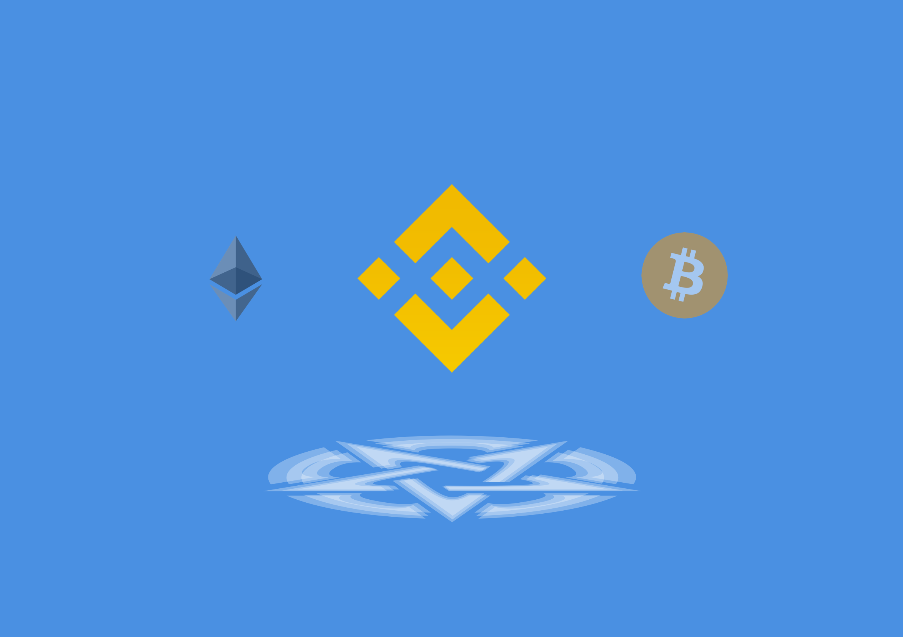

# BNB - BSC


[command-room-discovery.md](command-room-discovery.md)



此页面不是最终版本，正在建设中……



BSC的格局之大，在于构建CeFi与DeFi之间的超级桥梁，媲美甚至超越以太坊。BSC采取的共识协议为PoSA，结合了DPoS和PoA机制的联合功能，建立在21个验证节点的网络上，秒级出块时间能够为DeFi协议建立高速的基础设施。比后期上线的以太坊2.0单纯的POS机制更有先见之明。




如果你是第一次参与 BSC，需要设置 BSC 网络。以小狐狸钱包为例，在 Google 浏览器上打开小狐狸插件，选择自定义 RPC，网络名称填写币安智能链，新的 RPC URL 填写 [https://bsc-dataseed1.binance.org/](https://bsc-dataseed1.binance.org)，链 ID 填写 56，符号填写 BNB，屏蔽管理器 URL 填写 [https://bscscan.com/](https://bscscan.com)（具体设置可以参考这篇 [文档](https://bscscan.freshdesk.com/support/solutions/articles/67000185905-how-to-connect-metamask-to-binance-smart-chain-)）\




[币安桥](https://www.binance.org/cn/bridge)



#### 区块链浏览器：[bscscan](https://bscscan.com) 



**动态数据：**[defistation](https://www.defistation.io)&#x20;



在 BSC 上比较出彩的项目如下：

* 交易、建流动性、基础性挖矿：[Cake](https://pancakeswap.finance) ( [Info](https://pancakeswap.info) )
* 银行赛道：XVS、For、Cream
* 机枪池：Acryptos、[AutoFarm](https://autofarm.network)、Bunny、Beefy
* swap 赛道：Cake、Bake、Burger、Anyswap
* 稳定币赛道：bdolla
* 保险类：Helmet wstoe

其中，Cake 类似 BNB，XVS 类似 AAVE+UNI+MKR，ACS、Auto、Bunny 类似 YFI、Harvest。



## ****[**BSC 开发快速上手指南 (第一版)**](https://obsidianlabs.medium.com/bsc-%E5%BC%80%E5%8F%91%E5%BF%AB%E9%80%9F%E4%B8%8A%E6%89%8B%E6%8C%87%E5%8D%97-7a84efa128ea)**** 



> [https://www.chainnews.com/articles/798797725591.htm](https://www.chainnews.com/articles/798797725591.htm)


现在根据若尘的推荐，重点研究币安智能链，我们会把指挥室分裂出来，分裂出BSC和ETH，然后慢慢扩展我们的部署。

1，[YieldWatch](https://www.yieldwatch.net)

2，[AutoFarm](https://autofarm.network)

3，[PancakeSwap](https://pancakeswap.finance) ( [Pancakeswap Info](https://pancakeswap.info) )

4，[DeFiStation](https://www.defistation.io)

5，[belt.fi](https://belt.fi)

行，从这几个开始研究就行了

在研究明白可持续跨周期的盈利模式之前，还是使用币优和币安自带流动性挖矿。

我们不想研究那些昙花一现的高收益率，我们要找到可持续的，可长期运行的，稳定的盈利模式。

我们最好避开火币的Heco MDEX生态，我一直对火币的信用感到怀疑，因为毕竟火币分裂出的FCoin跑路了

belt.fi，目前综合来看最好的稳定币项目&#x20;

autofarm.network，bsc/heco/polygon链自动复投&#x20;

pancakebunny.finance，锁仓量最大的耕作聚合器&#x20;

dex.guru，dex聚合器（买小币用）&#x20;

然后最近polygon链很火，所以matic回调迅猛




[http://bsc.tokendiy.defiplot.com/#/](http://bsc.tokendiy.defiplot.com/#/)



[https://www.defistation.io/](https://www.defistation.io)

交易赛道 PancakeSwap

机枪池赛道 Autofarm

银行借贷赛道 venus

.png>)

* 交易、建流动性、基础性挖矿：Cake
* 银行赛道：XVS、For、Cream
* 机枪池：Acryptos、Autofarm、Bunny、Beefy
* swap 赛道：Cake、Bake、Burger、Anyswap
* 稳定币赛道：bdolla
* 保险类：Helmet wstoe

[一文纵览币安智能链全景图：DeFi、NFT 等 26 个细分赛道多线发展](https://www.chainnews.com/articles/308959402011.htm)

[玩转火爆的币安智能链：这份入门指南请收好](https://www.chainnews.com/articles/798797725591.htm)

**衍生品**

**去中心化衍生品** 市场在整个 DeFi 生态行业中占据了独特的地位，其未来的规模和发展前景充满想象力，币安智能链生态图谱在衍生品方面主要有 Hedget、Mettalex 以及 Injective Protocol 三个协议。

**Hedget**

[Hedget](https://www.hedget.com) _（HGET）_ 是用于期权交易的去中心化协议。通过提供抵押品，用户可以在区块链上创建和交易不同的期权类型，该协议还增加了对诸如以太坊的现有区块链的第二层支持，以实现更快、更便宜、更复杂的交易。量化交易公司 **Alameda Research** 曾对 Hedget 进行 50 万美元的 [战略投资](https://www.chainnews.com/news/865175811777.htm)，以换取 10 万 HGET 代币。

**Mettalex**

[Mettalex](https://mettalex.com) 由 **Fetch.ai** 提供支持的去中心化平台，用于交易加密货币和商品衍生品，目前正在准备在以太坊和币安智能链上启动主网。

**Injective Protocol**

[Injective Protocol](https://injectiveprotocol.com) 是一款基于以太坊网络，集成了可验证延迟函数 _（VDF）_ ，通过 **流逝时间证明** _（Proof of Elapsed Time）_ 以规避相同区块内的顺序冲突问题来杜绝交易作弊和不良交易的去中心化交易协议。曾在 2018 年获得 Binance Labs 孵化计划的天使投资，后又得到孵化社区 StartX 的生态支持。

_延伸阅读：《_[_链闻精选｜读懂 DeFi 潜力赛道「去中心化衍生品」_](https://www.chainnews.com/articles/235048309955.htm)_》_

**基础设施**

在 DeFi **基础设施** 的生态合作方面，币安智能链主要合作方有 Web3 区块链云基础设施平台 **ANKR** 、币安智能链区块浏览器 **BSCscan** 、智能合约云端开发工具 **ChainIDE** 、「以太坊加油站网络」 **Gas Station Network** 、以太坊智能合约生态系统 **MyWish** 、区块浏览器 **NowNodes** 、结合链外投票和链上治理的治理方案 **Snapshot** 七大协议。

**预言机**

去中心化的预言机网络作为连接区块链和 **链下世界** 的中间件，可以进一步扩展智能合约的应用场景，逐渐成为 DeFi 领域中不可或缺的一部分，目前币安智能链 DeFi 预言机生态中的合作伙伴有 **Band Protocol** 、 **ChainLink** 和 **Sphinx Protocol** 三个协议。

_延伸阅读：《_[_链闻精选好文丨读懂 DeFi 世界价格发现者「去中心化预言机」_](https://www.chainnews.com/articles/396855211142.htm)_》_

**交易 & 流动性**

[**BakerySwap**](https://www.bakeryswap.org) 是币安智能链上的 AMM 去中心化交易平台，Uniswap 下一次迭代。流动性提供商将获得 BAKE 代币奖励，从中可获得 BakerySwap 交易费用的一部分，并可作 BakerySwap 治理的一部分进行投票。

[**BestSwap**](https://bestswap.com) 由 **Roark Fund** 战略投资和孵化的去中心化交易所，产品层面，Bestswap 在币安智能链上的部署目前包 含 3 个部分：基于 AMM 的去中心化交易所 Bestswap，流动性挖矿平台 Best Farm，以及去中心化治理机制 DAO。

[**Bounce Finance**](https://bounce.finance) 是基于以太坊的批量拍卖工具与 Uniswap 协议不同的是，它需要设置每次拍卖的上限以及持续时间，超过上限的资金将会被弹回 _（bounce）_ 给用户。其协议治理代币 BOT，可能会加入拍卖池等功能，以及增加回购销毁模式。

[**bStable.finance**](https://bstable.finance/home/) 是基于币安智能链的开发的稳定币兑换协议，提供低滑点、低手续费且深度可靠的稳定币兑换服务。

[**BurgerSwap**](https://burgerswap.org) 是币安社区开发的首个挖矿项目，基于 **币安智能链** ，SushiSwap 等类似项目的主要缺陷之一是，它们实际上并不关心社区和治理。由于协议创建方式不民主，对流动性提供者的奖励和获得的奖励很少，而且不会改变。BurgerSwap 希望 BURGER 适合所有人，使所有人都能使用 DeFi。

[**DODO**](https://dodoex.io) 是基于 **主动做市商算法** 的下一代链上流动性解决方案，通过接入预言机，可以提供比 Uniswap 低十倍的滑点。另外 DODO 的特性包括只需要提供单一资产做流动性提供者，从而避免无常损失和持仓风险，而且支持首次资产发行以及闪电交换。

[**Equator.Finance**](https://equator.finance) 是通用流动性协议，支持灵活构建自定义资金池以及任何 BEP20 资产之间的建议。

[**Jetfuel**](https://jetfuel.finance) 是在币安智能链上搭建的通缩性流动性挖矿生态系统。

[**PancakeSwap**](https://pancakeswap.finance) 是一个建立在币安智能链上的 BEP-20 去中心化交易平台，利用自动做市商机制提供流通性。

[**Rubic**](https://rubic.finance) 是 DeFi 多链点对点平台，用户能够立即交易代币或按照其条款进行交易，分享并产生收入。

[**Spartan Protocol**](https://spartanprotocol.org) 是币安智能链上首个流动性激励协议。SPARTA 资产将被用作资金池中的流动性资产，同时也可作为抵押品合成代币，这样可以确保其具有很高的流动性，并且可以实时对不安全的头寸进行安全清算。

[**StableXSwap**](https://www.stablex.finance/#/swap) 是由 StableX Labs 在币安智能链上构建的专注于稳定币的 AMM DEX。

[**Tenet**](https://www.tenet.farm) 是 DREP Signal Labs 孵化的 DeFi 产品，专注于打造 DeFi Layer 2 设施的 AMM 连接器。

[**Thugs.Fi**](https://thugs.fi) 项目的愿景是在币安智能链上创建一个功能性和趣味性的代币生态系统，该生态系统围绕着 NFT、游戏和代币技术而建立。

[**UniFi**](https://unifiprotocol.com) 跨链 DeFi 基础设施，是一组非托管的，可互操作的，去中心化的跨链智能合约，旨在为下一代的 DeFi 开发提供基础设施。UniFi 提供了一座桥梁，将基于以太坊的 DeFi 产品的现有经济模型与其他区块链上不断发展的 DeFi 市场联系起来。

[**UniSave**](https://app.unisave.exchange/#/swap) 为 **Y3D Finance** _（Y3D）_ 社区孵化产品，是与 Uniswap 兼容的去中心化交易所协议，相比原版 Uniswap，UniSave 没有协议层面的手续费，但支持将协议中的闲置资产连接到其他 DeFi 聚合器协议中进行挖矿，提高做市收益。

[**Unitrade**](https://unitrade.app) 是基于 Uniswap 的智能交易平台，为用户提供各种 Uniswap 不具备的交易工具，包括：实时订单簿、实时深度图、成交历史、K 线指标、限价委托等功能。

**信用 & 借贷**

[**7up.Finance**](https://7up.finance/#/) 是一个基于币安智能链的去中心化 Filecoin _（FIL）_ 借贷和投资平台。

[**CokeFinance**](https://cokefinance.com/#/) 是一个基于币安智能链的开源 AMM 借贷协议，引入做市凭证 _（LP Tokens）_ 抵押即挖矿机制。

[**Cream.finance**](https://cream.finance) 是基于智能合约的开放式包容性金融系统，将推动新兴财务系统的边界，使其尽可能安全地包含尽可能多的用户和资产，其将首先在币安智能链上通过算法货币市场协议启动。

[**ForTube**](https://www.for.tube/home) 是原力协议推出的 DeFi 借贷平台。ForTube 基于智能合约和自动化算法技术，用户可以存币获得利息，抵押借币支付利息。ForTube 的利率由市场供需决定，资产由用户掌握，支持随存随取、随借随还。

[**Venus**](https://venus.io) 是一种基于算法的货币市场系统，旨在将基于去中心化金融的借贷体系引入币安智能链，也是币安新币挖矿上线的第四个项目。

_延伸阅读：《_[_全景式解读加密货币借贷市场挑战、趋势及行业影响_](https://www.chainnews.com/articles/682616127727.htm)_》_

**收益 & 聚合器**

[**Bearn.fi**](https://bearn.fi) 是跨链产品，其核心提供收益链生成，赌场和游戏聚合、桥接、资金管理和多链治理。

[**BeefyFinance**](https://beefy.finance) 和 [**Pancakebunny**](https://pancakebunny.finance/farm) 是基于币安智能链的收益聚合器。

[**Defi.money**](https://dfi.money/#/) _（YFII）_ 是专注于为用户提供 DeFi **聚合理财** 服务的平台。YFII 从众多 DeFi 流动性挖矿产品中，据年化收益率、安全系数、理财周期等因素，自动选择和配置最符合广大用户利益的产品。

[**Dego**](https://dego.finance) 是 DeFi 世界的乐高，采用模块化设计，融入产品各种元素的组合，以形成具有特定功能的子系统，将模块结合在一起，以创建具有多种功能的新系统、多元化的投资组合，并为用户带来可观的财务回报。

[**dForce**](https://dforce.network) 是基于区块链的去中心化金融 DeFi 和货币协议平台，为 DeFi 和开放式金融应用程序提供底层基础设施。

[**fry.world**](https://fry.world) 是币安智能链上的收益聚合器，可通过购买 BEP-20 代币，在限定时间内获得 FRIES。

[**OpenOcean**](https://openocean.finance) 是一个全聚合协议，可以通过智能算法结合机器学习，可为用户在不同的 DEX 和 CEX 上在进行价格对比后找到支持最优价格和最低滑点的路径，并进行一站式交易。

[**Reef.finance**](https://reef.finance) 是一个基于波卡的多链智能收益引擎和流动性聚合器。

[**Xend Finance**](https://xend.finance) 建立在币安智能链上，寻求在 DeFi 中引入「信用合作社」的观念。

_延伸阅读：《_[_链闻精选好文｜读懂风头渐盛的 DeFi 聚合器_](https://www.chainnews.com/articles/608336653882.htm)_》_

**数据分析 & 可视化**

[**BitQuery**](https://bitquery.io) 此前叫 Bloxy，正在构建一个区块链数据引擎，通过该引擎可以轻松访问多个区块链的数据。

[**BSC.NEWS**](https://www.bsc.news) 提供币安智能链相关的 DeFi 最新新闻、功能和分析类新闻报道。

[**CoinMarketCap**](https://coinmarketcap.com) 是加密数字市场信息平台，包括市值、排行等全面的数据信息。散户浏览排名前列的加密货币行情和市场数据的首选。大量媒体也喜欢引用该网站关于加密货币的报价。访问量巨大，甚至可以影响到市场行情。

[**DApp.com**](https://www.dapp.com) 是 DApp 分发平台，为包括以太坊、EOS、Tron、Steem、Tomochain、 IOST 、Blockstack 等多条公链中的超过 2,200 个应用提供展示分发及数据分析，其目标是构建数据驱动的区块链应用生态框架，让用户无门槛地发掘、使用所有去中心化应用。

[**Dapp.review**](https://dapp.review) 是专注于区块链的应用生态平台，目前已经收录了 15 条区块链总计超过 5000 个应用。

[**DAppRader**](https://dappradar.com) 向开发者和用户提供便利的应用市场数据追踪服务，包括基于以太坊、EOS 的 DApp 数据信息，和直观展示整个 DApp 生态系统的市场数据、统计数据图表和分析见解。

[**DefiStation**](https://www.defistation.io) 是 DeFi 排行与分析网站，针对在币安智能链上构建和运营的去中心化金融项目，实时跟踪锁定在链上的 DeFi 总市值，深入了解去中心化金融的增长趋势和动向。该项目由 Cosmostation 开发和维护，由币安资助。

[**PARSIQ**](https://www.parsiq.net) 是一个区块链监控和自动化工作平台，可以充当区块链和脱链应用程序之间的多层桥梁。PARSIQ 的功能可自动执行区块链分析和监控流程，并提供具有实时智能的可自定义工作流程。

**跨链**

[**AnySwap**](https://anyswap.exchange/dashboard) 是跨链数字资产交易协议，基于 Fusion DCRM 技术，具有自动定价和流动性系统。

[**Binance Bridge**](https://www.binance.org/cn/bridge) 是一项跨链桥接服务，旨在提高不同区块链之间的互操作性。从本质上讲，它允许任何人将选定的代币转换为 Wrapped 的形式代币 _（或「挂钩代币」）_ 以在 Binance Chain 和 Binance Smart Chain 上使用。

[**JellySwap**](https://jelly.market) 是支持跨链交换的去中心化应用程序，允许在不同网络之间进行价值转移。

[**NerveNetwork**](https://nerve.network) 是一个去中心化的数字资产服务网络，它基于 NULS 微服务框架，使用 NULSChainBox _（链工厂的底层）_ 开发搭建的区块链跨链交互协议。

[**PolyNetwork**](https://www.poly.network) 是一个跨链互操作性协议，旨在连接当前已存在的各条异构区块链 _(公有链、联盟链、私有链)_ ，可实现异构链间的任意信息跨链 _（不仅是资产跨链）_ ，最终实现跨链信息的事务一致性。

[**RenVM**](https://renproject.io) 是拜占庭错误 _（BFT）_ 网络，可实现区块链之间的通用互操作性。通过将共识与安全的多方计算 _（MPC）_ 算法相结合，RenVM 可以实例化一个去中心化、无需许可和无需信任的托管人，该托管人可以将资产锁定在一条链上，并以一对一的方式固定资产其他链上。
