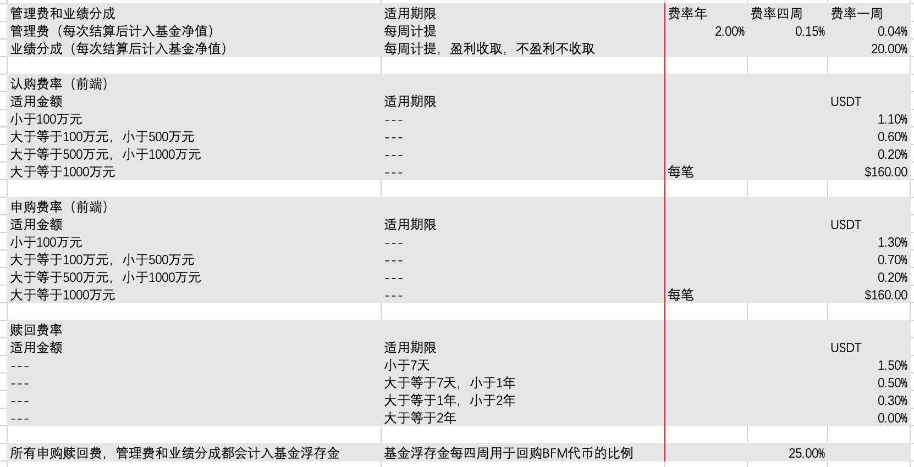

# 比坊梦基金会

> **比坊梦基金会**
>
> **BFM Foundation**

比坊梦基金会提供资产管理服务。


### [基金管理6.00](https://share.weiyun.com/djiMy3na)


### 基金已经成功在 Polygon 网络上发行，大家可以购买。





## 1，我能做什么:

帮您做资产管理。 

## 2，我怎么做:

把你的钱放在我的币安和派网账号上，只投BTC/ETH和USDT/DAI 流动性挖矿

## 3，怎么担保:

没有担保，一切靠我的个人信誉。 

#### 和其他人不同的是，我会在基金停运或破产清算后，统一打款。

为了保留长期价值，基金停运或基金破产清算后，统一以BTC，ETH或DOGE结算。所以请提供1+3个地址，1个申购赎回USDT地址，3个冷的破产清算的BTC/ETH/DOGE地址。至于打什么币种，看你的资产规模，大额BTC，小额DOGE

## 4，怎么收费:

收费包括：

**管理费**：总金额的年2%\(盈利不盈利都收取，每四周计提，按当月\(每月以每四周计\)是否盈利判断，计入基金净值\)（每年按365天计算，每四周提取按2%/365\*7\*4计算）  
+业绩分成**：**正收益的20%\(盈利收取，不盈利不收取，每四周计提，按当月\(每月以每四周计\)基金净值是否增加判断，计入基金净值\)

  
+**申购赎回费**  
      申购费和赎回费在结构上和[广发纳斯达克指数100A](http://fundf10.eastmoney.com/jjfl_270042.html)相同，在金额上是同期[广发纳斯达克指数100A](http://fundf10.eastmoney.com/jjfl_270042.html)的2倍（无优惠）。  
      申购费和赎回费计入基金剩余财产，归基金持有人所有。  
+**BNB收益**，流动性挖矿挖出的BNB都归基金管理人作为交易手续费抵补。  
  
**重点：所有费用的50%会用于回购BFM代币，每季度一次，所以可能会造成BFM代币的拉盘。**

群主会将大部分收入重新投入基金，和你们是平等的，只会在份额数量上加入群主的份额数量而已，唯一不同的是，群主不对自己的份额收费。

## 5，多少钱起投:

只接受USDT，你要是投BTC我不敢收，因为谁也没法跑赢BTC。 

申购是USDT申购，赎回是USDT赎回，只支持币安转账支付。

用EXCEL表格记录，单次申购金额不少于20000 USDT，单笔赎回金额不少于2000 USDT。

金额精确到小数点后2位，份额精确到小数点后8位。

以记录到EXCEL表格上的数据为准。

## 6，策略里有没有做空:

有做空，最大杠杆为1倍，使用BTCDOWN杠杆代币实现，不喜欢做空可以不投。 

## 7，什么策略:

策略是公开的，就是客观的卓尔金历法，加上一点主观判断，不过主观判断很少。



## 8，申购和赎回费怎么收取:

参考[广发纳斯达克指数A](http://fundf10.eastmoney.com/jjfl_270042.html)，是[广发纳斯达克100指数A](http://fundf10.eastmoney.com/jjfl_270042.html)的两倍。期限和费率都参考[广发纳斯达克指数A](http://fundf10.eastmoney.com/jjfl_270042.html)，不过不能保证，因为我可能睡懒觉。

基金认购期有费率优惠，管理费可以降到1%，不过收益分成还是10%。如果是申购期，管理费就是5%了，按照份额计算。

金额申购，份额赎回。管理费按份额计算，分成按照金额计算。 

### 8.1，如何计算份额：

最开始，募集期\(认购期\)2000USDT一份，募集期不参与BTC/ETH，收到钱全部投入USDT/DAI

募集期结束之后，每周周日用总金额/份数计算基金净值，用申购金额除以基金净值得到基金份数。

## 9，你会用你自己的币安账号吗？ :

不会，我自己的币安账号是1207866211，而资产管理账号会使用这个3146741560，都是qq邮箱。 

## 10，你怎么记录谁申购赎回了多少: 

申购是USDT申购，赎回是USDT赎回，只支持币安转账支付。

用EXCEL表格记录，单次申购不少于20000USDT，单笔赎回不少于2000USDT。金额精确到小数点后2位 。

## 11，年化，夏普，回撤这些数据？

最大回撤可能达到50%，最大收益可能达到6400% 

## 12，基金开户需要提供几个地址？:

### 12.1，申购赎回地址（你的币安地址） 

### 12.2，基金停运或破产清算后，统一打款地址（必须是你的保留50年以上长期固定地址，如Trust Wallet地址）。 

为了保留长期价值，基金停运或基金破产清算后，统一以BTC，ETH或DOGE结算。所以请提供1+3个地址，1个申购赎回USDT地址，3个冷的破产清算的BTC/ETH/DOGE地址。

## 13，基金运营结构

为了逃避监管，目前所有基金份额只支持USDT申购赎回。暂时不开放人民币直接申赎。使用的交易所暂时定为派网和币安，申赎会直接打到币安地址。

币安作为中转站地址，链接到：

1，对冲基金交易工具核心——派网Pionex， 

2，手续费浮存金支持的平台币价值管理核心——PancakeSwap

## 14，基金运作周期

每周开放一次申赎，

每周一到周五开放预约申赎，

周六整理名单，

周日上午调仓核算，下午结算申赎，公布基金净值，并在油管发布宏观经济货币政策。

## 15，基金代币经济模型与治理

我准备选择一种，就是开放式和封闭式相结合的方式，准备再发行一个代币。 这样你们买完基金之后就能拿这个代币去交易了，一个代币就是一个基金份额。 

但是这个代币是代表客户的基金份额，和我们组织的代币是不一样的。 

封闭式基金就是发行代币；开放式基金就是不发行代币，我自己结算。我正在研究这两种方式的区别。 

因为发行代币的话，就可以融入DeFi了，所以，我觉得这样很不错。为了提高我们的兼容性，我还是考虑发行基金份额代币。由于对PancakeSwap的运作机制不是很了解，因此，我这边还是选择手动申赎的方式。

我的权利只有三个，

1，决定什么时候支取浮存金和分红，

2，发起投票，修改基金的各项费率。

3，使用分红获得的BFM代币。赠送给别人，支持下一步开发，或者直接砸盘。 

一个被动就是，我的申购赎回手续费都是不交的。

修改基金各项费率，的投票权重，是通过你持有基金份额或者BFM代币的市场价值决定的，而且我保留否决权。 目前的治理模式是双轨制，持有基金份额和BFM代币都可以参与治理。

我保留一个权利，我可以决定浮存金是否被支取或者分红。但是，我为了制约我的权利，我支取的时候，必须先分红再支取。分红就是买入BFM代币，支取就是直接计入我的下一次基金份额。我分红的时候，我买入的BFM代币我自己是会保留的。 

| BTC/ETH | DeFi | BTC/ETH/DeFi | NFT | Metaverse/NFT |
| :--- | :--- | :--- | :--- | :--- |
| 币安流动性挖矿 | [DeFi++](https://app.zerion.io/invest/asset/DEFI%2B%2B-0x8d1ce361eb68e9e05573443c407d4a3bed23b033) | [BCP](https://app.zerion.io/invest/asset/BCP-0xe4f726adc8e89c6a6017f01eada77865db22da14) | [NFTX](https://app.zerion.io/invest/asset/NFTX-0x87d73e916d7057945c9bcd8cdd94e42a6f47f776) | [MVI](https://app.zerion.io/invest/asset/MVI-0x72e364f2abdc788b7e918bc238b21f109cd634d7) |
| [Uniswap WBTC/ETH Pool](https://app.zerion.io/invest/asset/UNI-V2-0xbb2b8038a1640196fbe3e38816f3e67cba72d940) | [DPI](https://app.zerion.io/invest/asset/DPI-0x1494ca1f11d487c2bbe4543e90080aeba4ba3c2b) |  | [$PLAY](https://app.zerion.io/invest/asset/PLAY-0x33e18a092a93ff21ad04746c7da12e35d34dc7c4) |  |
|  | [YPIE](https://app.zerion.io/invest/asset/YPIE-0x17525e4f4af59fbc29551bc4ece6ab60ed49ce31) |  |  |  |

