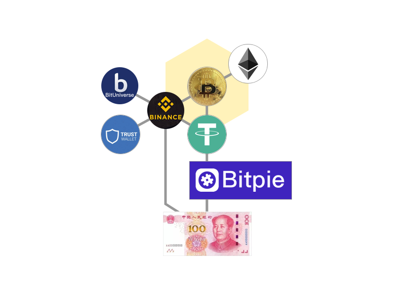
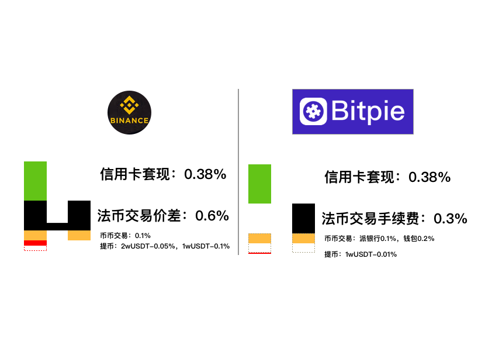
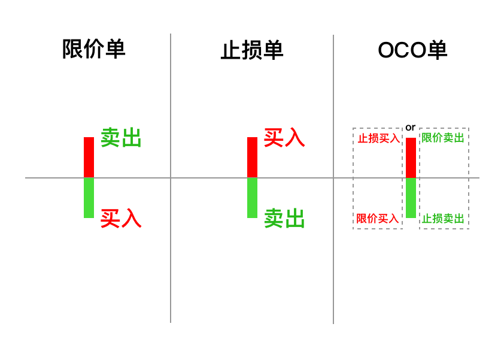
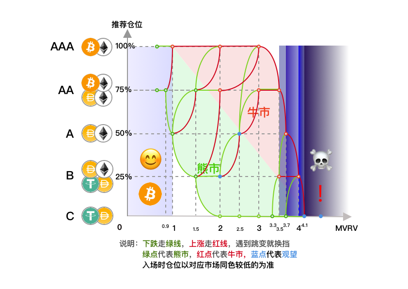
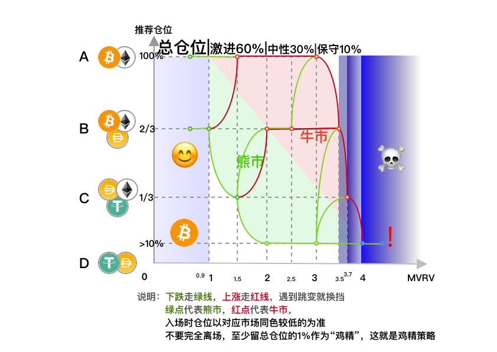

# 指挥室 \(探索\) 👔





## 传统区块链



* [**QKL123**](https://www.qkl123.com/data) **\(比特币数据\)**
* \*\*\*\*[**the Block**](https://www.theblockcrypto.com/data/) **\(数据网站\)**
* \*\*\*\*[**AssetDash**](https://assetdash.com/?all=true) **\(市值比较\)**
* [**BlockSite**](https://www.blocksite.org/) **\(项目介绍\)**
* \*\*\*\*[**巴比特**](https://www.8btc.com/) **&** [**链闻**](https://www.chainnews.com/) **\(新闻消息\)**
* \*\*\*\*[**CoinMarketCap**](https://coinmarketcap.com/) **\(**[**CMC DeFi**](https://coinmarketcap.com/defi/)**\) \(**[**CMC Farming**](https://coinmarketcap.com/yield-farming/)**\)**
* \*\*\*\*[**CoinGecko**](https://www.coingecko.com/zh/)\*\*\*\*
* \*\*\*\*[**其他区块链数据分析网站**](https://medium.com/@chainnews/%E9%80%81%E4%BD%A0-22-%E4%B8%AA%E9%93%BE%E4%B8%8A%E6%95%B0%E6%8D%AE%E8%B5%84%E6%BA%90%E4%B8%8E%E5%8F%AF%E8%A7%86%E5%8C%96%E5%88%A9%E5%99%A8-%E6%B4%9E%E7%A9%BF%E5%8A%A0%E5%AF%86%E6%8A%95%E8%B5%84%E9%87%8D%E9%87%8D%E8%BF%B7%E9%9B%BE-b57f5b4b5727)\*\*\*\*
* \*\*\*\*[**Gas费**](https://gasnow.sparkpool.com/)\*\*\*\*
* \*\*\*\*[**Block123**](https://www.block123.com/zh-hans/) **\(导航网站\)**



* \*\*\*\*[**好站点 - 云算力**](https://www.hzd.com/hashrate) ****
* \*\*\*\*[**Block123 - 云算力**](https://www.block123.com/zh-hant/c/016707973922.htm?tid=78)\*\*\*\*
* \*\*\*\*[**挖矿入门教程**](https://www.hzd.com/course)

**\(仅供参考，不构成本网站意见\)**




* [**比特派钱包**](https://bitpie.com/)（**推荐**）

* \*\*\*\*[**币安**](https://www.binance.com/cn) **（需要交提币手续费）**





* [**TrustWallet**](https://trustwallet.com/)**（**[BIP44](https://learnblockchain.cn/2018/09/28/hdwallet/)钱包**）**
* [**比特派钱包**](https://bitpie.com/)**（**非[BIP44](https://learnblockchain.cn/2018/09/28/hdwallet/)，可添加[BIP44](https://learnblockchain.cn/2018/09/28/hdwallet/)，支持法币交易）
* [**BitKeep**](https://bitkeep.org/)（[BIP44](https://learnblockchain.cn/2018/09/28/hdwallet/)钱包，对DeFi支持较好）
* [**TokenPocket**](https://www.tokenpocket.pro/)（[BIP44](https://learnblockchain.cn/2018/09/28/hdwallet/)钱包，对DeFi支持较好）
* \*\*\*\*[**更多-钱包筛选器**](https://www.qkl123.com/ranking/wallet?filter=true)\*\*\*\*




## **交易所**

* \*\*\*\*[**币安**](https://www.binancezh.co/cn/register?ref=EQ89E7WI) **（返现比例：我**10%，你10%**）**

## 量化

* \*\*\*\*[**币优**](https://www.biyou.tech/)
* \*\*\*\*[**派网 - Pionex**](https://www.pionex.cc/zh-CN/sign/ref/NxwM4W0S)\*\*\*\*

## [流动性挖矿](https://www.binance.com/zh-CN/swap/liquidity)

* [**MVRV**](https://charts.woobull.com/bitcoin-mvrv-ratio/) **（Woobull）或** [**MVRV**](https://www.blockchain.com/charts/mvrv)**（Blockchain.com）**

  \*\*\*\*[**MVRV**](https://medium.com/@kenoshaking/bitcoin-market-value-to-realized-value-mvrv-ratio-3ebc914dbaee)**：3.7**（表示高估）和 **1**（表示低估）




* [**ETHfans**](https://ethfans.org/)\*\*\*\*



[**如何在区块链上刻字**](https://www.jianshu.com/p/3668a66f3eba)\*\*\*\*

\*\*\*\*[**刻字2**](https://www.babaofan.com/news/popular/53507.html)\*\*\*\*

\*\*\*\*[**刻字3**](https://www.528btc.com/ask/158555831343012.html)\*\*\*\*



[如何发币](https://www.chainnews.com/articles/522868612900.htm)——UNI

[如何发币](https://sushiswapchef.medium.com/miso-minimal-initial-sushiswap-offering-a45a2da6081b)——SUSHI

[https://vittominacori.github.io/erc20-generator/create-token/](https://vittominacori.github.io/erc20-generator/create-token/)



## 数据分析工具

* \*\*\*\*[**Dune Analytic**](https://duneanalytics.com/home)
  * \*\*\*\*[**DEX - Dune Analytics**](https://duneanalytics.com/hagaetc/dex-metrics)\*\*\*\*
  * \*\*\*\*[**MakerDAO - Dune Analytics**](https://duneanalytics.com/hagaetc/maker-dao---mcd)\*\*\*\*
  * \*\*\*\*[**0x - Dune Analytic**](https://duneanalytics.com/0x/0x-trading-activity)
* \*\*\*\*[**Messari**](https://messari.io/)\*\*\*\*
* \*\*\*\*[**NansΞn**](https://www.nansen.ai/)\*\*\*\*
  * **Token God Mode - NansΞn**
  * **Wallet Profiler - NansΞn**
* \*\*\*\*[**Token Terminal**](https://www.tokenterminal.com/)\*\*\*\*
* \*\*\*\*[**DeFi Pulse**](https://defipulse.com/)\*\*\*\*
* \*\*\*\*[**Etherscan**](https://etherscan.io/)\*\*\*\*
  * [**以太坊指标 - Etherscan**](https://etherscan.io/charts)

**著名地址:** [**0xb1**](https://debank.com/profile/0xb1adceddb2941033a090dd166a462fe1c2029484)\*\*\*\*

## 比特币指标



* [**MVRV**](https://www.blockchain.com/charts/mvrv)**（Blockchain.com）或** [**MVRV**](https://charts.woobull.com/bitcoin-mvrv-ratio/)**（Woobull）**

  \*\*\*\*[**MVRV**](https://medium.com/@kenoshaking/bitcoin-market-value-to-realized-value-mvrv-ratio-3ebc914dbaee)**：3.7**（表示高估）和 **1**（表示低估）  
  （以7天平均为准）

* [**同架策略**](https://share.weiyun.com/xUw40P4l)\*\*\*\*





* \*\*\*\*[**S2F目标价格**](https://www.qkl123.com/data/s2f/btc)\*\*\*\*



* [永续合约费率](https://www.binance.com/zh-CN/futures/funding-history/1) - 币安

当市场趋势看涨时，资金费率为正，此时多头将向空头支付资金费率。相反，当市场看跌时，资金费率为负，此时是空头交易者向多头支付



* [HODL Waves](https://unchained-capital.com/hodlwaves/) - Unchained Capital



* \*\*\*\*[**比特币减半-QKL123**](https://www.qkl123.com/data/halve/btc) ****[**其他数据**](https://www.qkl123.com/data)\*\*\*\*



* [原报告](https://www.cftc.gov/dea/futures/deacmesf.htm)
* [可视化报告](https://www.tradingster.com/cot/futures/fin/133741)



* [**USDT市值TradingView**](https://www.tradingview.com/symbols/CRYPTOCAP-USDT/) **&** [**USDT发行量与比特币价格**](https://www.longhash.com/cn/livecharts/USDT-circulation-and-bitcoin-prices) **&** [**USDT市值**](https://coinmarketcap.com/currencies/tether/)

USDT市值增长的导数，决定了比特币的涨跌



### 指标组



* [**Datamish**](https://datamish.com/)\*\*\*\*
* \*\*\*\*[**Coinfarm**](https://coinfarm.online/)\*\*\*\*
* \*\*\*\*[**Bfxrate**](https://bfxrates.com/)\*\*\*\*
* \*\*\*\*[**Tensorcharts**](https://www.tensorcharts.com/) ****
* \*\*\*\*[**B站视频**](https://www.bilibili.com/video/BV1Be411s7pj)\*\*\*\*



\*\*\*\*[**Sharpe Ratio**](https://charts.woobull.com/bitcoin-risk-adjusted-return/)



[**比特币活跃地址数**](https://www.qkl123.com/data/active_address/btc)的平方和其价值之间存在一定对应关系，符合梅特卡夫定律。



* [**NVT**](https://charts.woobull.com/bitcoin-nvt-ratio/) **&** [**NVTS**](https://charts.woobull.com/bitcoin-nvt-signal/) **（Woobull）或** [**NVT**](https://www.blockchain.com/charts/nvt) **&** [**NVTS**](https://www.blockchain.com/charts/nvts)**（Blockchain.com）** [**NVT**](https://woobull.com/introducing-nvt-ratio-bitcoins-pe-ratio-use-it-to-detect-bubbles/#fnref2)**：90**（表示高估）和 **40**（表示低估） **如果价格小幅下跌后，NVT依然&gt;90，说明是泡沫，应该立即离场。** [**NVTS**](https://woobull.com/nvt-signal-a-new-trading-indicator-to-pick-tops-and-bottoms/)**：150**（表示高估）和 **45**（表示低估）




* [**RVT介绍**](https://medium.com/@_Checkmatey_/the-bitcoin-rvt-ratio-a-high-conviction-macro-indicator-615b68715b77)\*\*\*\*

* RVT \(90D\) 在顶部的翻转往往意味着市场的熊转牛，在市场在成本未提升的情况下开始活跃； 随着价格的升高，在人们的交易作用下，市场成本开始与交易量同步放大，
* RVT 持续维持在底部代表着市场的狂热，虽然难以预知顶部，但是投资者需要变得更加保守；
* 牛转熊后，交易量的萎缩往往要比市场成本更多，所以 RVT 会升高，交易量持续萎缩的情况下，投资者可以考虑更激进一些。
* 极端行情使得市场成本下降的同时放大了交易量，RVT 有所下降，不能作为进入牛市的讯号，需稳定后再做观察。




### UTXO \(&lt; 1 month\)

一月以下的 UTXO 的增加，代表着更多的 Holder 参与到市场交易中；突然的极端行情会造成该值的异常升高，这种情况下另行分析背后原因对市场状态的影响。

我们看到在2017年的牛市，该比例曾达到 23%，该值作为经验，应该是非常危险的信号了。实际上，可能当一月以下的 UTXO 占比超过 15% 时就是把仓位调低趋于保守的时候了（如从10% 调低至 5% ）；在此值长时间处于低位 10% 附近时，可以考虑以定投的方式调高仓位（如从 5% 调至 10%）。



* \*\*\*\*[**TradingView**](https://www.tradingview.com/chart/ooNfs1M1/) **下跌至第二条布林线离场**




### MVRV和S2F投资策略



## **DeFi**



## **AMM**

### [**项目列表-DeBank**](https://debank.com/projects)\*\*\*\*

* [**Zapper.fi**](https://www.zapper.fi/)**（**[**DeFi Zap 使用说明**](https://www.fmz.com/bbs-topic/5371)**，小白专用，🎵**[**Atom bomb baby**](https://music.163.com/song?id=567215077&userid=273670441)**）**
* \*\*\*\*[**Zerion**](https://app.zerion.io/exchange)\*\*\*\*
* \*\*\*\*[**DeBank**](https://debank.com/swap)\*\*\*\*

  * \*\*\*\*[**Uniswap**](https://app.uniswap.org/)**（**[**Uniwap 使用说明**](https://www.chainnews.com/articles/522868612900.htm)**） 数据：**[**Uniswap Info**](https://info.uniswap.org/) **&** [**Uniswap ROI**](https://www.uniswaproi.com/)**（**[**DAI/ETH**](%20https://info.uniswap.org/pair/0xa478c2975ab1ea89e8196811f51a7b7ade33eb11) **&** [**RenBTC/ETH**](https://info.uniswap.org/token/0xeb4c2781e4eba804ce9a9803c67d0893436bb27d)**） TV版：**[**uniswap.vision**](https://uniswap.vision/) **或** [**ChartEx**](https://www.chartex.pro/)
  * [**Curve**](https://www.curve.fi/)
  * \*\*\*\*[**Balancer**](https://balancer.exchange/)**（**[**pools**](https://pools.balancer.exchange/)**）（**[**0.01%**](https://pools.balancer.exchange/#/pool/0x2ee268541b96b2b8129a06b006fd247b467f6118) **&** [**2.5%**](https://pools.balancer.exchange/#/pool/0x7a672f0f4f67496d7179c1626ee9adead175e719/)**）**

  **聚合器**

  * [**1Inch**](https://1inch.exchange/)**，**[**Mooniswap**](https://mooniswap.exchange/)\*\*\*\*
  * \*\*\*\*[**Paraswap**](https://paraswap.io/)**，**[**Matcha**](https://matcha.xyz/)**，**[**Totle**](https://totle.exchange/)\*\*\*\*
  * \*\*\*\*[**比较各个AMM**](https://medium.com/bollinger-investment-group/constant-function-market-makers-defis-zero-to-one-innovation-968f77022159)
  * [**Alchemix**](https://app.alchemix.fi/)\*\*\*\*

  **PMM：**[**DodoEx**](https://app.dodoex.io/)  
  **其他：**[**BlackHoleSwap**](https://blackholeswap.com/swap)

* [其他工具](https://www.bilibili.com/video/BV13D4y1o7Wh?p=1)

## **聚合器**

* 资产管理平台， [**Zapper Finance**](https://zapper.fi/)**、**[**Zerion**](https://zerion.io/)**、**[**Debank**](https://debank.com/)**、**[**TokenSets**](https://tokensets.com/)
* 交易类聚合器， [**1inch Exchange**](https://1inch.exchange/)、[Matcha](https://matcha.xyz/)、[ParaSwap](https://paraswap.io/#/)、[InstaDapp](https://defi.instadapp.io/) 
* 收益类聚合器，[**YFI**](https://yearn.finance/)**、**[**YFII**](https://dfi.money/)**、**[**YFV**](https://valuedefi.io/)、[Rari Capital](https://app.rari.capital/)
* 机枪池，[**YFV-Vault**](https://valuedefi.io/value-vaults)
* FARM，[Badger](https://app.badger.finance/)**，**[**Harvest**](https://harvest.finance/)\*\*\*\*
* 稳定币聚合协议， [mStable](https://mstable.app/)
* 信息聚合，门户网站，[**DeFi Pulse**](https://defipulse.com/)、[**DeFi Prime**](https://defiprime.com/)、[CoinGecko](https://www.coingecko.com/)、[**链闻**](https://www.chainnews.com/tag_9336.htm)\*\*\*\*
* 比较收益，[pools.fyi](https://pools.fyi/)、[DeFi Rate](https://defirate.com/)
* 指数，[**DeFi Pulse Index \(DPI\)**](https://info.uniswap.org/token/0x1494ca1f11d487c2bbe4543e90080aeba4ba3c2b) **或** [**DPI \(Tokensets\)**](https://www.tokensets.com/portfolio/dpi) ****[**https://www.coingecko.com/en/coins/defipulse-index**](https://www.coingecko.com/en/coins/defipulse-index) ****[**https://www.indexcoop.com/**](https://www.indexcoop.com/)\*\*\*\*[**https://www.indexcoop.com/dpi**](https://www.indexcoop.com/dpi)\*\*\*\*[**https://www.indexcoop.com/farm**](https://www.indexcoop.com/farm)\*\*\*\*
* **理财，**[**Indexed.finance**](https://indexed.finance/)**、**[**Rari Capital**](http://rari.capital/)**、**[**PieDAO**](https://www.piedao.org/)\*\*\*\*

  \*\*\*\*

## 借贷

* \*\*\*\*[**Compound**](https://app.compound.finance/)\*\*\*\*
* \*\*\*\*[**Aave**](https://app.aave.com/)\*\*\*\*
* \*\*\*\*[**Cream**](https://app.cream.finance/)\*\*\*\*
* \*\*\*\*[**KeeperDAO**](https://app.keeperdao.com/)\*\*\*\*

  
  ****

* \*\*\*\*[**88mph**](https://88mph.app/)\*\*\*\*

### 闪电贷

* [**Aave**](https://app.aave.com/)

闪电贷一般需要用户通过编程实现，但目前也出现了一些工具，比如 [CollateralSwap](https://collateralswap.com/)、[DeFi Saver](https://app.defisaver.com/)、[Furucombo](https://furucombo.app/) 等，使得用户不需要编程也能使用闪电贷。

## **衍生品**

* \*\*\*\*[**dYdX**](https://dydx.exchange/) ****
* [**Synthetix**](https://synthetix.io/)\*\*\*\*
* \*\*\*\*[**Hegic**](https://www.hegic.co/)——如果说 Oypn 是订单簿式的期权，Hegic 就是 AMM 版期权，正如 Idex 与 Uniswap 的区别；
* [**Barnbridge**](https://barnbridge.com/) 一个把圈内各种波动率 Token 化的协议，通过建立分级收益债券来对冲圈内各种风险。

**不能理解，可以看看** [**动画片**](https://www.agefans.tv/play/20200054?playid=2_1)

[更多工具](https://www.163.com/dy/article/G0KADG9L0514832I.html)



## **ETH**

**智能合约，DeFi入金渠道**

## **BTC**

* WBTC
* [**RenBridge**](https://bridge.renproject.io/)\*\*\*\*

## [**DPI**](https://www.indexcoop.com/dpi) **—— DeFi指数**

## \*\*\*\*[**PieDAO**](https://www.piedao.org/)\*\*\*\*

[**BCP \(PieDAO Balanced Crypto Pie\)**](https://pools.piedao.org/#/pie/0xe4f726adc8e89c6a6017f01eada77865db22da14) **\(** 🥧 [**Oven**](https://pools.piedao.org/#/oven)**\) \(**[**介绍**](https://medium.com/piedao/announcing-balanced-crypto-pie-bcp-btc-eth-and-defi-7a2423c5d94e)**\)**

[**YPIE**](https://pools.piedao.org/#/pie/0x17525e4f4af59fbc29551bc4ece6ab60ed49ce31)  ,  [**DEFI++**](https://pools.piedao.org/#/pie/0x8d1ce361eb68e9e05573443c407d4a3bed23b033)

## **USD**

### [**yCRV**](https://docs.dfi.money/#/zh-cn/buy-tokens?id=_5-ycrv%e5%85%91%e6%8d%a2) **—— 复合债券**

融合了利息，机枪池，流动性挖矿

* **USDT —— 币圈入金渠道**
* **DAI —— 去中心化稳定币**
* [Curve](https://www.curve.fi/)
* [mStable](https://mstable.app/#/save)
* [Curve mUSD-3POOL](https://www.curve.fi/musd/deposit) , [mStable API](https://mstable.app/#/earn/curve-musd-3pool)
* [https://yearn.finance/zap](https://yearn.finance/zap) 或 [https://yearn.finance/earn](https://yearn.finance/earn)

最近资金涌入了 ESD、DSD、Basis 和 Frax 等二三四代算法型稳定币，反而一代的 AMPL 无人问津。

* Lien——无需 MakerDAO 150% 超额抵押，而是通过风险分级债券形式实现的基于 ETH 抵押的稳定币；

## 美股 

* [**Mirror.finance**](https://mirror.finance/)

\*\*\*\*[**教程**](https://www.douban.com/group/topic/204847108/)



## Layer-2

### Rollup\(卷叠\)

ZK Rollup\(零知卷叠\)

* [Loopring](https://loopring.io/#/)
* [Loopring Swap](https://exchange.loopring.io/)

Optimistic Rollup\(乐观卷叠\)

## PolkaDot

* [**PolkaSwap**](https://polkaswap.io/)\*\*\*\*
* \*\*\*\*[**Reef**](https://reef.finance/)\*\*\*\*

## **LINK**

* [**YFLink**](https://yflink.io/#/)

## **Fantom \(FTM\)\(AC站台\)**

\*\*\*\*[**https://www.fantom.foundation/**](https://www.fantom.foundation/)\*\*\*\*

\*\*\*\*[**https://pwawallet.fantom.network/\#/dashboard**](https://pwawallet.fantom.network/#/dashboard)\*\*\*\*

\*\*\*\*[**https://www.fantom.foundation/blog/how-to-use-sushiswap-on-fantom/**](https://www.fantom.foundation/blog/how-to-use-sushiswap-on-fantom/)  
****[**https://www.fantom.foundation/blog/how-to-use-c-r-e-a-m-on-fantom/**](https://www.fantom.foundation/blog/how-to-use-c-r-e-a-m-on-fantom/)  
****[**https://www.fantom.foundation/blog/how-to-use-curve-on-fantom/**](https://www.fantom.foundation/blog/how-to-use-curve-on-fantom/)\*\*\*\*

## **树图Conflux \(不推荐，观望\)**

\*\*\*\*[**https://moonswap.fi/**](https://moonswap.fi/)\*\*\*\*



参考数据分析网站 [Nansen](https://nansen.ai/)、[Intotheblock](https://app.intotheblock.com/insights/defi)、[TokenTerminal](https://www.tokenterminal.com/)、[Santiment](https://graphs.santiment.net/) 等创建的某些指标或模型。  
这是 [**TokenTerminal**](https://terminal.tokenterminal.com/dashboard/Dapps) ****设计的一个 P/S 指标  
[参考链接](https://www.chainnews.com/articles/649261412781.htm)



**T**[**okenSets**](https://www.tokensets.com/create)（需要约$1000）

[Balancer](https://pools.balancer.exchange/#/pool/new)（未知



## 纳指指标

[**The total market capitalization of Nasdaq 100**](https://markets.businessinsider.com/index/market-capitalization/nasdaq_100)\*\*\*\*



* [周期性调节市盈率（CAPE）](https://ycharts.com/indicators/cyclically_adjusted_pe_ratio)或 [席勒市盈率](https://www.gurufocus.cn/indicator/shiller_pe)。周期性调节市盈率=实际（通货膨胀调节后）股价/10年平均美股收益（[**介绍**](https://www.forbes.com/sites/danrunkevicius/2021/12/28/the-stock-market-is-the-cheapest-since-1980/?sh=5c81ea9952be)）&gt;40泡沫，&lt;10正常，仓位\(40-x\)/30\*100



* [超额收益指数（ECY）](https://www.macromicro.me/charts/27100/us-shiller-ecy)=（1/周期性调节市盈率（CAPE））-10年实际利率（[**介绍**](https://www.sohu.com/a/436891292_146833)）（+正数具有投资价值，-负数没有投资价值）



* [巴菲特指标](http://www.currentmarketvaluation.com/models/buffett-indicator.php) 或 [巴菲特指标](https://www.gurufocus.cn/indicator/buffett-market-valuation)（推荐）。以股市总市值占GNP（或GDP）的比例来衡量一国股市的估值水平，又被称作资产证券化率指标。（[**介绍**](https://www.sohu.com/a/437526687_146833)）一般情况，巴菲特指标位于70%至80%之间时是买入美股的好时机。如果巴菲特指标超过100%，则投资者需要关注美国股市的风险，并应该考虑持币观察。







* [**价值大师网**](https://www.gurufocus.cn/)\*\*\*\*



## MetaMask 清除 Pending 状态方法：点头像-设置-高级-重设账户

