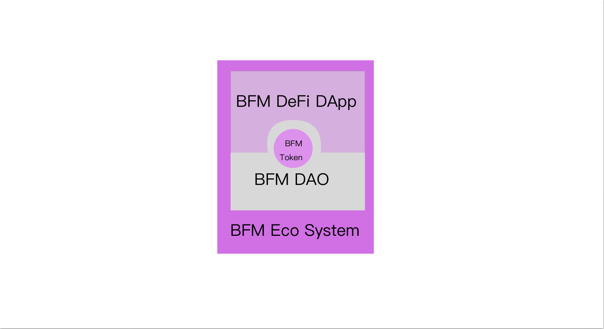
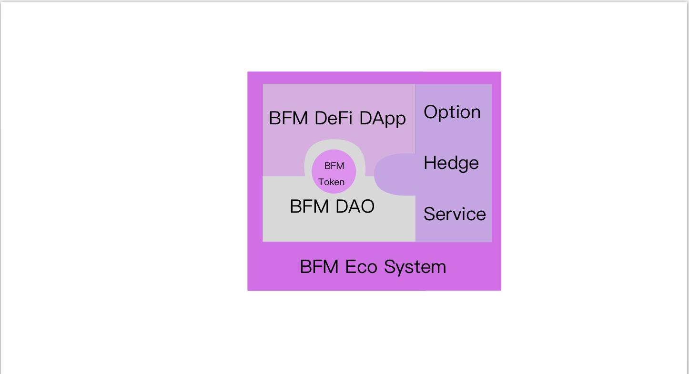
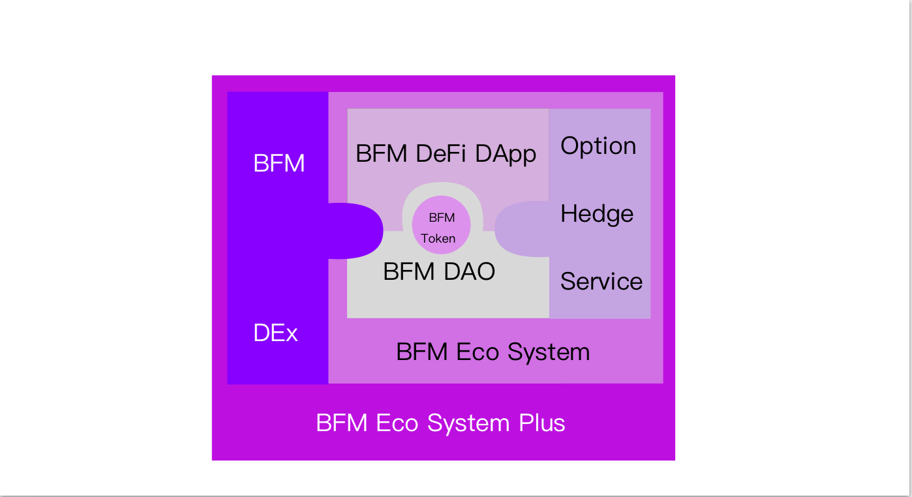

# 【架构】发展路线

## BFM Unity ：数十年的庞大工程



对于 BFM Unity 来说，其整个体系的实现预计将会是一个为期数十年的工程，涉及个步骤的庞大工程，具体来说，实现路径如下：

### 1，「对未知用战斗演算」

> 由休比编写的演算方式——遵循心的命令而行动，不进行理解和计算，如果敌人是未知的存在，就对所有无法计算的要素都纳入到估计之中。

 「对未知用战斗演算」阶段，BFM Unity 负责研究，实验 BFM 算法技术在交叉套利上的应用。

### 2，「伪典·森空摄」

> 森精种魔法的再现兵器——放出无数道可以切裂所有物体的真空刃的武装。

「伪典·森空摄」阶段，  
BFM Unity 尝试推广 BFM 算法技术在交叉套利上的应用。  
BFM Unity 将让市场上一部分成规模的交易者成为 BFM Unit\(s\)。  
BFM Unity 尝试组织 BFM Unit\(s\) **并行研究**，**并行推动** BFM 算法技术大幅前进。

### 3，「伪典·焉龙哮」

> 龙精种三王之一焉龙以生命为代价释放的崩啸，机凯种再现了其43.7%输出制成的武装。

「伪典·焉龙哮」阶段，  
BFM Unity 将整合，开源 BFM 算法技术相关代码，  
并开始广泛推广 BFM 算法技术在交叉套利上的应用。  
BFM Unity 将让市场上 1/3 以上交易者成为 BFM Unit\(s\)。

### 4，「伪典·天击」

> 复制了战神赐予天翼种的力量——天击制成的兵装。

「伪典·天击」阶段，BFM Unity 将真正向全市场宣告 BFM Unity 的影响力。  
BFM Unity 将组织 BFM Unit\(s\) 通过在同一时间停止套利系统运行，导致市场短时间流动性稀缺，造成交易踩踏现象，从而引发市场闪崩\(flash crash\)。  
此前， BFM Unity 将通知 BFM Unit\(s\) 提前持有看跌期权，以获得大规模盈利。

该过程中积累的资源将有助于 BFM Unity 加速发展。

### 5，「伪典·天移」

> 天翼种的空间转移能力。

「伪典·天移」阶段，BFM Unity 将建立在以 BTC，ETH为代表的加密货币与智能合约技术 之上，为 BFM Unit\(s\) 提供一个可以完全自由可依赖的 BFM Eco System 。   
BFM Eco System 包括：1，BFM DAO，2，一个代表 BFM DAO 价值的BFM Token，3，一个深度支持 BFM DAO 的 BFM DeFi DApp。

### 6，「进入禁止」

> 机凯种的防御武装。

「进入禁止」阶段，BFM Unity 将基于 BFM Eco System  为 BFM Unit\(s\) 提供期权对冲服务。

### 7，「一方通行」

> 机凯种为应对天翼种和森精种的空间转移所设计的空间破碎器。

「一方通行」阶段，BFM Unity 将建立在以 KMD 为代表的Atomic DEx 跨链技术 之上，为 BFM Unit\(s\) 提供一个真正跨链的去中心化交易所 BFM DEx，并使得 BFM DEx 与 BFM Eco System 中的 BFM DAO，BFM Token，BFM DeFi DApp 有机结合，使 BFM Eco System 升级成 BFM Eco System Plus。

### 8，「通行规制」

> 能将所有能量指向扭曲的武装。

「通行规制」阶段，BFM Unity 将整合 BFM Eco System Plus 的所有资源，并将 BFM Smart contract 逐渐落地，从而不断拓展系统的边界。这使得 BFM Unity 成为世界第一大经济体。

### 9，「制速违反」

> 将典开的全部武装一齐，以超高浓缩的精灵粒子化后放射出来，一般的生物──就连森精种触碰到的话也会被即死，休比利用超高浓缩精灵指向性使其挥发造成自身超加速。

「制速违反」阶段，BFM Unity 将整合 BFM Eco System Plus 的所有资源，向全世界依靠国家信用背书的信用货币发起和平解构。该过程中积累的资源将有助于 BFM Unity 加速发展。

###  10，「全方交叉」

> 与制速违反同理，将超高浓缩精灵以无指向性的挥发构成“攻势防壁”。

「全方交叉」阶段，BFM Unity 将整合 BFM Eco System Plus 的所有资源，向 BTC 等传统数字货币 Eco System 发起和平解构。

### N，「真典·弑星者」

> 将战神的「神击」、森精种的「虚空第零加护」、地精种的「髓爆」、龙精种的「崩啸」收束而成的能量复制，以72.8%输出再现制成的武装。

「真典·弑星者」阶段，BFM Unity 将在后量子技术 和 硬件优化的基础上，实现共产主义。

