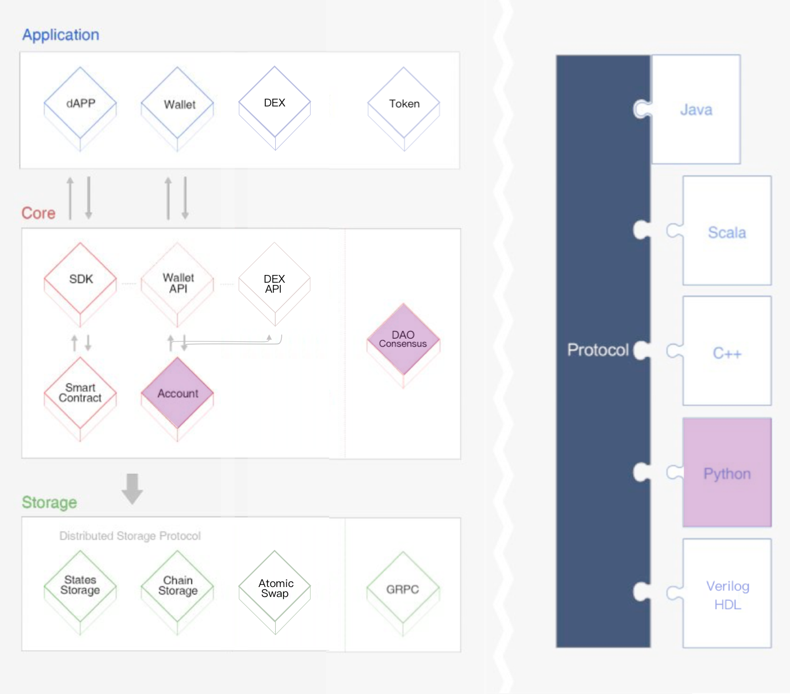

# 【架构】发展路线

## BFM Eco System 

BFM Eco System adopts a 3-layer architecture divided into Storage Layer, Core Layer, and Application Layer. The BFM protocol adheres to Google Protobuf, which intrinsically supports multi-language extension.

1 Core

There are several modules in the core layer, including smart contracts, account management, and consensus. A stack-based virtual machine is implemented on BFM and an optimized instruction set is used. In order to better support DApp developers, Solidity 4 was chosen as the smart contract language, followed by future support of other advanced languages. In addition, BFM's consensus mechanism is based on Delegated Proof of Stake \(DPoS\) and many innovations were made in order to meet its unique requirements.

2 Storage

BFM designed a unique distributed storage protocol consisting of Block Storage and State Storage. The notion of a graph database was introduced into the design of the storage layer to better meet the need for diversified data storage in the real world.

2.1 Blockchain Storage

BFM blockchain storage chooses to use LevelDB, which is developed by Google and proven successful with many companies and projects. It has high performance and supports arbitrary byte arrays as both keys and values, singular get, put and delete, batched put and delete, bi-directional iterators, and simple compression using the very fast Snappy algorithm.

2.2 State Storage

BFM has a KhaosDB in the full-node memory that can store all the newly forked chains generated within a certain period of time and supports witnesses to switch from their own active chain swiftly into a new main chain. It can also protect blockchain storage by making it more stable from being terminating abnormally in an intermediate state.

3 Application

Developers can create a diverse range of DApps and customized wallets on BFM. Since BFM enables smart contracts to be deployed and executed, the opportunities of utility applications are unlimited.Solidity official documentation: [https://solidity.readthedocs.io/](https://solidity.readthedocs.io/)

4 Protocol

 protocol adheres to Google Protocol Buffers 5 , which is a language-neutral, platform-neutral, and extensible way of serializing structured data for use in communications protocols, data storage, and more.

4.1 Protocol Buffers

Protocol Buffers \(Protobuf\) is a flexible, efficient, automated mechanism for serializing structured data, similar to JSON or XML, but much smaller, faster and simpler.

Protobuf \(.proto\) definitions can be used to generate code for C++, Java, C\#, Python, Ruby, Golang Objective-C, and Verilog HDL languages through the official code generators. Various third-party implementations are also available for many other languages. Protobuf eases development for clients by unifying the API definitions and also optimizing data transfers. Clients can take the API .proto from BFM’s protocol repository and integrate through the automatically-generated code libraries.

As a comparison, Protocol Buffers is 3 to 10 times smaller and 20 to 100 times faster than XML, with less ambiguous syntax. Protobuf generates data access classes that are easier to use programmatically.

4.2 HTTP

BFM Protocol provides a websocket & RESTful HTTP API alternative to the Protobuf API. They share the same interface but the HTTP API can be readily used in javascript clients.

5 BFM Virtual Machine BFM-VM\)

The BFM-VM is a lightweight, Turing complete virtual machine developed for BFM’s ecosystem. The BFM-VM connects seamlessly with the existing development ecosystem to provide millions of global developers with a custom-built blockchain system that is efficient, convenient, stable, secure, and scalable.

6 Decentralized Exchange \(DEX\) &

Google Protocol Buffers official documentation: [https://developers.google.com/protocol-buffers/](https://developers.google.com/protocol-buffers/)

The BFM network natively supports decentralized exchange functions. A decentralized exchange consists of multiple trading pairs. A trading pair \(notation “Exchange”\) is an Exchange Market between BFMRC-10 tokens, or between a BFMRC-10 token and BFM Token. Any account can create a trading pair between any tokens, even if the same pair already exists on the BFM network. Trading and price fluctuations of the trading pairs follow the Bancor Protocol 6 . The BFM network stipulates that the weights of the two tokens in all trading pairs are equal, so the ratio of their balances is the price between them. For example, consider a trading pair containing two tokens, ABC and DEF. ABC has a balance of 10 million and DEF has a balance of 1 million. Since their weights are equal, 10 ABC = 1 DEF. This means that the ratio of ABC to DEF is 10 ABC per DEF.

7 Implementation

The BFM blockchain code is implemented in Java and was originally a fork from EthereumJ.  
Bancor Protocol official website: [https://about.bancor.network/protocol/](https://about.bancor.network/protocol/)

## BFM Unity ：数十年的庞大工程



对于 BFM Unity 来说，其整个体系的实现预计将会是一个为期数十年的工程，涉及个步骤的庞大工程，具体来说，实现路径如下：

### 1，「对未知用战斗演算」

> 由休比编写的演算方式——遵循心的命令而行动，不进行理解和计算，如果敌人是未知的存在，就对所有无法计算的要素都纳入到估计之中。

 「对未知用战斗演算」阶段，BFM Unity 负责研究，实验 BFM 算法技术在交叉套利上的应用。

### 2，「伪典·森空摄」

> 森精种魔法的再现兵器——放出无数道可以切裂所有物体的真空刃的武装。

「伪典·森空摄」阶段，  
BFM Unity 尝试推广 BFM 算法技术在交叉套利上的应用。  
BFM Unity 将让市场上一部分成规模的交易者成为 BFM Unit\(s\)。  
BFM Unity 尝试组织 BFM Unit\(s\) **并行研究**，**并行推动** BFM 算法技术大幅前进。

### 3，「伪典·焉龙哮」

> 龙精种三王之一焉龙以生命为代价释放的崩啸，机凯种再现了其43.7%输出制成的武装。

「伪典·焉龙哮」阶段，  
BFM Unity 将整合，开源 BFM 算法技术相关代码，  
并开始广泛推广 BFM 算法技术在交叉套利上的应用。  
BFM Unity 将让市场上 1/3 以上交易者成为 BFM Unit\(s\)。

### 4，「伪典·天击」

> 复制了战神赐予天翼种的力量——天击制成的兵装。

「伪典·天击」阶段，BFM Unity 将真正向全市场宣告 BFM Unity 的影响力。  
BFM Unity 将组织 BFM Unit\(s\) ，通过联合在同一时间，停止套利系统运行，导致市场短时间流动性稀缺，造成交易踩踏现象，从而引发市场闪崩\(flash crash\)。  
此前， BFM Unity 将通知 BFM Unit\(s\) 提前持有看跌期权，以获得大规模盈利。

该过程中积累的资源将有助于 BFM Unity 加速发展。

### 5，「伪典·天移」

> 天翼种的空间转移能力。

「伪典·天移」阶段，BFM Unity 将在以 BTC，ETH为代表的 Cryptocurrency 与 Smart Contract 技术 之上，为 BFM Unit\(s\) 提供一个可以完全自由可依赖的 BFM Eco System 。   
BFM Eco System 包括：1，BFM DAO，2，一个代表 BFM DAO 价值的BFM Token，3，一个深度支持 BFM DAO 的 BFM DeFi DApp。

### 6，「进入禁止」

> 机凯种的防御武装。

「进入禁止」阶段，BFM Unity 将基于 BFM Eco System  为 BFM Unit\(s\) 提供期权对冲服务。

### 7，「一方通行」

> 机凯种为应对天翼种和森精种的空间转移所设计的空间破碎器。

「一方通行」阶段，BFM Unity 将在 Atomic Swap 跨链技术之上建立 DEx ，为 BFM Unit\(s\) 提供一个真正跨链的去中心化交易所 BFM DEx，并使得 BFM DEx 与 BFM Eco System 中的 BFM DAO，BFM Token，BFM DeFi DApp 有机结合，使 BFM Eco System 升级成 BFM Eco System Plus。

### 8，「通行规制」

> 能将所有能量指向扭曲的武装。

「通行规制」阶段，BFM Unity 将整合 BFM Eco System Plus 的所有资源，并将 BFM Smart Contract 逐渐落地，从而不断拓展系统的边界。这使得 BFM Unity 成为世界第一大经济体。

### 9，「制速违反」

> 将典开的全部武装一齐，以超高浓缩的精灵粒子化后放射出来，一般的生物──就连森精种触碰到的话也会被即死，休比利用超高浓缩精灵指向性使其挥发造成自身超加速。

「制速违反」阶段，BFM Unity 将整合 BFM Eco System Plus 的所有资源，向全世界依靠国家信用背书的信用货币发起和平解构。该过程中积累的资源将有助于 BFM Unity 加速发展。

###  10，「全方交叉」

> 与制速违反同理，将超高浓缩精灵以无指向性的挥发构成“攻势防壁”。

「全方交叉」阶段，BFM Unity 将整合 BFM Eco System Plus 的所有资源，向 BTC 等传统数字货币 Eco System 发起和平解构。

### N，「真典·弑星者」

> 将战神的「神击」、森精种的「虚空第零加护」、地精种的「髓爆」、龙精种的「崩啸」收束而成的能量复制，以72.8%输出再现制成的武装。

「真典·弑星者」阶段，BFM Unity 将在后量子技术 和 硬件优化的基础上，实现共产主义。

