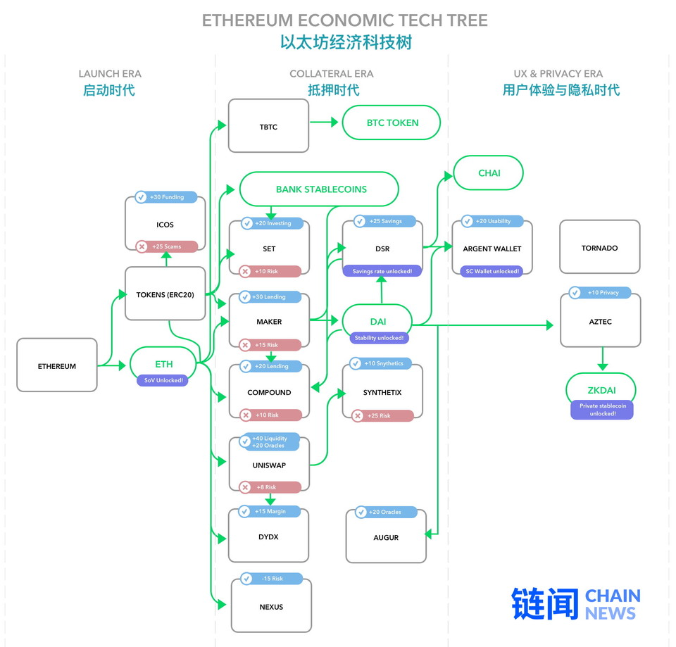

# 【规划】AMM & Pool-Arbitrage





让我们浏览一下以太坊当前主要的几个 AMM 项目：

**Bancor 2017**

* 第一个来自荒野的主要智能合约 AMM
* 率先试验了部分关键功能设计
* 使用一个联合曲线来计算价格
* 利用一个联合曲线来跟踪流动性提供者的贡献
* 通过一个枢纽辐射模式以连接多个资金池
* 很不幸，采用了 **BNT 代币**作为其枢纽货币 （而不是 Ether）

**Uniswap 2018**

* 主要目标：服务于**代币流动性**的去中心化协议
* 比 Bancor**更简单**的联合曲线
* 采用 **Ether** 作为其枢纽币种
* 非常节省燃料 （gas）
* 资本效率不高
* 总体而言，打造得极为出色 （请参阅 Hayden 2018 年 11 月启动该产品的推文）

> 推荐阅读：[试验性项目起家，Uniswap 如何实现百倍流动性增长？](https://www.chainnews.com/articles/549786271868.htm)

**Curve – 2020**

* 主要目标：**低滑点的**、稳定币-稳定币之间的交易
* 资本效率极高 =&gt; 非常低的滑点
* 类似 Balancer 的多维度联合面
* 稳定币的运行非常好，对非稳定币则运行效果不佳
* 其联合曲线有一定的风险
* 实际的联合曲线公式不透明 （参见我对此评论的推文）

> 推荐阅读：[读透热门 DeFi 项目 Curve：它为什么重要？为何被「攻击」？](https://www.chainnews.com/articles/127361083528.htm)

_Curve \(又名 Stableswap\) 的联合曲线与 Uniswap 联合曲线的对比_



\_\_

\_\_

以太坊很快还会迎来多个新的 AMM 项目：

**Balancer – 预计 2020 年推出**

* 主要目标：**去中心化 Vanguard**（链闻注：Vanguard 是全球最大的不收费基金家族、世界上第二大基金管理公司）
* 把 Uniswap 的联合曲线扩展到一个**多维的面**
* 在资金流动池中启用了代币权重 （例如，ETH=50%， Dai=25%， MKR=25% 等）
* 资产组合模式的资本效率比枢纽辐射模式高出**一倍以上**
* 但资产组合模式可能导致**流动性碎片化**
* 权重的引入增加了 gas 成本
* [了解更多](https://medium.com/balancer-protocol/bonding-surfaces-balancer-protocol-ff6d3d05d577)



**Shell 协议 – 预计 2020 年推出**

* 交易的滑点低
* 流动性提供商的**利润高**
* 有权重、多维度的池
* 支持任何风格的稳定币 （如 Dai、 cDai 和 Chai）
* AMM 行为的颗粒度定制
* 缓冲了某个稳定币违约的风险
* 将套利收益转移给流动性提供商

\_\_

## Pooling Arbitrage\(已废弃\)



