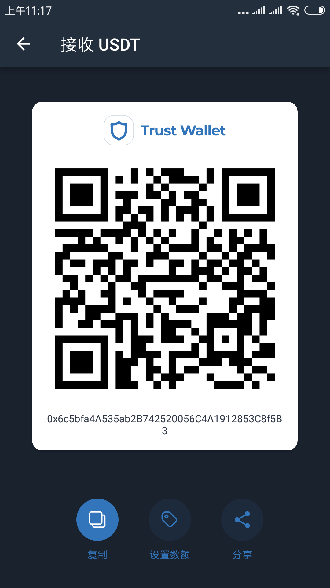

# 捐赠


你的打赏并不会返还，请量力而行。



你通过以下方式只会打赏给 Guhhhhaa 和 贝   贝   猫，不会捐赠给 BFM Unity。



对 Guhhhhaa 和 贝   贝   猫 的打赏并不会完全促进 BFM Unity 的发展。



**打赏者可能在未来发币后，被优先分配 BFM Token。**


## 打赏地址

```cpp
BTC:bc1qvspjnlckvze7thfukhc6zum67qavujw3e0kwgh
ETH:0x6c5bfa4A535ab2B742520056C4A1912853C8f5B3
BNB:bnb1t4tkywgz6q4xy7axx2qle6y9gt22syclth2sh3
USDT(ERC20):0x6c5bfa4A535ab2B742520056C4A1912853C8f5B3
USDT(TRC20):TWjbFpcFWxeBkttF8PpmwfC7ZzX2KNiGJB
```



## BTC





## ETH





## BNB





## 注意，是ERC20，别搞错了





## 注意，是TRC20，别搞错了






如你想非匿名打赏，请通过发送邮件到 guhhhhaa@gmail.com，并在邮件标题开头标注“打赏“字样，并在邮件中说明打赏相关信息 和 你的 name/ID。可以在邮件里指定资金用途。

未发送邮件，默认为匿名打赏。

你的信息会在本页面公布，但不一定及时。



赏金的用途可能包括并不限于：

1，日常生活，必需性消费。

2，购买域名，租借VPS。以及其他微型付费\(Github,SDK,Gitbook,Trello,WordPress,QQ群,网盘,JMS ss\)

3，必要的硬件成本。

4，招募开发者等人员。



赏金的用途不可能用于：  
  
1，非必需性消费

2，回购 BFM Token



Guhhhhaa 和 贝   贝   猫 一般情况下不能确定赏金的用途，所以赏金会留在地址里保持不动。  
如果 Guhhhhaa 和 贝   贝   猫 使用了赏金，会在此页公布数额和用途。


## 捐赠登记

| Name/ID | 时间 | 币种 | 数量 | 来自地址 | 指定用途 |
| :--- | :--- | :--- | :--- | :--- | :--- |
|  |  |  |  |  |  |

## 使用公示

| 次数 | 时间 | 币种 | 数量 | 转出地址 | 用途 |
| :--- | :--- | :--- | :--- | :--- | :--- |
|  |  |  |  |  |  |

