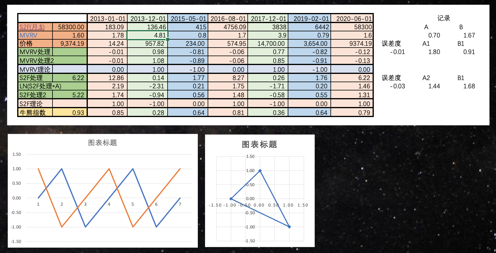
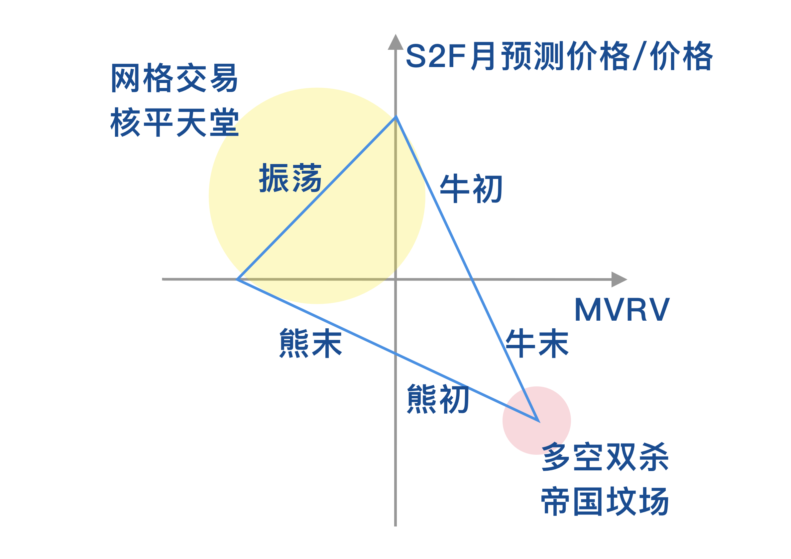
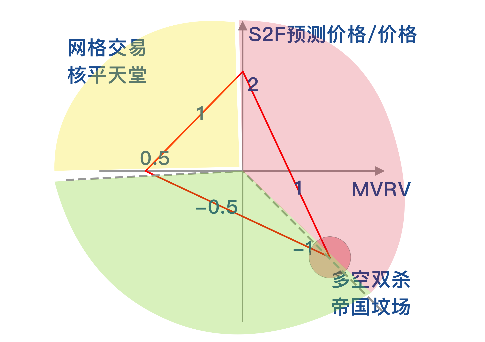

# 领航舵/雷达 🧭 🛰️

### 蓝色——横轴——MVRV 

### 红色——纵轴——S2F预测价格/价格

## [归一化操作](https://www.bfm-unity.com/management-cockpit-operation/shu-xue-li-qi)

```python
LN(MVRV/1.80)/0.91 # 对MVRV的处理

LN((S2F预测价格/价格)/1.44)/1.68 # 对S2F的处理
```







