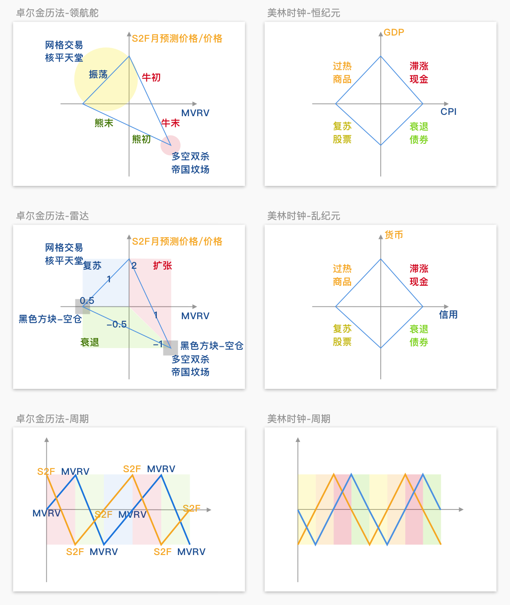

# 卓尔金历法/GPS 🌍 🕙 🧭 🛰️


**My clock is paper financial time**

**我的时钟（显示）账面的金融时间**

I totally mac while user vends guy

我彻底（施展）巨额 \* ，当使用者出售生命

**I think B I G cuz my limits the sky**

**我认为庞大，因为我的极限为天空**  
  
——[《C》-  岩崎琢](https://music.163.com/#/song?id=22713696)



## [卓尔金历法](https://share.weiyun.com/ToNaflWr)  \|  [卓尔金历法策略](https://share.weiyun.com/2xtyDqTF)

### [宣传视频](https://www.bilibili.com/video/BV1K64y1S7FS)  \|  [**讲故事**视频](https://www.bilibili.com/video/BV13x411R7Lf)

**你需要下载“卓尔金历法“这个Excel表格，才能真正应用这个水晶球。**




#### 熊市：下跌到顶点的1/4

#### 震荡市：振荡上涨2倍 

#### 牛市：减半后，上涨32倍-64倍

## [归一化操作](https://www.bfm-unity.com/management-cockpit-operation/shu-xue-li-qi) （数据归一到（-1，1））

```python
LN(MVRV/1.80)/0.91 # 对MVRV的处理

LN((S2F月预测价格/价格)/1.44)/1.68 # 对S2F的处理
```


### 蓝色曲线——横X轴——MVRV——[数据来源](https://www.blockchain.com/charts/mvrv)

### 橙色曲线——纵Y轴——S2F月预测价格/价格——[数据来源](https://www.qkl123.com/data/s2f/btc)

## 


## **卓尔金历法**说明

**顺着三角形顺时针运行 ，**

**红色是牛市，绿色是熊市，蓝色是震荡市。** 

**从蓝色到红色，减半开始，此时需要加杠杆，满仓多。**

**顺时针运行 ，落到第一个黑色框，就是牛市顶峰，熊市开始，可以做空。** 

**顺时针运行 ，落到第二个黑色框，就是熊市底部，可以入场开网格。**

**就像一个时钟一样，很方便。**

## **卓尔金历法与美林时钟的关系**



两个随机变量，才能校准、判断一个周期。

一个随机变量，是无法校准、判断周期的，所以用MACD，BOLL都是没用的。 

一个随机变量，单独用MVRV，或者单独用S2F，噪声扰动太大，所以不能单独用，必须二者结合判断。

在比特币，这两个随机变量是MVRV，S2F。 

在现实世界，这两个随机变量是GDP，CPI，或者货币，信用。

## 解释

不要让自己的人性干扰判断，比如说我那个卓尔金历法三角形，

如果你是普通人，按照感性思考，是无法理解价格的指数增长的，所以我用数学的LN\(\)来放弃感性思考。我放弃让自己来思考指数增长，而把指数增长的部分都取LN（）来滤除。这样我只需要思考简单的增长就行。

而且我放弃了思考价格和时间之间的关系，把绝对价格换成相对价格，把衡量绝对时间换成衡量状态，这样一切就都是相对的状态，而不是绝对的价格和时间。

用相对的思维来思考相对的牛熊，这样就容易多了。但是用绝对的思维思考相对的牛熊，就会很难。我通过一系列数学映射，简化了判断。 

相对的思维就是把一切都变成状态机，思考状态之间的切换，比如说我就把问题简化成了一个只有（-1，0，1）这三种状态的状态机。把所有的变量都归一到这三种状态中，然后再思考它们的关系，这样就很容易发现周期规律。 

但是一个连续的状态，如何转化成离散的判断呢？如何防止噪声干扰？如何防止频繁买卖？答案很简单，我们电子专业有一个叫（施密特触发器）的元器件，我们利用它的逻辑就可以了。简单地说，它的逻辑，就是达到阈值就切换，没达到阈值就维持原状态。这样就可以避免噪声干扰，实现AD转换了。 

在某些人（比如我）的眼里，比特币就是宏观电子，就是宏观的状态机，就是由三种状态，两个随机变量构成的。 

就像藏传佛教，宇宙就是由唵啊吽三种状态构成的。 我相信比特币就是宏观的电子，宏观的状态机。

