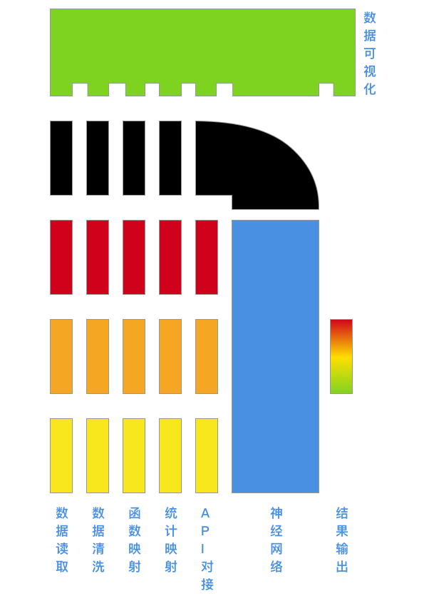
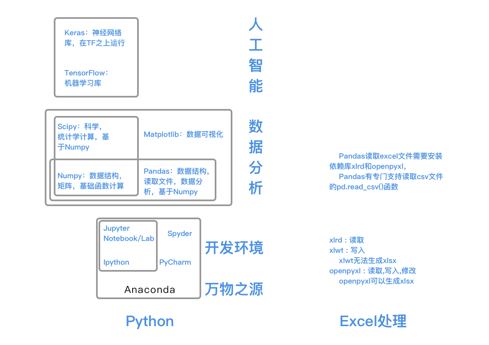

# 混乱的实验室

## Te-s-r-act，是 TensorAct，还是Tesseract ?




## 问题描述


## 

## 使用工具

[Anaconda](https://www.anaconda.com/) \(Jupyter Notebook，Jupyter Lab，Numpy，Pandas，SciPy，TensorFlow，Keras\)还有matplotlib，差点忘了

[**TensorFlow**](https://www.tensorflow.org/)  **\|**  [**TensorBoard**](https://www.tensorflow.org/tensorboard?hl=zh-cn)  **\|**  [**TensorBoard.dev**](https://tensorboard.dev/)  **\|**  [**Google Colab**](https://colab.research.google.com/notebooks/intro.ipynb)\*\*\*\*

[**https://playground.tensorflow.org/**](https://playground.tensorflow.org/)\*\*\*\*

\*\*\*\*[**https://nbviewer.jupyter.org/**](https://nbviewer.jupyter.org/)\*\*\*\*

### 数据来源

[MVRV](https://www.qkl123.com/data/mvrv/btc)  \|  [S2F](https://www.qkl123.com/data/s2f/btc)  \|  [NVT](https://www.qkl123.com/data/nvt/btc)




[22 款神经网络的设计和可视化工具](https://www.huaweicloud.com/articles/d90130bfd852a55e505155e381ebfab1.html)

[Mac版Excel如何添加数据分析功能？](https://answers.microsoft.com/zh-hans/msoffice/forum/all/mac%E7%89%88excel%E5%A6%82%E4%BD%95%E6%B7%BB/4f9c7fcf-ba8a-4f1a-8f00-bc35a43cb480)

[机器学习-回归问题\(Regression\)](https://zhuanlan.zhihu.com/p/127972563)

[标准化、归一化、正规化](https://zhuanlan.zhihu.com/p/73080065)

[一文读懂机器学习分类算法（附图文详解）](https://zhuanlan.zhihu.com/p/82114104)

[Q&A: 机器学习与金融行业](http://www.fintechgl.com/articles/59)

## 开发环境


[https://www.anaconda.com/](https://www.anaconda.com/)

[https://www.anaconda.com/pycharm](https://www.anaconda.com/pycharm)


**pandas**是一个数据处理的包，本身提供了许多读取文件的函数，像read\_csv（读取csv文件），read\_excel（读取excel文件）等，只需一行代码就能实现文件的读取。

## 规整化算法

第一步：去指数转线性，y = LN\(x/x的几何平均数\)，   
第二步：Logistic 模式 ，y = 1/\(1+e^\(-x\)\)   
第三步：z-score 标准化，y=\(x-μ\)/σ

只要经过这三步处理，不管之前是怎样分布的数据，都会转化为标准正态分布。

## 研发进度

### 2021.7.9 

安装了Anaconda，借助Anaconda 安装了  
Jupyter Notebook，Jupyter Lab，Numpy，Pandas，SciPy，TensorFlow，Keras  
还有matplotlib，差点忘了

课程？[在看了在看了](https://www.bilibili.com/video/BV1rz4y117p1)。

```python
from tensorflow import keras
import numpy as np
import pandas as pd
import matplotlib.pyplot as plt
```

找到了 [TensorFlow学习笔记](https://www.zhihu.com/column/c_1377756991213998081) ，发现逻辑回归分类问题应该用**交叉熵损失函数，**而不是**均方误差MSE损失函数**

\*\*\*\*[交叉熵](https://baike.baidu.com/item/%E4%BA%A4%E5%8F%89%E7%86%B5/8983241) \|  ****[损失函数](https://baike.baidu.com/item/%E6%8D%9F%E5%A4%B1%E5%87%BD%E6%95%B0/1783236)  \|  [归一化指数函数](https://baike.baidu.com/item/%E5%BD%92%E4%B8%80%E5%8C%96%E6%8C%87%E6%95%B0%E5%87%BD%E6%95%B0)\(Softmax函数\)

[matplotlib-tutorial](https://www.runoob.com/w3cnote/matplotlib-tutorial.html) 学会复制粘贴了，这是一种进步

[python-tutorial](https://www.runoob.com/python/python-tutorial.html) 找到了python基础教程，重新回去学python

不学了，要吐了

再想想

找到了一本书：利用Python进行数据分析：[README](https://seancheney.gitbook.io/python-for-data-analysis-2nd/)

找到了英文版

[https://github.com/wesm/pydata-book](https://github.com/wesm/pydata-book)

找到了中文版

[https://github.com/BrambleXu/pydata-notebook](https://github.com/BrambleXu/pydata-notebook)

* [Chapter 4: NumPy Basics: Arrays and Vectorized Computation（NumPy基础：数组和向量化计算）](http://nbviewer.jupyter.org/github/LearnXu/pydata-notebook/tree/master/Chapter-04/)
  * [4.1 The NumPy ndarray: A Multidimensional Array Object（ndarray: 多维数组对象\)](http://nbviewer.jupyter.org/github/LearnXu/pydata-notebook/blob/master/Chapter-04/4.1%20The%20NumPy%20ndarray%EF%BC%88%E5%A4%9A%E7%BB%B4%E6%95%B0%E7%BB%84%E5%AF%B9%E8%B1%A1%EF%BC%89.ipynb)
  * [4.2 Universal Functions: Fast Element-Wise Array Functions（通用函数：快速点对点数组函数）](http://nbviewer.jupyter.org/github/LearnXu/pydata-notebook/blob/master/Chapter-04/4.2%20Universal%20Functions%20%28%E9%80%9A%E7%94%A8%E5%87%BD%E6%95%B0%29.ipynb)
  * [4.3 Array-Oriented Programming with Arrays（数组导向编程）](http://nbviewer.jupyter.org/github/LearnXu/pydata-notebook/blob/master/Chapter-04/4.3%20Array-Oriented%20Programming%20with%20Arrays%EF%BC%88%E6%95%B0%E7%BB%84%E5%AF%BC%E5%90%91%E7%BC%96%E7%A8%8B%EF%BC%89.ipynb)
* [Chapter 5: Getting Started with pandas（开始使用pandas）](http://nbviewer.jupyter.org/github/LearnXu/pydata-notebook/tree/master/Chapter-05/)
  * [5.1 Introduction to pandas Data Structures（pandas的数据结构）](http://nbviewer.jupyter.org/github/LearnXu/pydata-notebook/blob/master/Chapter-05/5.1%20Introduction%20to%20pandas%20Data%20Structures%EF%BC%88pandas%E7%9A%84%E6%95%B0%E6%8D%AE%E7%BB%93%E6%9E%84%EF%BC%89.ipynb)
  * [5.2 Essential Functionality（主要功能）](http://nbviewer.jupyter.org/github/LearnXu/pydata-notebook/blob/master/Chapter-05/5.2%20Essential%20Functionality%EF%BC%88%E4%B8%BB%E8%A6%81%E5%8A%9F%E8%83%BD%EF%BC%89.ipynb)
  * [5.3 Summarizing and Computing Descriptive Statistics（汇总和描述性统计）](http://nbviewer.jupyter.org/github/LearnXu/pydata-notebook/blob/master/Chapter-05/5.3%20Summarizing%20and%20Computing%20Descriptive%20Statistics%EF%BC%88%E6%80%BB%E7%BB%93%E5%92%8C%E6%8F%8F%E8%BF%B0%E6%80%A7%E7%BB%9F%E8%AE%A1%EF%BC%89.ipynb)
* [Chapter 7: Data Cleaning and Preparation（数据清洗和准备）](http://nbviewer.jupyter.org/github/LearnXu/pydata-notebook/tree/master/Chapter-07/)
  * [7.1 Handling Missing Data（处理缺失数据）](http://nbviewer.jupyter.org/github/LearnXu/pydata-notebook/blob/master/Chapter-07/7.1%20Handling%20Missing%20Data%EF%BC%88%E5%A4%84%E7%90%86%E7%BC%BA%E5%A4%B1%E6%95%B0%E6%8D%AE%EF%BC%89.ipynb)
  * [7.2 Data Transformation（数据变换）](http://nbviewer.jupyter.org/github/LearnXu/pydata-notebook/blob/master/Chapter-07/7.2%20Data%20Transformation%EF%BC%88%E6%95%B0%E6%8D%AE%E5%8F%98%E6%8D%A2%EF%BC%89.ipynb)
  * [7.3 String Manipulation（字符串处理）](http://nbviewer.jupyter.org/github/LearnXu/pydata-notebook/blob/master/Chapter-07/7.3%20String%20Manipulation%EF%BC%88%E5%AD%97%E7%AC%A6%E4%B8%B2%E5%A4%84%E7%90%86%EF%BC%89.ipynb)
* [Chapter 11: Time Series（时间序列）](http://nbviewer.jupyter.org/github/LearnXu/pydata-notebook/tree/master/Chapter-11/)
  * [11.1 Date and Time Data Types and Tools（日期和时间数据类型及其工具）](http://nbviewer.jupyter.org/github/LearnXu/pydata-notebook/blob/master/Chapter-11/11.1%20Date%20and%20Time%20Data%20Types%20and%20Tools%EF%BC%88%E6%97%A5%E6%9C%9F%E5%92%8C%E6%97%B6%E9%97%B4%E6%95%B0%E6%8D%AE%E7%B1%BB%E5%9E%8B%E5%8F%8A%E5%85%B6%E5%B7%A5%E5%85%B7%EF%BC%89.ipynb)
  * [11.2 Time Series Basics（时间序列基础）](http://nbviewer.jupyter.org/github/LearnXu/pydata-notebook/blob/master/Chapter-11/11.2%20Time%20Series%20Basics%EF%BC%88%E6%97%B6%E9%97%B4%E5%BA%8F%E5%88%97%E5%9F%BA%E7%A1%80%EF%BC%89.ipynb)
  * [11.3 Date Ranges, Frequencies, and Shifting（日期范围，频度，和位移）](http://nbviewer.jupyter.org/github/LearnXu/pydata-notebook/blob/master/Chapter-11/11.3%20Date%20Ranges%2C%20Frequencies%2C%20and%20Shifting%EF%BC%88%E6%97%A5%E6%9C%9F%E8%8C%83%E5%9B%B4%EF%BC%8C%E9%A2%91%E5%BA%A6%EF%BC%8C%E5%92%8C%E4%BD%8D%E7%A7%BB%EF%BC%89.ipynb)
* [Chapter 12: Advanced pandas（高级pandas用法）](http://nbviewer.jupyter.org/github/LearnXu/pydata-notebook/tree/master/Chapter-12/)
  * [12.1 Categorical Data（类别数据）](http://nbviewer.jupyter.org/github/LearnXu/pydata-notebook/blob/master/Chapter-12/12.1%20Categorical%20Data%EF%BC%88%E7%B1%BB%E5%88%AB%E6%95%B0%E6%8D%AE%EF%BC%89.ipynb)
* [Chapter 14: Data Analysis Examples（数据分析实例）](http://nbviewer.jupyter.org/github/LearnXu/pydata-notebook/tree/master/Chapter-14/)
  * [14.1 USA.gov Data from Bitly（USA.gov数据集）](http://nbviewer.jupyter.org/github/LearnXu/pydata-notebook/blob/master/Chapter-14/14.1%20USA.gov%20Data%20from%20Bitly%EF%BC%88USA.gov%E6%95%B0%E6%8D%AE%E9%9B%86%EF%BC%89.ipynb)
  * [14.2 MovieLens 1M Dataset（MovieLens 1M数据集）](http://nbviewer.jupyter.org/github/LearnXu/pydata-notebook/blob/master/Chapter-14/14.2%20MovieLens%201M%20Dataset%EF%BC%88MovieLens%201M%E6%95%B0%E6%8D%AE%E9%9B%86%EF%BC%89.ipynb)
  * [14.3 US Baby Names 1880–2010（1880年至2010年美国婴儿姓名](http://nbviewer.jupyter.org/github/BrambleXu/pydata-notebook/blob/master/Chapter-14/14.3%20US%20Baby%20Names%201880%E2%80%932010%EF%BC%881880%E5%B9%B4%E8%87%B32010%E5%B9%B4%E7%BE%8E%E5%9B%BD%E5%A9%B4%E5%84%BF%E5%A7%93%E5%90%8D%EF%BC%89.ipynb)\*\*\*\*

**pandas**是一个数据处理的包，本身提供了许多读取文件的函数，像read\_csv（读取csv文件），read\_excel（读取excel文件）等，只需一行代码就能实现文件的读取。

### 2021.7.10

[python pandas read\_html快读读取中国商情网的A股，港股以及新三板股票](https://www.bilibili.com/video/BV1aQ4y1A7fh)

[pandas.read\_csv 详细介绍](https://www.gairuo.com/p/pandas-read-csv)

[pandas.read\_excel 详细介绍](https://www.gairuo.com/p/pandas-read-excel)

### 教程

[30分钟带你入门数据分析工具 Pandas](https://oicebot.github.io/2018/09/05/30-mins-into-pandas-for-data-science.html)

[十分钟入门 Pandas](https://www.pypandas.cn/docs/getting_started/10min.html) 🚩

### 读取写入数据

* CSV
  * [写入 CSV 文件 \(opens new window\)](https://pandas.pydata.org/pandas-docs/stable/user_guide/io.html#io-store-in-csv)。

```text
In [143]: df.to_csv('foo.csv')
```

* * 读取 CSV 文件数据：

```text
In [144]: pd.read_csv('foo.csv')
```

* Excel
  * 详见 [Excel \(opens new window\)](https://pandas.pydata.org/pandas-docs/stable/user_guide/io.html#io-excel)文档。
  * 写入 Excel 文件：

```text
In [147]: df.to_excel('foo.xlsx', sheet_name='Sheet1')
```

* * 读取 Excel 文件：

```text
In [148]: pd.read_excel('foo.xlsx', 'Sheet1', index_col=None, na_values=['NA'])
```


### Pandas 数据结构 <a id="pandas-&#x6570;&#x636E;&#x7ED3;&#x6784;"></a>

#### 1. Series <a id="1-series"></a>

Series 是一种一维数组，和 NumPy 里的数组很相似。事实上，Series 基本上就是基于 NumPy 的数组对象来的。和 NumPy 的数组不同，Series 能为数据自定义标签，也就是索引（index），然后通过索引来访问数组中的数据。

```text
import numpy as np
import pandas as pd
```

创建一个 Series 的基本语法如下：

```text
my_series = pd.Series(data, index)
```

#### 2. DataFrames <a id="2-dataframes"></a>

Pandas 的 DataFrame（数据表）是一种 2 维数据结构，数据以表格的形式存储，分成若干行和列。通过 DataFrame，你能很方便地处理数据。常见的操作比如选取、替换行或列的数据，还能重组数据表、修改索引、多重筛选等。

构建一个 DataFrame 对象的基本语法如下：

```text
pd.DataFrame(data,index)
```

```text
df = pd.DataFrame(data,index) 
```

### 可视化 <a id="&#x53EF;&#x89C6;&#x5316;"></a>

详见[可视化 \(opens new window\)](https://pandas.pydata.org/pandas-docs/stable/user_guide/visualization.html#visualization)文档。

```text
In [135]: ts = pd.Series(np.random.randn(1000),
   .....:                index=pd.date_range('1/1/2000', periods=1000))
   .....: 

In [136]: ts = ts.cumsum()

In [137]: ts.plot()
Out[137]: <matplotlib.axes._subplots.AxesSubplot at 0x7f2b5771ac88>
```


DataFrame 的 [plot\(\) \(opens new window\)](https://pandas.pydata.org/pandas-docs/stable/user_guide/visualization.html#visualization)方法可以快速绘制所有带标签的列：

```text
In [138]: df = pd.DataFrame(np.random.randn(1000, 4), index=ts.index,
   .....:                   columns=['A', 'B', 'C', 'D'])
   .....: 

In [139]: df = df.cumsum()

In [140]: plt.figure()
Out[140]: <Figure size 640x480 with 0 Axes>

In [141]: df.plot()
Out[141]: <matplotlib.axes._subplots.AxesSubplot at 0x7f2b53a2d7f0>

In [142]: plt.legend(loc='best')
Out[142]: <matplotlib.legend.Legend at 0x7f2b539728d0>
```


## [【美国微软大神的数据分析课】Pandas vs Excel](https://www.bilibili.com/video/BV1rt411y7PY)  🚩

## [python3带你玩转excel--工作党福利--（评论区附有课件和代码）](https://www.bilibili.com/video/BV1W7411G7wP)🚩

## [Excel动态仪表盘制作流程，非常详细【完结】](https://www.bilibili.com/video/BV1ov41147UG)🚩

## [python实现统计学包Scipy所有语法](https://www.bilibili.com/read/cv12026943) 🚩

## [python 正态分布\_python绘制正态分布及三大抽样分布的概率密度图像](https://blog.csdn.net/weixin_39725403/article/details/111293843) <a id="articleContentId"></a>

## [太玄的工具库0X04 NumPy SciPy](https://www.bilibili.com/read/cv115510) 🚩

## [【2021新版】Python入门编程100例，用小例子提升实战技能！](https://www.bilibili.com/video/BV1of4y1a7pz)

## [python3带你玩转excel--工作党福利--（评论区附有课件和代码）](https://www.bilibili.com/video/BV1W7411G7wP) 

|  |  |  |
| :--- | :--- | :--- |
| numpy | np.array \# ndarray | NumPy 提供了很多[统计函数](https://www.runoob.com/numpy/numpy-statistical-functions.html)，用于从数组中查找最小元素，最大元素，百分位标准差和方差等。 |
| scipy |  | scipy.stats |
| pandas | Series,DataFrame | excel,csv |
| matplotlib |  |  |
| tensorflow |  | keras |
|  |  |  |
| IPython |  |  |
| Spyder |  |  |
| Jupyter Notebook/Lab |  |  |
| PyCharm |  |  |

[SciPy - Stats\_学习Scipy\|WIKI教程](https://iowiki.com/scipy/scipy_stats.html)

[Scipy统计函数- Scipy教程™ - 易百教程](https://www.yiibai.com/scipy/scipy_stats.html) 🚩

[NumPy Ndarray 对象\| 菜鸟教程](https://www.runoob.com/numpy/numpy-ndarray-object.html)

[Scipy统计函数- Scipy教程教学\| 程式教程网- 亿聚网](https://www.1ju.org/scipy/scipy-stats)

## [1.5 ScSciPy Lecture Notes 中文版 🚩](https://wizardforcel.gitbooks.io/scipy-lecture-notes/content/4.html)

* [scipy：高级科学计算\| SciPy Lecture Notes 中文版 🚩](https://wizardforcel.gitbooks.io/scipy-lecture-notes/content/4.html)

## 1.5 Scipy：高级科学计算 <a id="15-scipy&#xFF1A;&#x9AD8;&#x7EA7;&#x79D1;&#x5B66;&#x8BA1;&#x7B97;"></a>

作者：Adrien Chauve, Andre Espaze, Emmanuelle Gouillart, Gaël Varoquaux, Ralf Gommers

**Scipy**

`scipy`包包含许多专注于科学计算中的常见问题的工具箱。它的子模块对应于不同的应用，比如插值、积分、优化、图像处理、统计和特殊功能等。

`scipy`可以与其他标准科学计算包相对比，比如GSL \(C和C++的GNU科学计算包\), 或者Matlab的工具箱。`scipy`是Python中科学程序的核心程序包；这意味着有效的操作`numpy`数组，因此，numpy和scipy可以一起工作。

在实现一个程序前，有必要确认一下需要的数据处理时候已经在scipy中实现。作为非专业程序员，科学家通常倾向于**重新发明轮子**，这产生了小玩具、不优化、很难分享以及不可以维护的代码。相反，scipy的程序是优化并且测试过的，因此应该尽可能使用。

**警告** 这个教程根本不是数值计算的介绍。因为列举scipy的不同子模块和功能将会是非常枯燥的，相反我们将聚焦于列出一些例子，给出如何用scipy进行科学计算的大概思路。

scipy是由针对特定任务的子模块组成的：

|  |  |
| :--- | :--- |
| [`scipy.cluster`](http://docs.scipy.org/doc/scipy/reference/cluster.html#scipy.cluster) | 向量计算 / Kmeans |
| [`scipy.constants`](http://docs.scipy.org/doc/scipy/reference/constants.html#scipy.constants) | 物理和数学常量 |
| [`scipy.fftpack`](http://docs.scipy.org/doc/scipy/reference/fftpack.html#scipy.fftpack) | 傅里叶变换 |
| [`scipy.integrate`](http://docs.scipy.org/doc/scipy/reference/integrate.html#scipy.integrate) | 积分程序 |
| [`scipy.interpolate`](http://docs.scipy.org/doc/scipy/reference/interpolate.html#scipy.interpolate) | 插值 |
| [`scipy.io`](http://docs.scipy.org/doc/scipy/reference/io.html#scipy.io) | 数据输入和输出 |
| [`scipy.linalg`](http://docs.scipy.org/doc/scipy/reference/linalg.html#scipy.linalg) | 线性代数程序 |
| [`scipy.ndimage`](http://docs.scipy.org/doc/scipy/reference/ndimage.html#scipy.ndimage) | n-维图像包 |
| [`scipy.odr`](http://docs.scipy.org/doc/scipy/reference/odr.html#scipy.odr) | 正交距离回归 |
| [`scipy.optimize`](http://docs.scipy.org/doc/scipy/reference/optimize.html#scipy.optimize) | 优化 |
| [`scipy.signal`](http://docs.scipy.org/doc/scipy/reference/signal.html#scipy.signal) | 信号处理 |
| [`scipy.sparse`](http://docs.scipy.org/doc/scipy/reference/sparse.html#scipy.sparse) | 稀疏矩阵 |
| [`scipy.spatial`](http://docs.scipy.org/doc/scipy/reference/spatial.html#scipy.spatial) | 空间数据结构和算法 |
| [`scipy.special`](http://docs.scipy.org/doc/scipy/reference/special.html#scipy.special) | 一些特殊数学函数 |
| [`scipy.stats`](http://docs.scipy.org/doc/scipy/reference/stats.html#scipy.stats) | 统计 |

他们全都依赖于[numpy](http://docs.scipy.org/doc/numpy/reference/index.html#numpy), 但是大多数是彼此独立的。导入Numpy和Scipy的标准方式：

In \[1\]:

```text
import numpy as np
from scipy import stats  # 其他的子模块类似
```

`scipy`的主要命名空间通常包含的函数其实是numpy（试一下`scipy.cos`其实是`np.cos`\) 。这些函数的暴露只是因为历史原因；通常没有必要在你的代码中使用`import scipy`。



## [如何系统地学习Python 中 matplotlib, numpy, scipy, pandas？](https://www.zhihu.com/question/37180159/answer/304720890)


* [【美国微软大神的数据分析课】Pandas vs Excel](https://www.bilibili.com/video/BV1rt411y7PY)  🚩
* [python3带你玩转excel--工作党福利--（评论区附有课件和代码）](https://www.bilibili.com/video/BV1W7411G7wP)🚩
* [如何系统地学习Python 中 matplotlib, numpy, scipy, pandas？](https://www.zhihu.com/question/37180159/answer/304720890)🚩
* \*\*\*\*[**机器学习之数据的偏态分布和数据的标准化**](https://blog.csdn.net/m0_37870649/article/details/80638179)**🚩**
* [人工智能实践：Tensorflow笔记](https://www.icourse163.org/course/PKU-1002536002?tid=1452937471)🚩


## 2021.7.13

### columns 列

### 连接 pandas.concat\(\)

pandas.concat\(\)通常用来连接DataFrame对象。  
[pandas中concat\(\)的用法](https://zhuanlan.zhihu.com/p/69224745)

#### .reset\_index\(drop=True\)

### 索引 pandas \(loc、iloc、ix\)

[pandas \(loc、iloc、ix\)的区别](https://www.cnblogs.com/keye/p/7825280.html)  
**loc：**通过行标签索引数据  
**iloc：**通过行号索引行数据  
**ix：**通过行标签或行号索引数据（基于loc和iloc的混合）

### 删除 pandas.drop\(columns=\_\_\_\_\_\)

### 插入 pandas.insert\(1,columns=\_\_\_\_\_,value=\_\_\_\_\_\)

### 改名 pandas.rename\(字典\)

### line 行

### 追加.append

#### .reset\_index\(drop=True\)

### .at

### 删除行.index


### .concat\(\),.iloc\(\),.drop\(\),.insert\(\),.rename\(\),.append\(\),.reset\_index\(\),.at\(\),.index\(\)

[原创 PANDAS 数据合并与重塑（concat篇）](https://blog.csdn.net/stevenkwong/article/details/52528616)

[原创 PANDAS 数据合并与重塑（join/merge篇）](https://blog.csdn.net/stevenkwong/article/details/52540605)

[原创 pandas笔记 基础／groupby／concat／merge／join](https://blog.csdn.net/sinat_27400761/article/details/79647448)

[原创 Series 创建、索引、删除、数学运算 归纳总结](https://blog.csdn.net/Krinys/article/details/105668376)


[数据分析之Pandas（四）DataFrame运算](https://blog.csdn.net/qq_42642945/article/details/88636151)

[pandas笔记（7）DataFrame数学运算](https://blog.csdn.net/weixin_44830542/article/details/108248919)


[Python绘制三维散点图](https://blog.csdn.net/qq_29066329/article/details/89916973)

[matplotlib绘制三维散点图](https://blog.csdn.net/qq_29066329/article/details/89916973)


