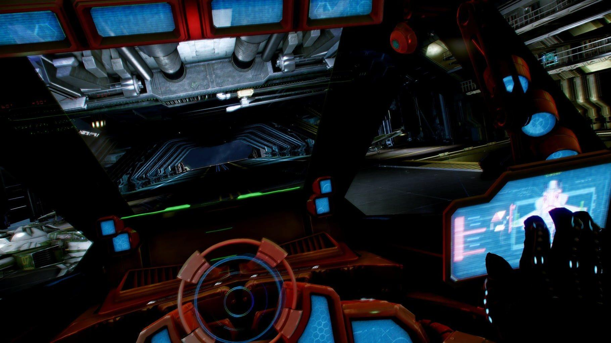

# LV1-驾驶舱 \(运行\) 🚜

> 驾驶舱专注于已经成为共识和基础设施的的投资组合项目的运行。
>
> 在这里，我们极力简化操作流程，以适合最小可运行投资系统，方便用户进行高效操作。



## 基本驾驶模块

* [**币安**](https://www.binancezh.co/cn/register?ref=EQ89E7WI)**\(此链接返现比例: 我10%, 你10%**\)\([**流动性挖矿**](https://www.binance.com/zh-CN/swap/liquidity)**）**
* \*\*\*\*[**派网 - Pionex**](https://www.pionex.cc/zh-CN/sign/ref/NxwM4W0S)\*\*\*\*
* [**币优**](https://www.biyou.tech/)，[**Trust Wallet**](https://trustwallet.com/)，[**Blockchain.com**](https://www.blockchain.com/wallet)\*\*\*\*



## 资产配置



### 战略资产配置——卓尔金历



### 战术资产配置——哈布历



## 核心显示界面


* \*\*\*\*[**卓尔金历法 🕙**](https://www.bfm-unity.com/qian-xian/management-cockpit-operation/zi-chan-pei-zhi/ling-hang-duo-lei-da)\*\*\*\*

  [卓尔金+哈布飞船](https://share.weiyun.com/O2bZwwMx)  
  ****

* [**MVRV**](https://www.blockchain.com/charts/mvrv)[（](https://www.jianshu.com/p/f6992e6c6ea6)[Python获取MVRV](https://coinmetrics.io/newdata/split/btc_CapMVRVCur.txt)，[参考链接](https://www.jianshu.com/p/f6992e6c6ea6)）  \|  [**S2F**](https://www.qkl123.com/data/s2f/btc)  ****\|  [**HODL Waves**](https://unchained-capital.com/hodlwaves/)  **\|**  [减半时间](https://www.qkl123.com/data/halve/btc)  \|  [CFTC持仓报告](https://www.tradingster.com/cot/futures/fin/133741)  \|  [彩虹图🌈](https://www.blockchaincenter.net/bitcoin-rainbow-chart/)
* [**CAPE**](https://www.gurufocus.cn/indicator/shiller_pe)   **\|**  [**巴菲特指标**](https://www.gurufocus.cn/indicator/buffett-market-valuation) ****
* [Sharpe Ratio](https://charts.woobull.com/bitcoin-risk-adjusted-return/)  \|  [市值比较](https://assetdash.com/?all=true) 
* [跟踪美联储操作](https://robo.datayes.com/v2/landing/monitor_detail?slotId=243342) 
* CPI&gt;3%通胀，&gt;5%严重通胀


##  **DeFi 操作面板**


* \*\*\*\*[**DeBank**](https://debank.com/swap) **\(**[**协议列表**](https://debank.com/projects)**\)**
* [**Zapper.fi**](https://www.zapper.fi/)
* \*\*\*\*[**Zerion**](https://app.zerion.io/exchange) ****
* **🦄️** [**Uniswap**](https://app.uniswap.org/)  **\|**  [**Uniswap Info**](https://info.uniswap.org/)  ****🆕
* \*\*\*\*[**yCRV**](https://docs.dfi.money/#/zh-cn/buy-tokens?id=_5-ycrv%e5%85%91%e6%8d%a2)\*\*\*\*
* \*\*\*\*[**DPI**](https://www.indexcoop.com/dpi)
* \*\*\*\*[**BCP \(PieDAO Balanced Crypto Pie\)**](https://pools.piedao.org/#/pie/0xe4f726adc8e89c6a6017f01eada77865db22da14) **\(** 🥧 [**Oven**](https://pools.piedao.org/#/oven) **\) \(**[**介绍**](https://medium.com/piedao/announcing-balanced-crypto-pie-bcp-btc-eth-and-defi-7a2423c5d94e)**\)**
* [**YPIE**](https://pools.piedao.org/#/pie/0x17525e4f4af59fbc29551bc4ece6ab60ed49ce31)  ,  [**DEFI++**](https://pools.piedao.org/#/pie/0x8d1ce361eb68e9e05573443c407d4a3bed23b033) ****
* \*\*\*\*[**Gas费**](https://gasnow.sparkpool.com/)\*\*\*\*

  
  [**估值**](https://terminal.tokenterminal.com/dashboard/Dapps)**（**[**参考链接**](https://www.chainnews.com/articles/649261412781.htm)**）**


## 基金股票





## 薅羊毛





## 融资加杠杆



## 离岸金融



