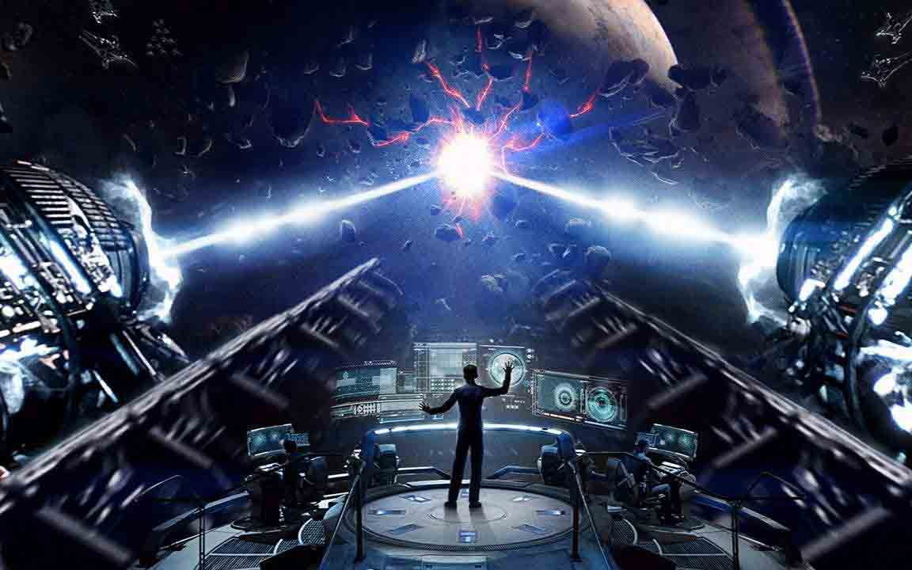
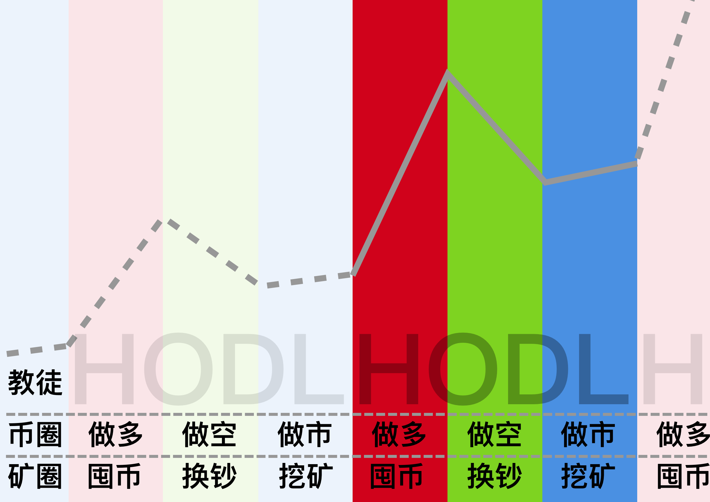
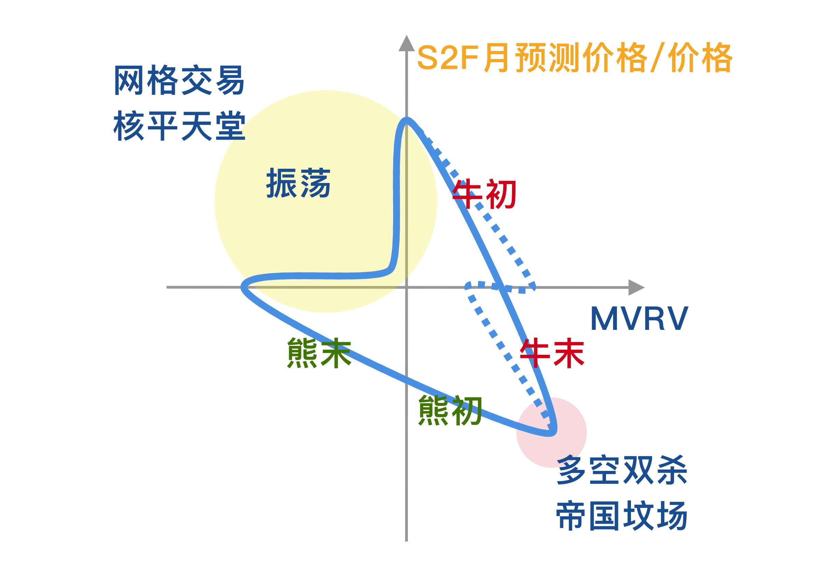
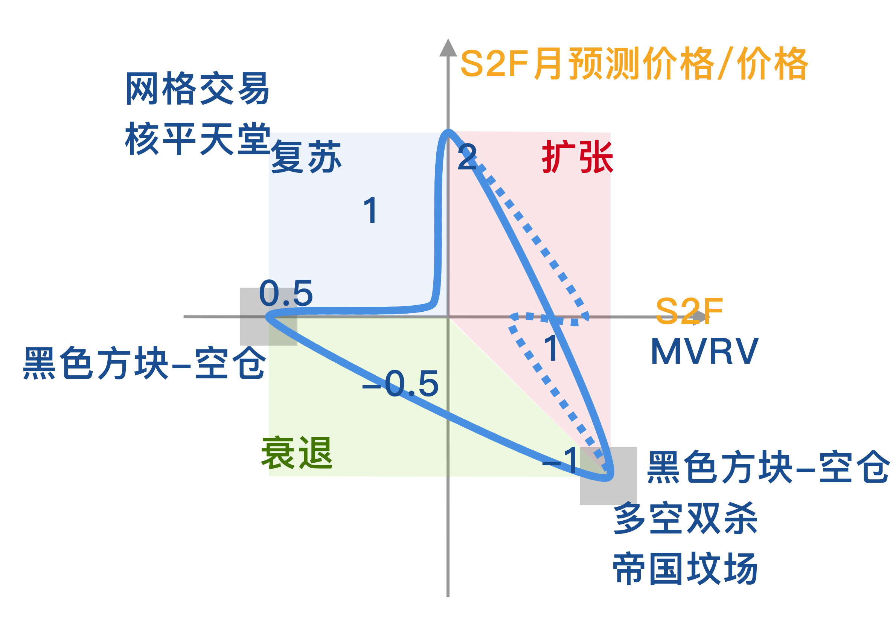

# 战略资产配置——卓尔金历 🕙



> My clock is paper financial time    我的**时钟**显示账面的**金融时间**
>
> ——[《C》-  岩崎琢](https://music.163.com/#/song?id=22713696)

> 歌者启动了**大眼睛**的进程。
>
> —— 《三体》- 刘慈欣


Disclaimer: **Any information found on this page is not to be considered as financial advice. You should do your own research before making any decisions.**



## 最新版下载链接🔗    [卓尔金+哈布飞船5.02](https://share.weiyun.com/7rzN1OXD)



### [宣传视频1](https://www.bilibili.com/video/BV1K64y1S7FS)  \|  [宣传视频2](https://www.bilibili.com/video/BV16X4y1g7tH/)  \|  [代言视频1](https://www.bilibili.com/video/BV13x411R7Lf)  \|  [代言视频2](https://www.bilibili.com/video/BV12b411p7Hi)











## 版本记录

### 经典版 1.0

[卓尔金历法](https://share.weiyun.com/dhfGbd7l)  \|  [卓尔金-探索者号飞船](https://share.weiyun.com/NAsqLyq8)

### 升级版 2.0 —— 范围更大，考虑情况更多

[卓尔金历法](https://share.weiyun.com/dhfGbd7l)  \|  [卓尔金-探索者号飞船](https://share.weiyun.com/NAsqLyq8)

### 智能版 3.0 —— 智能函数拟合，更精确，更易调节

[卓尔金-智能原子钟](https://share.weiyun.com/y9kahvvr)  \|  [卓尔金-智能飞船](https://share.weiyun.com/NrrPpvCw)

### 尊享版 4.0 —— 优化了UI，增加了误差分析功能

[卓尔金飞船](https://share.weiyun.com/5vy0sGcS)

### 哈布历 4.9 —— 增加了哈布历法

[卓尔金+哈布飞船](https://share.weiyun.com/O2bZwwMx)

### 哈布历 5.0 —— 微调更新，优化了部分公式，修复了链接型的BUG，优化了UI，添加了LOGO

[卓尔金+哈布飞船\(1\)](https://share.weiyun.com/kqakKw4y)

### 哈布历 5.01 —— 增加了与目录间的链接

[卓尔金+哈布飞船5.01](https://share.weiyun.com/miHqj1Ri)

### 哈布历 5.02 —— 

重组了卓尔金历法实验室，以适应更复杂的自动化分析，未来只需要输入参数，不需要像以前那样做实验了；  
增加了卓尔金历法实验室与记录仪和卓尔金历法中参数的的连接，使卓尔金历法更智能；  
增加了卓尔金历法实验室对神经网络中心点的控制，对延展参数的控制正在研究中。

[卓尔金+哈布飞船5.02](https://share.weiyun.com/7rzN1OXD)




#### [http://www.chidaolian.com/article-45496-1](http://www.chidaolian.com/article-45496-1)

#### 熊市：下跌到顶点的1/5

#### 震荡市：振荡上涨2倍 

#### 牛市：减半后，上涨32倍-64倍

熊市做空时。可以买杠杆代币BTCDOWN，并计算好杠杆率。  
震荡行情，网格是用币优做的，BTC/USDT   
牛市做多时。可以用币安的流动性挖矿，做BTC/ETH。 

具体软件如下：



## [归一化操作](https://www.bfm-unity.com/management-cockpit-operation/shu-xue-li-qi) 

数据归一到（-1，1）

```python
LN(MVRV/1.80)/0.91 # 对MVRV的处理

LN((S2F月预测价格/价格)/1.44)/1.68 # 对S2F的处理
```

## 图表说明


**蓝色曲线——横X轴——MVRV——**[**数据来源**](https://www.blockchain.com/charts/mvrv)\*\*\*\*

**橙色曲线——纵Y轴——S2F月预测价格/价格——**[**数据来源**](https://www.qkl123.com/data/s2f/btc)\*\*\*\*

## 回测研究


## 归纳推理





## **历法**说明

**顺着三角形顺时针运行，**

**红色是牛市，绿色是熊市，蓝色是震荡市。** 

**从蓝色到红色，减半开始，此时需要加杠杆，满仓多。**

**顺时针运行 ，落到第一个黑色框，就是牛市顶峰，熊市开始，可以做空。** 

**顺时针运行 ，落到第二个黑色框，就是熊市底部，可以入场开网格。**

**就像一个时钟一样，很方便。**

## 模拟神经网络查找表


## 确定仓位

* [史上最牛查找函数组合Index+Match](https://www.sohu.com/a/334505538_825825)
* [EXCEL取小数点后一位](https://zhidao.baidu.com/question/27632380.html)

```python
=INDEX(
    神经网络!C26:W46,
    MATCH(
        ROUND(卓尔金历法GPS定位系统!D9,1),
        神经网络!B26:B46,
        0),
    MATCH(
        ROUND(卓尔金历法GPS定位系统!D7,1),
        神经网络!C25:W25,
        0)
    )
```

## **与美林时钟的关系**


两个随机变量，才能校准、判断一个周期。

一个随机变量，是无法校准、判断周期的，所以用MACD，BOLL都是没用的。 

一个随机变量，单独用MVRV，或者单独用S2F，噪声扰动太大，所以不能单独用，必须二者结合判断。

在比特币，这两个随机变量是MVRV，S2F。 

在现实世界，这两个随机变量是GDP，CPI，或者货币，信用。

## 逻辑解释

不要让自己的人性干扰判断，比如说我那个卓尔金历法，

如果你是普通人，按照感性思考，是无法理解价格的指数增长的，所以我用数学的LN\(\)来放弃感性思考。我放弃让自己来思考指数增长，而把指数增长的部分都取LN\(\)来滤除。一个指数增长的数列取LN\(\)之后就变成了线性增长，这样我只需要思考简单的线性增长就行。我通过一系列数学映射，简化了判断。 

而且我放弃了思考价格和时间之间的关系，把绝对价格换成相对价格，把衡量绝对时间换成衡量状态，这样一切就都是相对的状态，而不是绝对的价格和时间。

用相对的思维来思考相对的牛熊，这样就容易多了。但是用绝对的思维思考相对的牛熊，就会很难。

相对的思维就是把一切都变成状态机，思考状态之间的切换，比如说我就把问题简化成了一个只有\(-1，0，1\)这三种状态的状态机。把所有的变量都归一到这三种状态中，然后再思考它们的关系，这样就很容易发现周期规律。 

但是一个连续的状态，如何转化成离散的判断呢？如何防止噪声干扰？如何防止频繁买卖？答案很简单，我们电子专业有一个叫\(施密特触发器\)的元器件，我们利用它的逻辑就可以了。简单地说，它的逻辑，就是达到阈值就切换，没达到阈值就维持原状态。这样就可以避免噪声干扰，实现AD转换了。 

在某些人\(比如我\)的眼里，比特币就是宏观电子，就是宏观的状态机，就是由三种状态，两个随机变量构成的。 就像藏传佛教，宇宙就是由唵啊吽三种状态构成的。 我相信比特币就是宏观的电子，宏观的状态机。

## 局限性

你可以研究过去的几次周期，来拟合这个三角形。 

不过既然我给出了研究结果，你再研究一遍，也差不了多少，所以只要会使用就行了。 

未来的话，每次达到新的阶段，都需要重新拟合一遍，来适应市场。

而且，如果最坏的情况，就是这个模型失效了，我们也可能会重新修改模型的框架规则。 

但是在一个周期内还是不需要修改的，在3个周期，也就是10-12年之内，这个模型会很稳定。10-12年之内，这个模型会很稳定。数据不需要太大的修改。

我们很懒。不需要加班996改这个。 

币圈人都知道，我们在一个没有尽头的电梯里，周围是无尽虚空。

我能在黑暗中寻找一丝光亮，我已经尽力了。还是那句话，这里很危险。信则灵，不信则不灵。 

我建议你先看一下《三体》，里面有一个假说，射手和农场主假设，这是很可怕的。 


但是，我们会因为害怕就放弃寻找规则吗？

如果有人能找到规则，至少比面对无尽虚空更强一点， 至少我找到了一定的规则，很宏大的规则。以3-4年的减半为周期的规则。我希望它能运行的长一点。

我只是选择了几个数据，你认为我是射手和农场主假说那样的情况，也好。

不过，减半行情是比特币自身的性质，这是不受市场上的人类行为的控制的。

所以根据减半规则，推导出的比特币周期是可以站住脚的。 

还是那句话，你面对的是无尽虚空，而我是那个拿着火把的玛雅祭司。

你说我提出的卓尔金历法不是科学，我也承认，但是，在美洲的原始部落里，这是最可信的了。

信不信由你，信则灵，不信则不灵。

虽然玛雅文明最后灭亡了，但是历史是轮回的，玛雅文明至少创造了历史。 

历史是不可重复性实验，而科学是可重复性实验。

所以，科学无法审判历史；所以，科学无法审判玛雅文明的卓尔金历法。 

这是哲学问题，不是科学问题。

我们操控的是宏观电子，玩的是不可重复性实验。面对的是无尽虚空。

我们面对的问题是很危险的，但是我撕开了一个口子。

就算我们是玛雅人，也要在石头上用黑曜石刻下卓尔金历法。

特别是“活人献祭”的金融领域，所谓的科学很可能只是“射手与农场主”假说。

但是我们也不能因噎废食，也要敢于发现规律，创造规律。 

金融是什么？金融就是活人献祭。

科学是什么？科学就是历法，根据历法，什么时候举行活人献祭。

其实我们和玛雅文明没区别，我们只是把历法刻在区块链上，而玛雅文明刻在石头上。

但是，我们和玛雅文明面对的都是可怕的无尽虚空，没有必要五十步笑百步。

我就是你们的大祭司，你爱信不信，有时候真的，由不得你不信。

## 相对论视角

卓尔金历法是MVRV和S2F的月均线合并起来的二维图。

这里没有时间，也没有价格。因为时间和价格我都不考虑了，我只考虑相对位置。

对于比特币来说，绝对的现实世界时间和美元价格都不重要，因为比特币有自己的时间（时间戳，区块），自己的价格（聪）。所以它相对美元的价格是由它自己的性质决定的。我只考虑它自己的性质，摒弃了外界条件的干扰。

比特币是一个内部统一的结构，它是靠自己决定它自己价值的，外部的时间和外部的美元对它都不会造成本质的影响。 所以，你不能考虑时间，只能考虑它自己内部的相对状态。这个内部状态就是MVRV，和S2F。我用“相除“提纯了S2F，让它变成了一个没有货币单位的相对值。

用相对值来衡量比特币整个经济系统所处的状态，这样就合理了，也能解释其为什么相对美元的价格周期了——因为它的内部状态发生了变化。 所以我们只要分析MVRV和S2F反映的内部状态，就可以判断所处的周期位置。自然就能预测接下来的行情。

但这个行情，是和下周或者下个月没关系的，因为，比特币的时间是靠“区块高度”衡量的，不是靠（天）（周）（月）衡量的。

所以你在时间价格图上各种画线来预测，是没有卵用的。因为技术指标参考的时间是现实时间，不是（区块高度），所以，既然时间轴都错了，再分析也没有意义，这就是技术指标在比特币上无用的原因。

区块高度和现实时间不是一一对应的，它可以伸长，也可以收缩，全看矿工挖的进度。 是矿工和算力决定了比特币的时间（区块高度），而不是现实时间。

所以，既然技术指标参考的价格是美元价格，参考的时间是现实时间，那么技术指标在分析比特币上卵用没有。

比特币的时间是相对时间，产生的价值是相对价值，所以比特币具有“相对论”性质，而技术指标大多是“经典力学”思维，所以技术指标完全彻底地在比特币上失效，无用！

所以我们分析比特币周期也必须使用相对指标，比如说MV/RV，比如说S2F预测价格/价格。

这样才能使用比特币的“相对论”性质，摆脱现实时间和美元定价体系的“经典力学坐标系”的干扰！

我们必须使用相对论思维来研究比特币。

因为比特币的时间不是现实时间，是区块高度，价值也不是相对美元的价格，是MVRV和S2F决定的强弱体系！

我们必须脱离（现实时间，美元）这个坐标系，进入（区块高度，相对价值）这个坐标系！

否则，我们无法分析比特币。

既然区块链已经离开了地球，为什么还要使用地球的时间和地球的坐标系？

反正判断周期和时间和价格都没有关系。 

比特币有自己的价值体系，有自己的时钟系统。 所以外界时间影响不到它的运行。 这就是为什么比特币可以逃过摩尔定律的原因。 

所以，我们用现实的美元和现实的时间是干扰不了比特币的……比特币自己有一套自己的经济体系（聪，交易手续费，挖矿成本，减半机制）和时间体系（区块高度，时间戳）。 

所以，现实的经济动荡，和比特币是完全脱轨的。 

所以，基于现实世界消息面，判断多空，是完全没有用的。 两个连基本法则都脱轨的经济系统，怎么会有干扰？笑话。

## 讨论

能回测出来的东西都不是秘密，不是秘密的东西就是共识，而共识才是最值钱的 

回测出的东西=共识+噪声+过拟合。你要做的就是分离提纯出共识，去除噪声和过拟合

我的卓尔金历法由于过于粗糙，过于傻逼， 所以提纯出的理论大部分都是共识。

不要小看共识，就算你认为不是秘密，不会有超额收益， 但是违背共识，也会付出沉重的代价。

**不知道秘密，顶多没有超额收益。 但是不知道共识，可是连平均收益都没有。** 

**我认为市场共识占了收益的80%，而秘密和内幕消息只占了收益的20%** 

观点，构成了命题的假设和框架。一切命题都是建立在假设上的。然后才是数据分析。 假设很重要，比数据分析更重要 

我这个模型已经足够naive了，一般越naive越不容易过拟合 

表达观点，强化共识的原因，只是为了防止陷入囚徒困境。 

宏观电子是没有量子态的。 一旦宏观了，量子态就很弱了

## 自我，超我，机器智能

人在金融市场拼的是什么？就是拼的自己价值观不会受到金融市场的毁灭和侵蚀。 如果你把你的价值观，委托给相对估值法，委托给电脑机器，那么，你的思维就永远不会受到金融市场的波动的侵蚀，而是一直保持理客中的状态。

做金融这行就是要有自信，要相信你就是比别人优秀，然后你就真的会比别人优秀。

有些人做着做着就被市场侵蚀掉，放弃自尊心，放弃自信心，这是不对的。

只要你把判断委托给机器，你的意识，你的思维模型就永远不会受到市场的侵蚀。

那样你就会解放出来，去搭建去升级你创造出的机器智能。

我就是这么做的。

一定要有超然物外的思维。

如果你不能超然物外，你就依然是那个自己下棋的柯洁，你不依靠机器的智慧，就永远达不到阿法狗的层次。

总结来说，就是

1，思维模型不要被市场侵蚀，要学会让机器（Excel）顶在前面，代替自己的计算和判断。

2，一定要有自信心，要坚持，要执着。要让自己的超我思维模型和机器智能相结合，让这个系统越来越强大。

3，一定要有超然物外的思维，要让自己的超我脱离这个局，让超我做一个局外人去下判断，而自我只是那个负责执行的人。 重要的是，把转瞬即逝的超我的判断，注入机器智能中，固定下来。

你的自我可以去接触市场，可以有喜怒哀乐，可以被市场侵蚀掉，因为你的自我是负责执行的。

但是你的超我一定要独立出来，超我是转瞬即逝的，如果超我坚持不住判断，一定要及时地把超我注入到机器智能之中。这样你的超我就会一直指导自我的判断了。

你要做的是， 1，保留超我的洞察力， 2，保留自我的执行力， 3，由于超我维持的时间很短，要及时把超我注入到机器中固定下来。 4，不要让自我参与判断，而且不要随便放弃你的超我，即使是被固定到机器中的超我，也不能放弃，要把超我不断地发展下去。

## 鲸鱼洄游

我们是被潮水裹挟着前进，但是我们不能看不清方向。 

 比特币不是神，它只是一个鲸鱼，它的方向我们可以大概预测出来。

毕竟它只是一个动物，有类似动物的洄游行为。 

 不要太瞧得起比特币了，它也不过如此。

#### [座头鲸沿直线洄游奥秘：或观星望日定方位](https://www.chinadaily.com.cn/hqgj/2011-04/22/content_12373180.htm)

#### 背景图片：[https://photo.16pic.com/00/07/97/16pic\_797125\_b.jpg](https://photo.16pic.com/00/07/97/16pic_797125_b.jpg)

