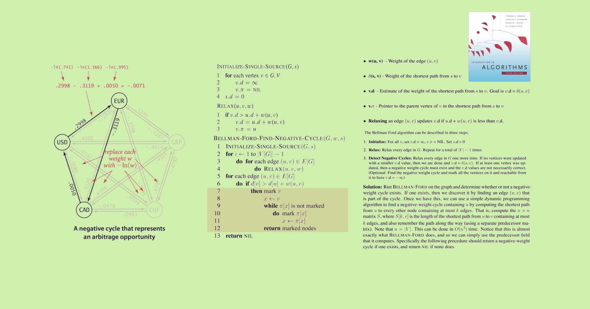

# LV4-研究院 \(架构\) 🔬

## 👩‍🔬 👨‍🔬 ➡️ 三角套利研究院 ⚠️ ☢️ ☠️ 🔥 💥 🧪 🔬 💻——黑洞计划


我们在尝试部署[**BellmanFord算法**](https://www.bfm-unity.com/what-is-bfm-al)在[**币安**](https://www.binance.com/cn)上或者Uniswap上，进行单交易所内部多币种的多角套利。

如果在[**币安**](https://www.binance.com/cn)上运行，需要对接交易所API。使用[**python**](https://www.python.org/downloads/)，ccxt，asyncio，通过异步并发协程的方式运行[Bellman-Ford算法](https://www.bfm-unity.com/what-is-bfm-al)，以寻找套利路径。

我们发现了一个可以参考的项目：Peregrine，它可以**打印**出一个套利路径，但是没有**执行**下单的程序。

我们需要参考Peregrine的代码，自己编写并添加这个**执行**下单的程序。



[**BellmanFord算法**](https://www.bfm-unity.com/what-is-bfm-al) **+** [**参考文献**](https://www.bfm-unity.com/what-is-bfm-al/bfm-al-ckwx) **+** [**三角套利核心代码**](https://www.bfm-unity.com/ruan-jian-bfm-on-python) **+** [**陵墓**](https://www.bfm-unity.com/what-is-bfm-al/lo-st) **+** [**量子退火和FPGA**](https://guhhhhaa.gitbook.io/bfm-unity-doc-v1/bfm-suan-fa-de-wei-lai-fa-zhan-wei-wan-cheng)\*\*\*\*

千千的搬砖之王策略  \|  [**视频**](https://mp.weixin.qq.com/s/MsXdWAGJR0Kl9BPIUPxQgA)  **\|**  [**代码**](https://guhhhhaa.gitbook.io/bfm-unity-doc-v1/ruan-jian-bfm-on-python/qian-qian-de-liang-hua-shi-jie-hou-ban-dai-ma)  
****BellmanFord三角套利策略，是千千搬砖之王策略的算法升级版

千千的其它视频：[**上篇**](https://mp.weixin.qq.com/s/lVqcoBvtmyLaohz7DLtIoA)  **\|**  [**下篇**](https://mp.weixin.qq.com/s/6qL4redQ3lFiNvZOowpBaA)  **\|**  [**部署**](https://mp.weixin.qq.com/s/6bKVOqcYppqta3zRdMtvWA)  **\|**  [**回测**](https://mp.weixin.qq.com/s/Ju4XFDHTq7wk2wokArmKGw)  **\|**  [**三角套利策略介绍**](https://mp.weixin.qq.com/s/G5t7TyIyrH40Kl55feTDIw)\*\*\*\*

[**宝塔面板**](https://www.bt.cn/)**（**[**安装教程**](https://www.bt.cn/bbs/thread-19376-1-1.html)**） \|**  [**阿里云**](https://www.aliyun.com/)  **\|**  [**腾讯云**](https://cloud.tencent.com/)

**相关知乎问题：**

* [Bellman-Ford算法是如何用于三角套利的？](https://www.zhihu.com/question/360354203)
* [如何利用云计算（如AWS，阿里云，腾讯云）部署FPGA实例，用于BellmanFord三角套利？](https://www.zhihu.com/question/448419550)

我已经[**联系币安**](https://www.binance.com/zh-CN/my/user-support/feedback/entry)让他们自己研发三角套利策略了，不知道以[**币安**](https://www.binance.com/cn)的研发实力，会不会搞出一个功能，让散户人人都可以参与三角套利，这样散户只需要投资就行了，不需要研究技术。


## **导游**



## **总架构**











## 

