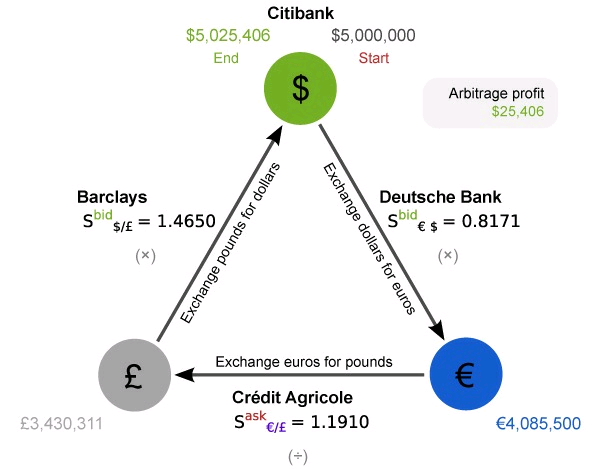

# BFM算法是什么

## 早日研究BFM，早日粉碎世界九大洲由各国国家信用背书的货币体系，才能早日实现共产主义。

## 为什么我能得出BFM=共产主义？

1. BFM是世界经济金融系统金字塔的顶端。 
2. BFM可以被每个人掌握，推广，使用。 
3. BFM在算法和哲学的高度，解构并重新建构了全球货币制度。 


**所以，BFM=共产主义**


## BFM算法的原理是什么？

BFM算法非常简单，简单到，幼儿园小朋友都能够理解。 

```text
世界的本质，不就是 2 * 3 = 6 吗，有什么难的。
```

就像动画片[《游戏人生·ZERO》](https://www.bilibili.com/bangumi/play/ep281830?theme=movie)里的特图神一样，伸手一把夺走星杯。


犹豫就会败北，果断就会白给。




```c
无定价缺陷的货币汇率关系：2 * 3 = 6
有定价缺陷的货币汇率关系：2 * 3 > 5.9 
用环形表示有缺陷汇率关系：2 * 3 * 1/5.9 > 1 
取ln的环形有缺陷汇率关系：-ln2 + -ln3 + -ln(1/5.9) < 0，
就是一个负权环。 
然后用Bellman-Ford-Moore算法去找，时间复杂度是O(N^3)。

你要做的是，把市场数据下载到一个服务器里，
用货币名称作为顶点V，用 -ln(汇率)作为边权E，
建立货币市场，带边权有向图G(V,E)的邻接矩阵，
用这个B-F-M算法，从图的邻接矩阵表示里面，寻找其中的套利路径。
```

## BFM算法的具体表述

```c
INITIALIZE-SINGLE-SOURCE(G,s)
    for each vertex v ∈ G.V
        v.d = ∞
        v.π = NIL 
    s.d = 0
RELAX(u,v,w)
    if v.d > u.d + w(u,v)
        v.d = u.d + w(u,v)
        v.π = u 
//算法本体开始
BELLMAN-FORD-FIND-NEGATIVE-CYCLE(G,w,s)
//第一部分：初始化，引用INITIALIZE-SINGLE-SOURCE(G,s)
    INITIALIZE-SINGLE-SOURCE(G,s)
//第二部分：计算，引用RELAX(u,v,w)
    for i <- 1 to |V[G]| - 1 
        do for each edge (u,v) ∈ E[G]
            do RELAX(u,v,w) 
//第三部分：检验，FIND-NEGATIVE-CYCLE。
    for each edge (u,v) ∈ E[G]
        do if d[v] > d[u] + w(u,v)
            then mark v
                x <- v
                while π[x] is not marked 
                    do mark π[x]
                        x <- π[x]
                return marked nodes 
    return NIL
```

## BFM算法的时间复杂度分析


## BFM-Find算法和BFM-Detect算法的比较


