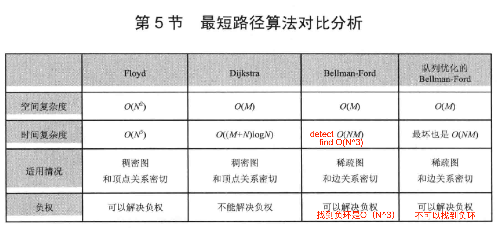
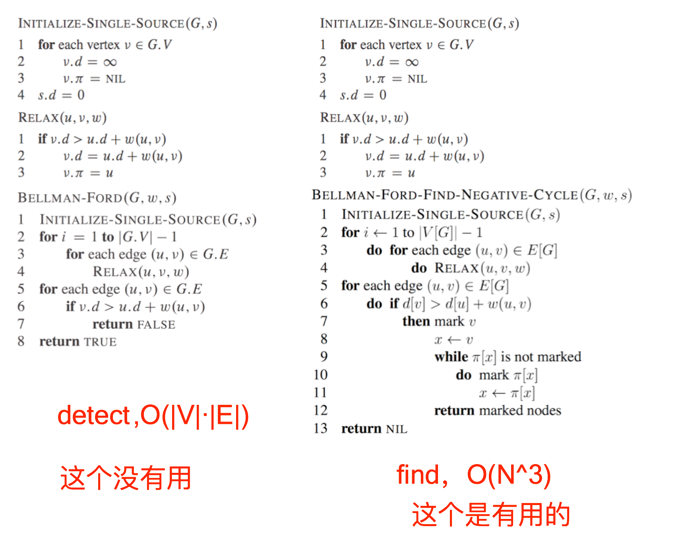

# 【算法】算法描述


本章包含 **核心算法** ，需要 **开发者** 细读，  
  
如不想看算法，想直接看 **程序，**可跳到 [**这一页**](https://guhhhhaa.gitbook.io/bfm/ruan-jian-bfm-on-python)\*\*\*\*



## 为什么 BFM = 共产主义？

1. BFM 是世界经济金融系统金字塔的顶端。 
2. BFM 可以被每个人掌握，推广，使用。 
3. BFM 在算法和哲学的高度，解构并重新建构了全球货币制度。 


**所以，BFM = 共产主义**


## BFM Unity 的组织性质是什么？

> BFM Unity 是以算法为核心驱动的去中心化自治组织（DAO）。

## BFM 算法的原理是什么？

```c
世界的本质：2 * 3 = 6
```

BFM 算法于 1955 年由 Alfonso Shimbel 创立。



{% embed url="https://en.wikipedia.org/wiki/Bellman%E2%80%93Ford\_algorithm" %}

我们利用 BFM 算法进行交叉套利路径的优化搜索。



```c
无定价缺陷的货币汇率关系：2 * 3 = 6
有定价缺陷的货币汇率关系：2 * 3 > 5.9 
用环形表示有缺陷汇率关系：2 * 3 * 1/5.9 > 1 
取ln的环形有缺陷汇率关系：-ln2 + -ln3 + -ln(1/5.9) < 0，
就是一个负权环。 
然后用Bellman-Ford-Moore算法去找，时间复杂度是 O(N^3)。

你要做的是，把市场数据下载到一个服务器里，
用货币名称作为顶点V，用 -ln(汇率)作为边权E，
建立货币市场，带边权有向图 G(V,E) 的邻接矩阵，
用这个 B-F-M 算法，从图的邻接矩阵表示里面，寻找其中的套利路径。
```

## BFM 算法的具体表述

```c
INITIALIZE-SINGLE-SOURCE(G,s)
    for each vertex v ∈ G.V
        v.d = ∞
        v.π = NIL 
    s.d = 0
RELAX(u,v,w)
    if v.d > u.d + w(u,v)
        v.d = u.d + w(u,v)
        v.π = u 
//算法本体开始
BELLMAN-FORD-FIND-NEGATIVE-CYCLE(G,w,s)
//第一部分：初始化，引用INITIALIZE-SINGLE-SOURCE(G,s)
    INITIALIZE-SINGLE-SOURCE(G,s)
//第二部分：计算，引用RELAX(u,v,w)
    for i <- 1 to |V[G]| - 1 
        do for each edge (u,v) ∈ E[G]
            do RELAX(u,v,w) 
//第三部分：检验，FIND-NEGATIVE-CYCLE。
    for each edge (u,v) ∈ E[G]
        do if d[v] > d[u] + w(u,v)
            then mark v
                x <- v
                while π[x] is not marked 
                    do mark π[x]
                        x <- π[x]
                return marked nodes 
    return NIL
```

## BFM 算法的时间复杂度分析



## BFM-Detect 算法 和 BFM-Find 算法 的比较



## find 算法和 predecessor chain 有关。

我们发现了一个术语叫 predecessor chain ，前驱链，这很重要。






检验你是否理解了 BFM 算法，需回答以下几个问题。  
  
1，BFM-find 和 BFM-detect 步骤有什么不同？   
2，BFM-find 和 BFM-detect 的时间复杂度有什么不同？  
3，BFM-find 里面的步骤涉及前驱链，什么是前驱链? 涉及前驱链的步骤到底做了什么？   
4，为什么算法运行前要对汇率取-ln？   
5，为什么汇率在取 -ln 之前要移动小数点再乘以几百？   
6，BFM 算法基于图的邻接矩阵表示。什么是图的邻接矩阵表示？BFM 算法的步骤中如何使用图的邻接矩阵表示？   
  
这 6 个细节问题，如果你不能回答其中的任何一个，那么 BFM 算法就和你无缘了，所以，坑还是很深的。


## 有些问题回答不出来？可以看看这个：



