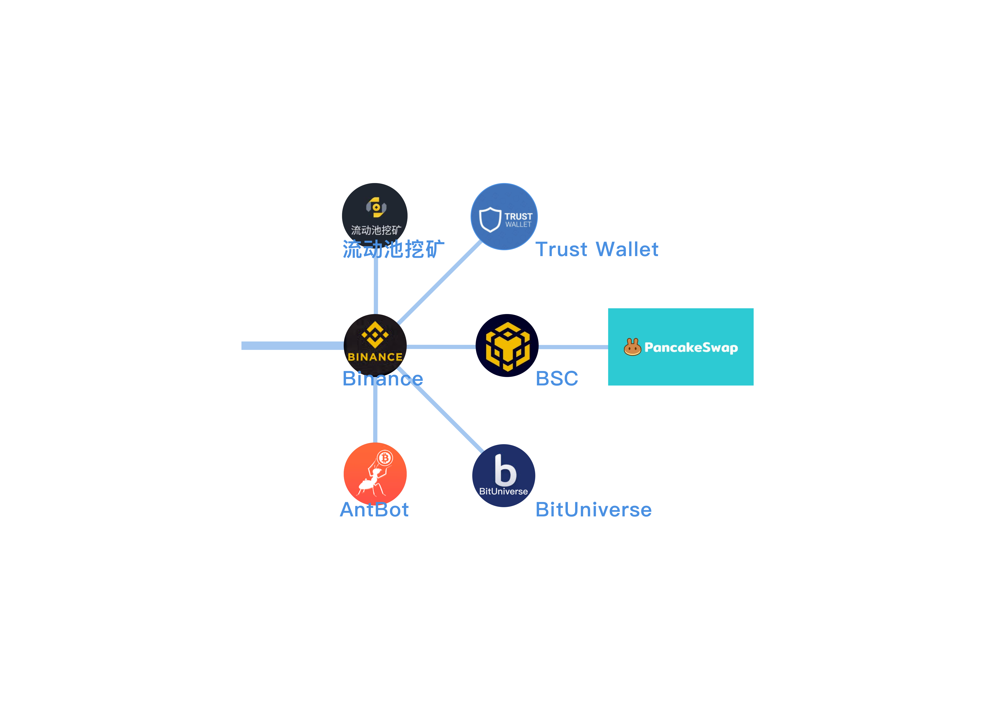

# 新人必看（🔥）

## 0，科学上网（BUFF++,DEBUFF--）

* 首先你需要科学上网，才能正常访问本网站
* 由于兔国政策不友好，本网站已经屏蔽兔国IP，不对兔国人民提供服务


[ss-v2ray.md](gong-ju/ss-v2ray.md)


## 1，入金（年化收益：50%）

### **使用法币购买USDT**

* ****[**Binance**](https://www.binance.com/zh-CN)****
* ****[**Gate.io**](https://www.gate.io/zh-cn)****
* ****[**MEXC**](https://www.mexc.com/zh-cn)****
* ****[**OKX**](https://www.okx.com/)****
* [**CoinCola**](https://www.coincola.com/?lang=zh-CN)****

## 2，机器人（年化收益：100%）

<figure><figcaption></figcaption></figure>

### 绑定API



[**AntBot**](https://antrade.io/)**（**[**文档**](https://antrade.io/guide/docs/cn)**）**

* **网格**
* **移动网格**
* **双向网格**
* 再平衡（智能调仓）🆓
* 马丁



****[**币优 - BitUniverse**](https://www.bituniverse.org/zh-CN/index.html)

* **网格** 🆓



### 交易所自带



[**Binance**](https://www.binance.com/zh-CN)****

* **网格**
  * **现货网格**
  * **合约网格**



[**KuCoin**](https://www.kucoin.com/)****

* **网格**
  * **现货网格**
  * **合约网格**
* **无限网格**
* **再平衡（智能持仓）**
* **极速定投**



[**Gate.io**](https://www.gate.io/zh-cn)****

* **网格**
  * **现货网格**
* **无限网格**
* **再平衡（智能调仓）**
* **组合指标**
* **MACD**
* **MACD-RSI**
* **双均线**
* **双均线-RSI**



[**OKX**](https://www.okx.com/)****

* **网格**
* **再平衡（屯币宝）**
* 马丁



[**派网 - Pionex**](https://www.pionex.cc/zh-CN/sign/ref/NxwM4W0S)**（不推荐）**

* **网格**
* **屯币宝**
* 马丁



| 第一步                                                           | 第二步                                                           | 第三步                                                           | 第四步                                                                                                                |
| ------------------------------------------------------------- | ------------------------------------------------------------- | ------------------------------------------------------------- | ------------------------------------------------------------------------------------------------------------------ |
| 
火箭发射

 | 
变轨展开

 | 
环绕同步

 | 
空间站组装对接

                                                |
| <ul><li>定投</li></ul>                                          | <ul><li>单币网格</li><li>单币流动性挖矿</li></ul>                        | 

<ul><li>双币网格</li><li>双币流动性挖矿 </li></ul>             | <ul><li>多币动态平衡</li></ul>                                                                                           |
| <ul><li>USDT ->BTC</li><li>USDT ->ETH</li></ul>         | <ul><li>BTC/USDT</li><li>ETH/USDT</li></ul>                   | <ul><li>ETH/BTC</li><li>MATIC/BNB</li></ul>                   | 

<ul><li>BTC</li><li>ETH</li><li>BNB</li></ul><ul><li>DOGE</li><li>MATIC</li><li>SHIB</li><li>AVAX</li></ul> |
| <ul><li>币安 🆓</li><li>KuCoin 🆓</li></ul>                     | <ul><li>币安+BitUniverse 🆓</li><li>KuCoin 🆓</li></ul>         | <ul><li>币安+BitUniverse 🆓</li><li>KuCoin 🆓</li></ul>         | <ul><li>币安+AntBot 🆓</li><li>KuCoin 🆓</li></ul>                                                                   |

## 3，智能投顾表格（年化收益：500%）

* 智能投顾表格，帮您轻松确定杠杆率，抄底+逃顶
* **MVRV+S2F+币圈美林时钟+激活函数神经元确定仓位+帕累托分布+香农的恶魔+山寨币指数+市值占比幂率修正——共同构筑的基于Excel表格的策略！**


[the-tzolkin-calendar](bfm-da-bi-fang-meng-shu-chan/zi-chan-pei-zhi/the-tzolkin-calendar/)


## 4，其他交易所 和 DeFi

* ****[**FTX 交易所**](https://ftx.com/#a=45676115) **** 600种加密货币、美股凭证任你买卖，可以购买B站，台积电，特斯拉，谷歌等公司股票。
* 可以绑定交易所API用[**币优 - BitUniverse**](https://www.bituniverse.org/zh-CN/index.html)**对以上股票进行网格做市。**


[management-cockpit-operation](bfm-da-bi-fang-meng-shu-chan/management-cockpit-operation/)



[command-room-discovery.md](bfm-eco.-bi-fang-meng-qu-kuai-sheng-tai/command-room-discovery.md)


## 5，加群讨论


[ru-he-jia-ru-wo-men-de-tao-lun-qun-zu](bfm-unity-bi-fang-meng-lian-he-ti/ru-he-jia-ru-wo-men-de-tao-lun-qun-zu/)


## 6，投资治理通证Token，或者自立门户！


[juan-zeng-da-shang.md](bfm-da-bi-fang-meng-shu-chan/juan-zeng-da-shang.md)



[ru-he-jia-ru-wo-men-de-tao-lun-qun-zu](bfm-unity-bi-fang-meng-lian-he-ti/ru-he-jia-ru-wo-men-de-tao-lun-qun-zu/)

